## 🧚 Tinkerbell 🧚 An Autonomous Agentic Development Runtime

**Tinkerbell** is a next-generation, open-source Autonomous Agentic Development system designed from the ground up for sophisticated, scalable, and intelligent software development. 

Tinkerbell significantly advances beyond traditional LLM-based agents (such as Gemini-cli or Claude) by leveraging semantic reasoning, structured memory management, and distributed execution. 

---

## 🚀 Why Tinkerbell?

Current agentic systems, despite handling large token contexts, often struggle with scalability, efficiency, accuracy, and maintainability. Tinkerbell addresses these critical limitations through a carefully designed architecture that provides unmatched precision, auditability, and flexibility.

Unlike conventional large-context LLM agents, Tinkerbell’s groundbreaking approach includes:

* **Structured Semantic Memory** with explicit versioning and temporal drift management.
* **Specialized FAR Agent Clusters** for in-depth and context-aware reasoning.
* **Efficient Virtual Canvas and GitOps-based Micro-Commits** for auditable and structured code evolution.
* **Scalable Kubernetes-driven orchestration** utilizing Flintlock and Firecracker MicroVMs for robust isolation.
* **Intelligent Multi-LLM Routing** to select the optimal model for every task.
* **Comprehensive Observability** via structured logging and detailed Prometheus metrics.

---

## 🛠️ Core Features and Capabilities

### 🌐 Semantic Graph and Persistent Memory

* Explicitly structured memory using Neo4j graphs and vector embeddings.
* Precise semantic relationships for deep contextual reasoning.
* Temporal versioning and drift handling ensure accurate, current context.

### 🔍 Specialized Skill Clusters (Hexagonal Architecture)

* Coordinated agent clusters specialized by personas (Planning, QA, Security, Docs).
* Enhanced collaboration, reasoning depth, and task precision.

### ⚙️ Virtual Canvas and GitOps Strategy

* Granular, semantic-aware micro-commits for auditability.
* Clear traceability and debugging of agentic decisions.

### 🚦 Kubernetes-based FAR Controller

* Robust orchestration of FAR agents, leveraging Kubernetes' scalability.
* Node-level orchestration via Liquidmetal, with efficient lifecycle handling (sleep, resurrection).

### 🚀 Firecracker MicroVM Integration via Flintlock

* Lightweight, fast, secure VM-based isolation for each FAR agent.
* Predictable performance, strong security isolation, and low resource overhead.

### 🤖 Multi-LLM Routing with GenAI

* Dynamically selects optimal LLMs based on cost, performance, and capabilities.
* Seamless integration with emerging specialized and optimized inference models.

### 📈 Advanced Observability (Prometheus, Grafana, Tracing)

* Structured Prometheus metrics, providing deep insight into operations.
* Detailed tracing spans and structured logging with Rust’s `tracing` crate.

---

## 🗺️ System Architecture Overview

```mermaid
graph TD
    subgraph FAR Infrastructure
        subgraph Kubernetes Cluster
            FAR_Controller["🚦 Kubernetes FAR Controller"]
            JobQueue["📥 Task Queue"]
            Metrics["📈 Metrics & Logs"]
        end
        subgraph Compute Blades
            Liquidmetal["💧 Liquidmetal Daemon"]
            Flintlock["🧩 Flintlock Orchestrator"]
            FAR_VM["🔥 FAR Agent MicroVM"]
            Liquidmetal --> Flintlock --> FAR_VM
        end
        FAR_Controller <-->|mTLS Secure| Liquidmetal
    end
    subgraph Memory & Storage
        SemanticMemory["📚 Neo4j Semantic Memory"]
        VectorEmbeddings["🧮 VectorDB"]
        S3Cache["📦 S3 Cache"]
    end
    subgraph LLM Routing
        GenAIRouter["🧭 GenAI Router"]
        LLMs["🧠 Multiple Specialized LLMs"]
        GenAIRouter --> LLMs
    end
    FAR_VM --> SemanticMemory
    FAR_VM --> VectorEmbeddings
    FAR_VM --> S3Cache
    FAR_VM --> GenAIRouter
    FAR_Controller --> Metrics
```

---

## 🌟 Tinkerbell vs. Traditional Large-Context Systems

| Capability                   | Gemini-cli (1M context) | 🔥 **Tinkerbell**                                |
| ---------------------------- | ----------------------- | ------------------------------------------------ |
| **Context Management**       | 🔸 Flat token context   | ✅ Semantic graph, structured memory              |
| **Temporal Drift Handling**  | ❌ None                  | ✅ Explicit temporal versioning                   |
| **Reasoning Precision**      | 🔸 Moderate             | ✅ High via specialized clusters                  |
| **Resource Efficiency**      | ❌ High resource usage   | ✅ MicroVMs, caching, efficient orchestration     |
| **Auditability & Debugging** | 🔸 Low                  | ✅ High with structured logging and micro-commits |
| **Multi-LLM Integration**    | ❌ Limited               | ✅ Intelligent GenAI routing                      |

---

## 🤝 Open-Source Governance & Contribution

We foster an inclusive, transparent, and collaborative open-source community. Our structured contribution framework ensures high-quality contributions, efficient reviews, and transparent decision-making.

**Roles:**

* **Maintainers:** Oversee releases, governance, and strategic direction.
* **Reviewers:** Ensure code quality, review PRs, and guide contributions.
* **Contributors:** Submit issues, enhancements, documentation, and code.

We offer clear escalation paths and a collaborative community for resolving technical and strategic challenges.

---

## 📅 Release Strategy

Tinkerbell follows strict Semantic Versioning (SemVer), regular release cycles, and structured changelogs:

* **Stable Releases**: Quarterly, production-ready.
* **LTS Releases**: 18-month support for security & critical bug fixes.
* **Edge Releases**: Continuous, for rapid iteration and experimentation.

---

## 📖 ADRs (Architectural Decision Records)

All Tinkerbell design decisions are transparently documented via comprehensive [ADRs](./docs/adr). This structured approach ensures clarity, informed evolution, and community alignment.

---

## 💻 Getting Started

Check our [Documentation](./docs) to quickly set up your local Tinkerbell environment, start contributing, or explore our ADRs in detail.

---

## 🚧 Roadmap & Future Direction

Our detailed roadmap outlines future enhancements, such as:

* Advanced security, backup, and disaster recovery features.
* Enhanced authentication, authorization, and secret management.
* Scalability, compliance, and performance optimizations.

---

## 🌐 Join the Community!

We warmly welcome engineers, developers, architects, and enthusiasts passionate about autonomous software development, semantic technologies, and next-generation LLMs.

* 📬 **[GitHub Discussions](https://github.com/microscaler/tinkerbell/discussions)**
* 🚀 **[Open Issues](https://github.com/microscaler/tinkerbell/issues)**

---

