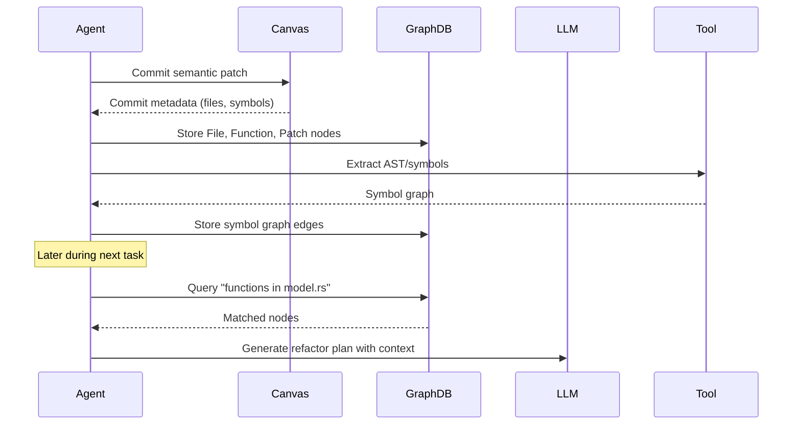

# ADR-0008: Persistent Agent Memory Strategy

## Status
Accepted

## Context
Autonomous agents must retain long-lived, queryable memory to:
- Track previously completed tasks
- Remember file structure and semantic meaning
- Retrieve relationships between source code, features, commits, and goals
- Support long-term interaction continuity and project context

Tinkerbell supports short-term task recovery via WALs, but lacks a scalable, persistent, semantically searchable memory substrate. To operate effectively at scale and maintain reasoning depth, Tinkerbell must store and query **structured memory graphs** across tasks.

---

## Decision

We adopt a **graph-based memory model** using an embedded **Neo4j-compatible store** for persistent, semantically indexed knowledge across:
- Files, types, modules, symbols
- Commits, features, agent plans
- Named tasks, goals, and project metadata

### Technical Approach
- Backed by `neo4rs` or `bolt-client` as Rust Neo4j clients
- Graph lives inside `graphdb/` crate
- Stores structured semantic nodes and relationships:
```plaintext
(:File)-[:CONTAINS]->(:Function)-[:CALLS]->(:Function)
(:Commit)-[:MODIFIES]->(:File)
(:LLMPlan)-[:PROPOSED]->(:Patch)
```

### Memory Ingestion Events
- On every canvas commit
- On tool metadata extraction (AST analysis, symbol indexing)
- On LLM plan acceptance
- On task completion (task + plan archiving)

### Memory Query Events
- During LLM planning: retrieve symbol graphs or prior commits
- During code diffing: find semantic neighbors or dependent modules
- During meta-review: visualize history of edits per feature

---

## Sequence Diagram: Persistent Memory in Use



---

## Rationale

### 🧠 Agentic Recall
- Enables agents to remember prior work, plans, and file structure
- Supports long-running goals (e.g., refactor across days)

### 🔍 Semantic Search
- Indexed relationships between symbols, files, commits
- Enables LLM prompts with higher fidelity than flat file scans

### 🧱 Self-Modeling Agents
- Agents can query their own past performance, patch history, and code evolution
- Allows future reinforcement learning or auto-improvement

### 💾 Embedded + Portable
- Runs in embedded mode (optional serverless setup)
- Can optionally sync or snapshot into external Neo4j clusters

---

## Consequences

- Requires memory ingestion policies and TTL strategies (graph garbage collection)
- Adds persistent dependency (Neo4j) to agent runtime
- LLM prompts must be designed to request memory graphs clearly
- Must include memory visualization tools for dev/debug/audit
- CI must validate memory write/read cycles on plan+patch flows

---

## Alternatives Considered

- **Flat JSON index** – Inefficient for relationship traversal
- **SQLite** – Structured, but poor graph traversal semantics
- **In-memory vector stores only** – Good for embedding lookup, bad for reasoning

---

## Related Documents
- [ADR-0005: Virtual Canvas and GitOps Strategy](adr_0005_virtual_canvas_gitops.md)
- [Tinkerbell System Architecture](../whitepapers/Tinkerbell%20System%20Architecture%20and%20Design%20Overview.md)

---

## Adopted
This ADR is accepted as of June 2025. Tinkerbell will persist task-aware memory using a semantic graph database that supports LLM-guided reasoning, code search, and structural introspection.

Maintainers: `@casibbald`, `@microscaler-team`
