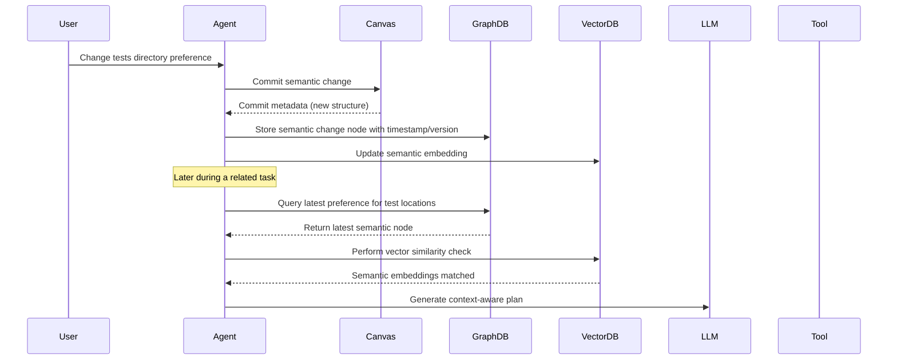
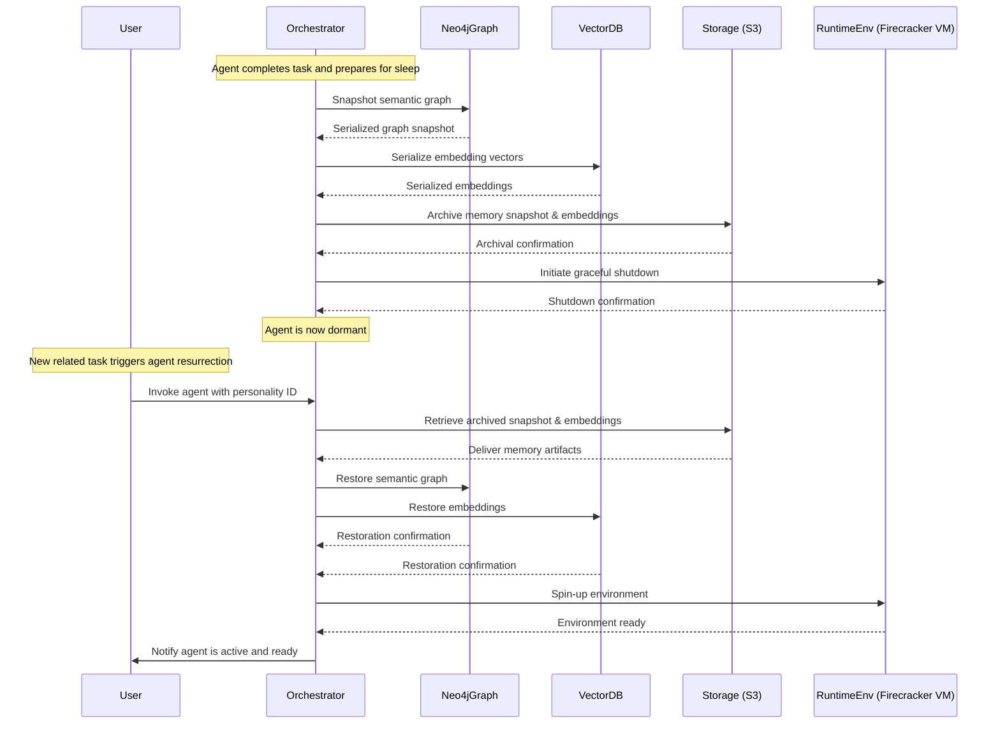

# ADR-0008: Persistent Agent Memory Strategy

## Status
Accepted

> This document replaces the previous version of ADR-0008. The content has been significantly revised to incorporate 
> feedback and improvements based on recent research findings.
> 
> Replaces - [ADR-0008: Persistent Agent Memory Strategy](0008-Persistent_Agent_Memory_Strategy.md)


## Context
Autonomous agents must retain long-lived, queryable memory to:
- Track previously completed tasks
- Remember evolving file structures and semantic context
- Retrieve relationships between source code, features, commits, and goals
- Support long-term interaction continuity and project context

Tinkerbell supports short-term task recovery via WALs but requires a robust, persistent, semantically searchable memory substrate capable of handling memory drift and versioned states.

---

## Decision

We adopt a sophisticated **graph-based memory model** using an embedded **Neo4j-compatible store** combined with vector embeddings to facilitate flexible semantic querying and handle temporal memory drift effectively. The persistent memory explicitly differentiates between:
- **Semantic Memory**: Persistent knowledge and factual data with temporal versioning
- **Episodic Memory**: Event logs and historical context (leveraging WAL)
- **Procedural Memory**: Defined agent capabilities and skills (Rust trait implementations)

### Technical Approach
- Utilize `neo4rs` or `bolt-client` Rust Neo4j clients for graph storage
- Combine semantic graph with vector embeddings (local vector DB) for enriched retrieval
- Implement structured temporal versioning of semantic knowledge:
```plaintext
(:Fact {version, timestamp})-[:UPDATED_BY]->(:Fact)
(:File)-[:CONTAINS]->(:Function)-[:CALLS]->(:Function)
(:Commit)-[:MODIFIES]->(:File)
(:LLMPlan)-[:PROPOSED]->(:Patch)
```

### Memory Ingestion Events
- On each canvas commit
- On tool metadata extraction (AST analysis, symbol indexing)
- Upon LLM plan acceptance
- At task completion (archiving task, plan, and version updates)
- Upon explicit semantic changes (directory structure preferences, conventions)

### Memory Query Events
- During LLM planning: semantic and episodic queries for historical and current states
- During code diffing and refactoring: retrieve semantic neighbors, module dependencies
- For meta-reviews and decision-chain explanations

---

## Sequence Diagram: Persistent Memory with Temporal Drift Handling



---

## Rationale

### 🧠 Comprehensive Memory Management
- Differentiates clearly between semantic, episodic, procedural memory types
- Addresses common failure modes observed in LangChain, Claude, and Gemini

### 🔍 Advanced Semantic and Temporal Querying
- Version-aware retrieval allows handling temporal drift and memory evolution explicitly
- Integrates semantic graph and vector embeddings for nuanced querying

### 📆 Handling Temporal Drift
- Versioned memory ensures clarity on current and historical states
- Decision-chains document why current semantic states differ from historical ones

### 💾 Robust and Extensible
- Supports integration with external vector databases or clustering tools
- Graph and embeddings complement LLM-guided reasoning and introspection

---

## 💤 Sleep and Resurrection of FAR Systems

### Context & Motivation

In large-scale agentic runtimes, computational resources must be efficiently managed. Agents often have episodic active periods followed by dormancy. To enable efficient resource utilization, Tinkerbell FAR systems can enter a **sleep state**, allowing resource deallocation, and later be seamlessly **resurrected** with full memory integrity and context restored.

This approach dramatically reduces infrastructure costs and enables agents to scale dynamically across distributed clusters or edge-computing environments.

---

## 🛠️ Detailed Design of Sleep and Resurrection

The concept of Sleep and Resurrection involves clearly defined processes:

### Entering Sleep Mode:

1. **State Snapshotting:**

    * The agent records current semantic, episodic, and procedural memory states.
    * Persistent snapshots are captured via explicit graph and vector database dumps (Neo4j snapshots and serialized vector embeddings).

2. **Archiving Memory and State:**

    * Snapshots and serialized memory structures are stored in a versioned, durable cache such as **AWS S3**, **GCP Cloud Storage**, or similar object storage services.
    * Each memory snapshot is associated with a unique agent "personality" identifier, facilitating future retrieval.

3. **Resource Deallocation:**

    * Agent runtime resources (CPU, RAM, Firecracker VMs) are gracefully shut down or reallocated, leaving the agent fully dormant.

### Resurrection Process:

1. **Memory Retrieval and Rehydration:**

    * Upon task invocation or explicit resurrection request, the orchestrator identifies the relevant archived memory snapshot from cache storage.
    * Vector embeddings and semantic graphs are pulled from storage and restored into their respective stores (Neo4j and vector database).

2. **State Validation and Warm-up:**

    * Memory is revalidated, confirming schema integrity and ensuring compatibility with the current runtime version.
    * Procedural memory (skills registry) is reloaded and verified.

3. **Agent Activation:**

    * Agent runtime resources (Firecracker VM, process environment) are spun up, fully reconstructing the agent's runtime state.
    * The agent signals readiness upon successful state restoration, resuming operations seamlessly from the preserved memory state.

---

## 🔄 Archiving and Caching Strategy for Vector DBs

### Archiving on Task Completion:

* At task conclusion, memory states relevant to the agent’s "personality" are explicitly versioned and archived, along with relevant metadata (task identifiers, timestamps, decision chains).
* Archiving frequency and version granularity are configurable per task type or agent role.

### Efficient Retrieval:

* Archived vector embeddings and graph snapshots are tagged with semantic identifiers to facilitate quick and precise restoration.
* Differential archives (incremental changes rather than full dumps) are considered for performance optimization.

### Use of Shared Memory:

* Common semantic facts and procedural knowledge across multiple agents are stored as shared memory artifacts in centralized caches or vector stores.
* Agents access shared embeddings and semantic graphs, reducing redundancy and storage overhead, and ensuring consistency in large, distributed, multi-skilled agent systems.

---

## 🕸️ Distributed Multi-Agent Memory Coordination

In distributed multi-skilled environments, individual agents must leverage common experiences and shared knowledge to operate cohesively. The following strategies will ensure consistency and scalability:

### Centralized Shared Memory:

* Commonly accessed semantic facts, skills, or episodic experiences are stored centrally and accessed on-demand.
* Distributed caches (e.g., Redis, Cloudflare KV, or CDN-based storage) optimize retrieval latency.

### Hierarchical Memory Structures:

* Individual agent memories act as overlays or "diffs" on top of shared central memories.
* Agents maintain a local cache of frequently accessed memories to minimize network overhead.

### Memory Consistency and Conflict Resolution:

* Conflict resolution strategies such as timestamp-based consistency (LWW - Last Write Wins) or semantic merging are explicitly defined.
* Distributed agents regularly synchronize with centralized memories or subscribe to update streams via pub/sub mechanisms (Kafka, Redis Streams).

---

## 🎯 Example Scenario – Practical Illustration

**Scenario:**
An agent tasked with complex codebase refactoring completes its work and becomes dormant. Later, a related refactoring project arises, requiring the resurrection of the agent to leverage its prior knowledge:

1. The agent's semantic and episodic memories related to the original refactoring task are archived in S3.
2. On the new task trigger, Tinkerbell’s orchestrator:

    * Pulls the archived vector embeddings and Neo4j snapshots.
    * Restores memory state and procedural skills in a freshly instantiated Firecracker runtime environment.
3. The resurrected agent immediately leverages previously archived semantic knowledge and procedural expertise, significantly accelerating the new task’s completion.

---

## 📊 Enhanced Sequence Diagram: Sleep and Resurrection



---

## 🚀 Anticipated Industry Impact and Rationale

### Groundbreaking Capabilities:

* Enables efficient use of computational resources through practical sleep-resurrection mechanisms, a capability currently underserved in industry-standard agentic systems.
* Facilitates multi-agent collaboration through sophisticated shared-memory handling, significantly advancing the state of agentic architectures.
* Delivers industry-leading solutions to persistent memory management, temporal drift, and semantic versioning, setting benchmarks for agent runtime design.

### Clear Industry Leadership Potential:

* This design significantly surpasses existing approaches (LangChain, Gemini, Claude) by explicitly managing memory dormancy, shared experiences, and resurrection integrity.
* Pioneers comprehensive handling of semantic evolution and multi-agent consistency, addressing fundamental industry-wide shortcomings in agent systems.

---

## 🔖 Consequences and Considerations:

* Increased complexity in memory management due to sophisticated versioning and archiving mechanisms.
* Enhanced requirements for infrastructure (storage and bandwidth for caching operations).
* Increased necessity for clear governance and conflict resolution strategies in shared memory architectures.
* Requires clearly defined memory versioning and garbage collection strategies
* Introduces complexity via integration of vector embeddings with graph structures
* Demands explicit LLM prompts to manage and utilize temporal memory effectively
* Requires tooling for visualizing temporal memory evolution for debugging and auditing
* CI must validate comprehensive memory ingestion, retrieval, and drift handling

---

## Alternatives Considered

- **Flat JSON index**: Poor semantic and temporal querying capabilities
- **SQLite**: Limited graph traversal and semantic embedding integration
- **In-memory vector stores only**: Insufficient for complex semantic versioning and drift


---

**This comprehensive approach positions Tinkerbell not only as a powerful and robust autonomous runtime but as an innovative leader addressing critical and previously neglected aspects of autonomous agentic memory management and lifecycle handling.**


## Comparative Analysis
| **Feature**                             | **LangChain** | **Claude** | **Gemini** | **Tinkerbell**                |
|:----------------------------------------|:-------------:|:----------:|:----------:|:------------------------------|
| Semantic Memory                        | ✔️            | ✔️         | ✔️         | ✔️ *(Enhanced)*                |
| Episodic Memory                        | Limited       | ❌         | ❌         | ✔️ *(WAL-based)*               |
| Procedural Memory                      | ❌            | ❌         | ❌         | ✔️                             |
| Temporal Drift Handling                | ❌            | ❌         | ❌         | ✔️                             |
| Integrated Graph + Vector Store        | Limited       | ❌         | Limited    | ✔️ *(Robust)*                  |
| Sleep and Resurrection Mechanism       | ❌            | ❌         | ❌         | ✔️ *(Innovative)*              |
| Shared Memory Coordination             | ❌            | ❌         | ❌         | ✔️ *(Advanced)*                |
| Versioned Memory States                | ❌            | ❌         | ❌         | ✔️ *(Industry-leading)*        |
| Decision Chains for Semantic Evolution | ❌            | ❌         | ❌         | ✔️ *(Explicit)*                |
| Vector Embedding Integration           | Limited       | ❌         | Limited    | ✔️ *(Advanced)*                |
| Semantic Querying                      | Limited       | ❌         | Limited    | ✔️ *(Nuanced)*                 |

---

## Related Documents
- [ADR-0005: Virtual Canvas and GitOps Strategy](adr_0005_virtual_canvas_gitops.md)
- [Tinkerbell System Architecture](../whitepapers/Tinkerbell%20System%20Architecture%20and%20Design%20Overview.md)

---

## Adopted
This ADR is accepted as of June 2025. Tinkerbell will persist task-aware memory using an advanced semantic graph and embedding database designed explicitly to handle evolving semantic states and temporal memory drift, supporting robust LLM-guided reasoning and introspection.

Maintainers: `@casibbald`, `@microscaler-team`
