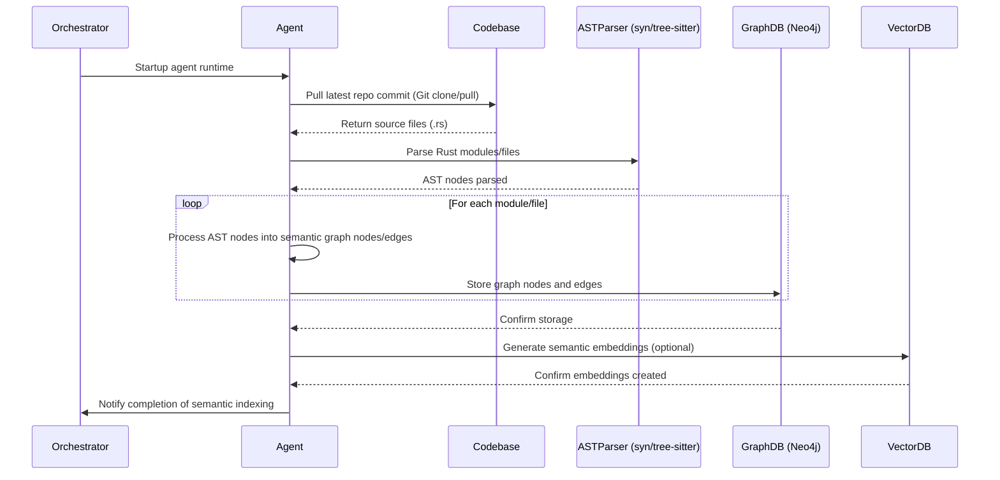
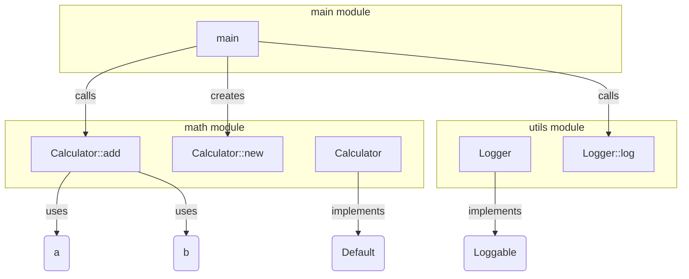

# ADR-0009: Code Structure Graph and Symbol Analysis

## Status

Proposed

## Context

Autonomous agentic runtimes require a deep semantic understanding of source code to accurately generate, refactor, and maintain software. Current solutions (e.g., LangChain, Gemini CLI) fall short by only supporting shallow AST parsing or basic text-based analysis. They often fail to precisely track dependencies, symbol references, and code semantics, severely limiting their usefulness in complex codebases.

Key issues in existing systems:

* **Limited semantic depth**: Most systems only parse code superficially, leading to weak refactoring or impact analysis.
* **Poor symbol and dependency tracking**: Imprecise or absent tracking of code structure, resulting in repetitive errors and brittle agent behavior.
* **Weak refactoring intelligence**: Without semantic relationships, agents struggle to produce reliable and robust code modifications.

## Decision

We adopt a rigorous, graph-based **Code Structure Graph strategy**, leveraging Neo4j alongside advanced AST parsing and symbol resolution libraries to capture comprehensive semantic and structural relationships.

### Technical Implementation

* **AST Parsing**: Utilize Rust’s `syn` crate and `tree-sitter` for multi-language support (Rust, Python, TypeScript).
* **Graph Mapping**: Map parsed AST nodes to a semantic graph model stored in Neo4j.
* **Symbol Indexing**: Explicit indexing of functions, structs, traits, variables, and their dependencies.
* **Integration with Git and Canvas**: Link semantic graph elements directly to commits and canvas-generated patches.

### Semantic Graph Schema (Detailed):

```plaintext
(:Module)-[:DEFINES]->(:Struct|:Enum|:Trait|:Function)
(:Struct)-[:IMPLEMENTS]->(:Trait)
(:Function)-[:CALLS]->(:Function)
(:Function)-[:USES]->(:Struct|:Variable)
(:File)-[:CONTAINS]->(:Module)
(:Commit)-[:MODIFIES]->(:File|:Symbol)
(:Patch)-[:PROPOSED_CHANGE]->(:Symbol)
```

---

## 🔄 Sequence Diagram: Codebase Parsing and Graph Generation



---

## 🛠️ Practical Mock Example: Simple Rust Codebase

Imagine a simple Rust project consisting of three modules:

**Structure:**

```
src/
├── main.rs
├── math/
│   ├── mod.rs
│   └── calculator.rs
└── utils.rs
```

### Example Rust Code (Simplified):

**main.rs**

```rust
mod math;
mod utils;

use math::calculator::Calculator;
use utils::Logger;

fn main() {
    let calc = Calculator::new();
    let result = calc.add(5, 10);
    Logger::log(result);
}
```

**math/calculator.rs**

```rust
pub struct Calculator;

impl Calculator {
    pub fn new() -> Self {
        Calculator
    }

    pub fn add(&self, a: i32, b: i32) -> i32 {
        a + b
    }
}
```

**utils.rs**

```rust
pub struct Logger;

impl Logger {
    pub fn log(value: i32) {
        println!("Result is: {}", value);
    }
}
```

### 📈 Corresponding Semantic Graph Representation:

**Nodes and Relationships:**

* **Modules:** `main`, `math`, `utils`
* **Structs:** `Calculator`, `Logger`
* **Functions/Methods:** `main()`, `Calculator::new()`, `Calculator::add()`, `Logger::log()`

```plaintext
(:Module {name:"main"})-[:USES]->(:Struct {name:"Calculator"})
(:Module {name:"main"})-[:USES]->(:Struct {name:"Logger"})
(:Function {name:"main"})-[:CALLS]->(:Function {name:"Calculator::new"})
(:Function {name:"main"})-[:CALLS]->(:Function {name:"Calculator::add"})
(:Function {name:"main"})-[:CALLS]->(:Function {name:"Logger::log"})

(:Module {name:"math"})-[:DEFINES]->(:Struct {name:"Calculator"})
(:Struct {name:"Calculator"})-[:IMPLEMENTS]->(:Trait {name:"Default"}) // example trait

(:Function {name:"Calculator::add"})-[:USES]->(:Variable {name:"a"})
(:Function {name:"Calculator::add"})-[:USES]->(:Variable {name:"b"})

(:Module {name:"utils"})-[:DEFINES]->(:Struct {name:"Logger"})
(:Struct {name:"Logger"})-[:IMPLEMENTS]->(:Trait {name:"Loggable"}) // example trait
```

### 📊 Visual Representation (Mock):



---

## 🎯 Rationale for Chosen Approach

* **Rich Semantic Understanding:** Clearly captures deep code structures, enabling robust reasoning and refactoring decisions.
* **Enhanced Codebase Navigation:** Enables precise symbol and dependency resolution.
* **Powerful Multi-Language Support:** Supports consistent semantic graphing across multiple programming languages (Rust, Python, TypeScript).
* **Comprehensive Impact Analysis:** Directly supports sophisticated, semantic-aware code changes and refactoring tasks, vastly superior to current AST-only approaches.

---

## 🚨 Consequences & Trade-offs

* **Complexity:** Requires initial investment in AST parsing and semantic mapping infrastructure.
* **Performance Overhead:** Incremental computational cost during parsing and indexing phases.
* **Maintenance:** Requires discipline to maintain accurate semantic graphs through all code changes.

---

## ✅ Alternatives Considered and Dismissed

* **Flat text indexing**: Lacks semantic depth and precise impact analysis.
* **Pure AST analysis without semantic graphing**: Provides limited contextual reasoning.
* **Static code analyzers without graphs**: Lack flexibility and deep semantic relationships needed for robust agentic behaviors.

---

## 🚀 Industry-Leading Capabilities:

This semantic graph and symbol analysis approach positions Tinkerbell to provide an unmatched code-understanding capability, substantially outperforming current agentic systems by enabling sophisticated, semantic reasoning and refactoring.

---

## Next Steps:

With your confirmation, this ADR can be accepted and implemented immediately.

✅ **Ready for review and acceptance.**
