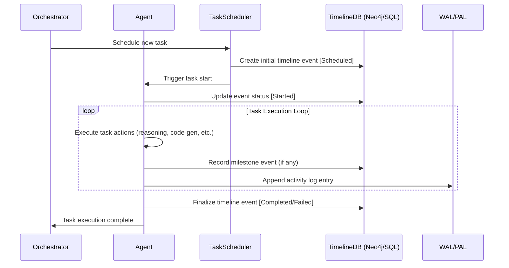

# ADR-0010: Task Plan Timeline and Execution Metadata

## Status

Proposed

---

## Context

Autonomous agentic runtimes must carefully manage, track, and audit their actions over time. Without structured execution metadata and timeline management, it's challenging to:

* Track the execution status of long-running or complex tasks.
* Provide granular insights into past decisions or actions for debugging and auditing purposes.
* Support clear historical querying ("What was done? When? Why?").
* Enable efficient recovery, rollback, or resumption from failure or interruptions.

Current solutions often lack comprehensive task execution metadata or structured timelines, leading to opaque execution histories, difficulty in debugging, and limited traceability.

---

## Decision

We will implement a rigorous **Task Plan Timeline and Execution Metadata strategy** utilizing structured timeline events, detailed metadata, and explicit task execution tracking integrated directly into the agent’s operational lifecycle.

### Technical Implementation

**1. Explicit Task Timeline Management**

* All tasks explicitly record start, intermediate milestones, significant decisions, and completion events to a structured task timeline.
* Tasks maintain status: `Scheduled`, `In-Progress`, `Paused`, `Completed`, `Failed`, `Rolled Back`.

**2. Rich Execution Metadata**
Each task timeline event will store comprehensive metadata, including:

* Timestamp (high-resolution UTC)
* Action description and identifiers
* Agent identity (for multi-agent contexts)
* Codebase snapshot (commit IDs, branch info)
* Canvas patch identifiers (if applicable)
* Associated WAL entries
* Resource metrics (CPU, Memory, Duration)
* Detailed decision-chain reasoning context from the LLM.

**3. Persistent Storage**

* Timeline and metadata entries are durably stored in a structured database (e.g., PostgreSQL, SQLite, or Neo4j).
* Integrated directly with the WAL and PAL mechanisms for durability and fast recovery.

---

## Semantic Timeline Schema (Proposed):

```plaintext
(:Task)-[:HAS_TIMELINE]->(:TimelineEvent)
(:TimelineEvent {
  timestamp: datetime,
  status: string, // Scheduled, Started, Paused, Completed, etc.
  description: string,
  resource_usage: map,
  agent_id: string,
  commit_ref: string,
  patch_id: string,
  wal_entry_id: string,
  reasoning_context: string // LLM decision-chain context
})-[:NEXT_EVENT]->(:TimelineEvent)
```

---

## 🔄 Sequence Diagram: Task Execution Timeline Management



---

## 🛠️ Practical Example Scenario (Mock):

**Example Task:** "Implement User Authentication Module"

**Timeline Events Generated:**

| Timestamp            | Status    | Description                                  | Metadata                                   |
| -------------------- | --------- | -------------------------------------------- | ------------------------------------------ |
| 2025-06-28T09:00:00Z | Scheduled | Task scheduled by Orchestrator               | TaskID, AgentID                            |
| 2025-06-28T09:05:00Z | Started   | Agent began task execution                   | CPU/Mem Initial Metrics                    |
| 2025-06-28T09:15:00Z | Milestone | Generated initial auth module scaffolding    | Commit `f3a5b0`, Canvas Patch `#123`       |
| 2025-06-28T09:30:00Z | Milestone | Completed user login function implementation | Commit `8eac47`, Canvas Patch `#124`       |
| 2025-06-28T09:45:00Z | Paused    | Awaiting manual code review                  | Context: "LLM awaiting external approval"  |
| 2025-06-28T10:30:00Z | Resumed   | Task resumed post-review                     | Approved by: User123                       |
| 2025-06-28T10:45:00Z | Completed | User Authentication Module completed         | Final Commit `ff23d7`, Canvas Patch `#125` |

---

## 🎯 Rationale for Chosen Approach:

* **Complete Transparency and Traceability:**
  Explicit timeline events with metadata enable precise task status tracking and easy debugging or auditing.

* **Enhanced Recovery & Resumption:**
  Granular timeline entries allow tasks to resume precisely from interruptions or failures.

* **Integration with Existing WAL/PAL:**
  Leverages already robust logging and activity tracking mechanisms for durability and state management.

* **Comprehensive Reasoning Context:**
  LLM decision-chain context explicitly stored, ensuring transparency of agent decisions and enabling clear explanations.

---

## 🚨 Consequences and Trade-offs:

* **Increased Metadata Volume:**
  Comprehensive tracking produces higher storage requirements.

* **Performance Overhead:**
  Slight overhead due to frequent timeline writes and database interactions.

* **Complexity in Task State Management:**
  Requires disciplined task lifecycle management and clear rules for event states.

---

## ✅ Alternatives Considered and Dismissed:

* **Event Logs Without Metadata:** Insufficient for detailed task recovery and reasoning transparency.
* **In-memory Tracking Only:** Not durable; poses risks of data loss upon crashes.
* **Separate Timeline Database (Unintegrated):** Increased complexity without clear benefits over integrated solutions.

---

## 🚀 Industry-Leading Capabilities:

This detailed Task Plan Timeline and Execution Metadata strategy significantly enhances agent runtime transparency, debugging capability, and resilience, offering industry-leading visibility into autonomous agentic task execution processes.

---

## Next Steps:

Upon confirmation, this ADR is ready for acceptance and implementation.

✅ **Ready for review and acceptance.**
