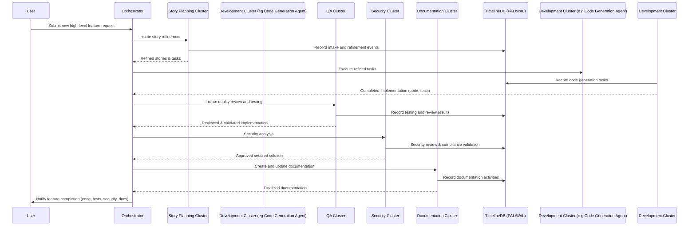

# ADR-0012: Agent Skill System and Hexagonal Skilled Clusters

## Status

Proposed (Future Plan)

---

## Context

Autonomous agentic systems greatly benefit from modular, composable skills to execute complex tasks reliably and flexibly. However, scaling an autonomous runtime to tackle large-scale software development and operational tasks demands not only modular skills within agents but also structured groups of specialized agents organized into coordinated clusters.

Current agent systems often suffer from:

* **Rigid Task Execution:** Monolithic agents cannot dynamically adapt to various complex workflows.
* **Lack of Modularity:** Skills tightly coupled within a single agent limit reuse and flexibility.
* **Limited Composability:** Single-agent systems struggle to dynamically orchestrate multi-skill scenarios effectively.

To address these shortcomings, Tinkerbell's future plans include not only robust modular skill composition but also structured organization of agents into specialized clusters—referred to as **Hexagonal Skilled Clusters**—that simulate distinct human personas or teams in a software development lifecycle.

---

## Decision

We propose the adoption of an **Agent Skill System** complemented by a structured **Hexagonal Skilled Clusters Architecture**.

* Individual agents provide modular, composable "skills" with explicit interfaces.
* Agents are organized into specialized, coordinated clusters, each cluster possessing a unique persona and role, collaborating through clearly defined task hand-off points.

---

## Technical Implementation

### 1. Individual Agent Skill Definition (Rust Trait Example)

Each agent’s capability will be defined explicitly via a Rust trait:

```rust
pub trait AgentSkill {
    fn name(&self) -> &'static str;
    fn description(&self) -> &'static str;

    fn execute(&self, input: SkillInput) -> SkillResult<SkillOutput>;
    fn dependencies(&self) -> Vec<&'static str>;
}
```

### 2. Hexagonal Skilled Clusters Structure

Clusters are composed of multiple FAR agents, each configured with specialized skill sets. Each cluster is orchestrated by a dedicated coordinator agent that manages intra-cluster collaboration and external communication with other clusters.

### 3. Cluster Coordinator Agent

Each cluster includes a dedicated **Coordinator Agent**, responsible for:

* Task intake and distribution among agents within the cluster.
* Monitoring skill execution status and progress.
* Ensuring effective inter-cluster task hand-offs.
* Aggregating results, reporting progress, and handling task completion signals.

---

## 🛠️ Practical Example: Hexagonal Skilled Clusters

### Cluster Examples and their Skills:

#### 1. 📚 Story Planning & Refinement Cluster:

* **Skills**:

  * Research and Information Gathering
  * Story Expansion and Refinement
  * GitHub Issue & Project Board Management
  * Estimation and Prioritization
  * Dependency Mapping
* **Persona**: Product Manager / Analyst
* **Responsibilities**: Intake raw user requests, refine into well-defined actionable tasks, and hand-off to development clusters.

#### 2. ✅ QA & Code Review Cluster:

* **Skills**:

  * Automated Code Review
  * Test Generation and Execution
  * Functional Testing
  * Regression Analysis
* **Persona**: Quality Assurance Engineer
* **Responsibilities**: Review developed solutions, provide detailed feedback, validate and ensure quality standards before hand-off to security or documentation clusters.

#### 3. 🔐 Security Cluster:

* **Skills**:

  * Vulnerability Scanning and Assessment
  * Secure Code Analysis
  * Compliance and Policy Validation
  * Threat Modeling
* **Persona**: Security Engineer
* **Responsibilities**: Validate code and architecture for vulnerabilities, compliance issues, and risks, hand-off secured solutions for final documentation or deployment.

#### 4. 📖 Documentation Authoring Cluster:

* **Skills**:

  * Technical Writing and Summarization
  * Markdown and Documentation Structuring
  * DocBook Generation and Maintenance
* **Persona**: Technical Writer
* **Responsibilities**: Create comprehensive documentation reflecting the finalized implementation, ensure continuous documentation updates, and maintain docbooks.

---

## 🔄 Enhanced Sequence Diagram: Hexagonal Cluster Workflow



---

## 🎯 Rationale for Chosen Approach

* **Clear Team-like Organization**: Explicit personas in clusters match real-world software teams, easing human-agent collaboration.
* **Enhanced Specialization and Depth**: Each cluster deeply specializes in its tasks, improving quality and reliability.
* **Scalable and Modular Organization**: Clusters can be independently scaled or enhanced without major disruptions to other agent groups.
* **Transparent Workflow**: Clear inter-cluster hand-offs provide transparency, easy debugging, and auditability.

---

## 🚨 Consequences and Trade-offs

* **Complex Orchestration**: Coordinating multiple specialized clusters introduces additional complexity.
* **Initial Setup Effort**: Defining clear cluster boundaries, hand-offs, and coordinator logic requires upfront effort.
* **Communication Overhead**: Inter-cluster communication introduces minor latency overhead.

---

## ✅ Alternatives Considered and Dismissed

* **Single Generalist Agents**: Poor scalability and limited depth in specialized tasks.
* **Static Workflow Pipelines**: Lack adaptability and dynamic responsiveness to evolving task requirements.
* **Fully Decentralized Agent Model (no coordinators)**: Complexity of peer-to-peer communication and reduced traceability.

---

## 🚀 Industry-Leading Capabilities

The introduction of specialized, persona-driven Hexagonal Skilled Clusters will significantly elevate Tinkerbell’s capabilities beyond current industry practices, providing a uniquely scalable, modular, and human-like collaborative agent runtime.

---

## Next Steps:

Upon review and confirmation, this enhanced ADR is ready for acceptance, detailed design, and implementation planning.

✅ **Ready for review and acceptance.**
