# ADR-0016: Filesystem Socket Protocol for CLI and Node-level FAR Orchestration

## Status

Proposed

---

## Context

Tinkerbell's **Firecracker Agentic Runtime (FAR)** requires robust management of agent lifecycles across hardware nodes. Each hardware node will run a lightweight orchestrator daemon (**Flintlock**) to handle lifecycle events (start, sleep, resurrect, forced sleep). To achieve local efficiency, secure communication, and scalability, a structured Filesystem Socket Protocol via Unix Domain Sockets is necessary.

This design includes explicit lifecycle states and local node orchestrators communicating with a central orchestrator, ensuring responsiveness, scalability, and operational transparency.

* Difficulty scaling agent lifecycle operations centrally.
* Unreliable or latent management responses due to centralized control overhead.
* Limited ability for responsive node-level decisions (agent sleep, resurrection, blocked states).
* 
---

## Decision

We adopt a structured, secure, and efficient **Filesystem Socket Protocol** for local FAR agent lifecycle management, leveraging a **Flintlock daemon** on each node. Moreover, we aim to reuse, extend, or contribute to **Flintlock's Flintlock** project for microVM orchestration, significantly reducing internal complexity and development overhead.

This design enables:

* Efficient local node management (agent startup, sleep, resurrection).
* Scalable cluster orchestration with minimal central overhead.
* Highly responsive local decision-making.
* Explicit, secure communication channels for agent management and lifecycle coordination.

---

## Technical Implementation

### 1. Node-Level Flintlock Daemon Responsibilities

The local Flintlock orchestrator daemon is responsible for:

* Listening via Unix Domain Socket (`/var/run/Flintlock.sock`) for local commands.
* Communicating securely with the central orchestrator for task and lifecycle management.
* Managing FAR agent lifecycle events explicitly (start, sleep, forced sleep, resurrection).
* Integrating directly with **Flintlock** for efficient MicroVM orchestration.

### 2. Filesystem Socket Protocol Specification

Communication is secured and structured via **Unix Domain Sockets** for local efficiency and security.

**Socket Path:**

```plaintext
/var/run/Flintlock.sock
```

**Command Message Structure (JSON):**

```json
{
  "action": "start|sleep|force_sleep|resurrect|status",
  "agent_id": "agent-uuid-1234",
  "parameters": {
    "task_id": "task-uuid-5678",
    "resource_limits": {"cpu": 2, "memory_mb": 2048}
  }
}
```

### 3. Flintlock Integration Strategy

Given the complexity and scope, Flintlock provides critical functionality for MicroVM lifecycle management. A systematic evaluation was conducted to consider reuse and contribution to Flintlock.

```json
{
  "agent_id": "agent-uuid-1234",
  "status": "acknowledged|completed|error",
  "message": "Detailed status or error message here"
}
```

### 3. Agent Lifecycle and State Management

Agents manage lifecycle transitions explicitly, supported by detailed state management:

* **Active**: Agent actively executing tasks.
* **Sleeping**: Agent voluntarily or forced into sleep; minimal resource consumption.
* **Resurrecting**: Agent rehydrated from cached memory (S3 or local cache) back to active state.
* **Blocked**: Agent awaiting human or another agent’s input.

### 4. Central Orchestrator and Job Queues

The central orchestrator maintains high-level coordination:

* Job queueing (task management and dispatch).
* Monitoring agent status across compute blades.
* Dispatching commands to node orchestrators (Flintlock) based on workload and resource utilization.
* Aggregating and reporting cluster-wide metrics and logs.

## 🔗 Evaluation and Integration with Flintlock

### Overview of Flintlock Project

**[Flintlock](https://github.com/Flintlock-dev/flintlock)** is an open-source, scalable MicroVM orchestrator specifically designed to manage Firecracker MicroVMs. Flintlock offers:

* Declarative YAML-based VM definitions.
* Built-in lifecycle management (start, pause, resume, delete).
* Resource allocation control (CPU, memory, storage, network).
* Secure isolated execution and orchestration via REST APIs and Unix Domain Sockets.

### Requirements Mapping

Explicit mapping of Tinkerbell's FAR requirements to Flintlock's capabilities:

| Requirement                                     | Flintlock Support | Notes and Actions Required                                     |
| ----------------------------------------------- | ----------------- | -------------------------------------------------------------- |
| Firecracker MicroVM lifecycle management        | ✅                 | Fully supported                                                |
| Secure Unix Domain Socket interface             | ✅                 | Supported; direct integration possible                         |
| Local orchestrator per hardware node            | ✅                 | Flintlock inherently uses node-local daemons                   |
| Lifecycle states (start, pause, resume)         | ✅                 | Fully supported                                                |
| Extended lifecycle states (sleep, resurrection) | ⚠️ Partial        | Requires custom logic; potential upstream contribution         |
| Integration with Central Orchestrator           | ⚠️ Partial        | REST API available; may need extensions (gRPC or RPC)          |
| Cached memory/state management via S3           | ⚠️ Partial        | Snapshotting supported; S3 integration might need contribution |
| Resource-aware scheduling and enforcement       | ✅                 | Explicitly defined resource constraints supported              |

---

## Recommended Decision Path

Given Flintlock meets the majority of our needs:

* **Preferred:**

    * Engage early with Flintlock maintainers to explore upstream contributions.
    * Clearly outline specific lifecycle state extensions required by Tinkerbell (e.g., sleep, resurrect logic, state caching via S3).
    * Actively contribute our enhancements back to the Flintlock project, ensuring community alignment and mutual benefit.

* **Fallback:**

    * If upstream collaboration proves challenging, maintain an internal fork or create compatible plugins/extensions, ensuring minimal divergence from Flintlock’s mainline codebase.

---

## 🔄 System Architecture with Flintlock Integration

```mermaid
graph TD
    subgraph Central Orchestrator Cluster
        CentralOrchestrator["🌐 Central Orchestrator"]
        JobQueue[🗃️ Job Queue]
        MetricsDB[(📊 Metrics & Logs)]
        CentralOrchestrator --> JobQueue
        CentralOrchestrator --> MetricsDB
    end

    subgraph Compute Blade Node
        direction TB
        Flintlock["💧 Flintlock Daemon (Node Orchestrator)"]
        Socket[/📡 Unix Domain Socket/]
        Flintlock["🧩 Flintlock MicroVM Orchestrator"]
        MicroVM1["🔥 FAR Agent VM #1"]
        MicroVM2["🔥 FAR Agent VM #2"]
        LocalCache[(🗄️ Local Memory Cache)]

        Flintlock --> Socket
        Socket --> Flintlock
        Flintlock --> MicroVM1
        Flintlock --> MicroVM2
        MicroVM1 --> LocalCache
        MicroVM2 --> LocalCache
    end

    subgraph Cloud Storage
        S3["📦 S3 Cache Storage"]
    end

    CentralOrchestrator <-->|Secure Channel - mTLS| Flintlock
    Flintlock --> S3
    MicroVM1 --> S3
    MicroVM2 --> S3
```



---

## 🔄 Sequence Diagram: Integrated Flintlock & FAR Agent Management


---

## 🎯 Benefits of Flintlock Integration

* **Significant reduction** in development and maintenance overhead.
* **Improved reliability and maturity** through existing robust implementations.
* **Potential upstream contributions** benefiting the open-source community.
* **Alignment** with industry-leading practices.

---

## 🚨 Trade-offs and Risks

* Dependence on community responsiveness for feature integration.
* Possible delays due to upstream merge processes.
* Complexity in managing internal custom extensions if upstream merges lag.

---

## ✅ Alternatives Considered and Dismissed

* **Building from Scratch**: Extensive time, resource, and reliability trade-offs make this unattractive.
* **Direct Firecracker orchestration without frameworks**: High complexity, reduced maintainability, and operational overhead.

---

## 📌 Immediate Recommended Action Items

* **Engage** the Flintlock project maintainers early to gauge interest and align roadmaps.
* **Clearly document** Tinkerbell’s extended lifecycle states and caching mechanisms to facilitate community discussion.
* **Prototype** preliminary integrations in a fork or branch to validate feasibility before significant investment.

---

## 🚀 Industry-Leading Capabilities

Integrating Flintlock ensures Tinkerbell benefits from industry-leading orchestration capabilities, reliability, and community-driven extensibility. This positions Tinkerbell to lead with a highly scalable, robust, and secure FAR infrastructure.

---

## Next Steps

Upon your confirmation, ADR-0016 enriched with Flintlock integration considerations is now ready for immediate acceptance and implementation planning.

✅ **Ready for final review and acceptance.**
