# 🎤 **Tinkerbell: Autonomous Agentic Development**

**Engineering the Future of Intelligent Software**

---

## Slide 1: 🚀 **Introduction (2 mins)**

* **What is Tinkerbell?**

    * Autonomous agentic runtime.
    * Semantic, intelligent, scalable software development.
* **Mission:**
  *"To revolutionize how autonomous software agents build, refactor, and maintain complex software systems."*

### Speaker Notes:

* **Start strong:**
  "Imagine a world where software doesn't just follow instructions but intelligently anticipates developer needs and collaboratively builds, maintains, and refactors itself."

* **Define the Vision:**
  "Tinkerbell is designed as an open-source Autonomous Agentic Development system, fundamentally reimagining how we leverage intelligent agents to build software."

* **Briefly introduce your role and why you're excited:**
  "I'm thrilled to share our vision and invite you all to join and shape this groundbreaking project."

---

## Slide 2: ⚙️ **Why Tinkerbell? (3 mins)**

**Limitations of current agentic systems:**

* Large-context models are expensive, stale quickly, and struggle with reasoning depth.
* Hard to debug, low transparency, limited auditability.
* Resource-heavy with limited scalability.

**Tinkerbell’s unique approach:**

* Semantic reasoning & explicit memory management.
* Specialized, clustered FAR agents.
* Scalable Kubernetes-based orchestration & intelligent multi-LLM routing.

### Speaker Notes:

* **Highlight current challenges:**
  "Current agentic systems like Gemini-cli are impressive in scale but face severe challenges: massive context windows rapidly become outdated, expensive, and lack transparency."

* **Clearly present our solution:**
  "Tinkerbell moves beyond brute-force approaches, introducing structured semantic reasoning, specialized FAR agent clusters, and Kubernetes-based scalability—addressing all major shortcomings of today's agentic systems."

---

## Slide 3: 🧩 **Core Architectural Innovations (5 mins)**

* **Semantic Memory (Neo4j + VectorDB)**
* **Micro-Commit GitOps**
* **Hexagonal Skill Clusters**
* **Kubernetes & Firecracker MicroVM orchestration**
* **Intelligent LLM Router (GenAI)**
* **Advanced Observability (Prometheus, Tracing)**

### Speaker Notes:

* **Quickly introduce each innovation with enthusiasm:**

    * "Semantic Memory" — "Think of it as the agent’s long-term brain, carefully structured and always up-to-date."
    * "Micro-Commit GitOps" — "Each incremental step is auditable, transparent, and precise."
    * "Specialized Clusters" — "Teams of specialized agents perform tasks like human personas, dramatically enhancing output quality."
    * "Kubernetes & Firecracker" — "Scalable orchestration and robust isolation—fast, secure, and efficient."
    * "Intelligent LLM Routing" — "Optimally choosing the right model every time for maximum performance."
    * "Advanced Observability" — "Unprecedented transparency into the system’s inner workings."

---

## Slide 4: 📊 **System Architecture Overview (3 mins)**

*Simple diagram focusing on clarity:*

```mermaid
graph TD
    FAR_Controller["🚦 Kubernetes FAR Controller"]
    SkillClusters["🧩 Hexagonal Skill Clusters"]
    Liquidmetal["💧 Liquidmetal (Node orchestration)"]
    Flintlock["🔥 Flintlock + Firecracker MicroVMs"]
    SemanticMemory["📚 Semantic Memory + VectorDB"]
    GenAIRouter["🧭 Multi-LLM Router"]

    FAR_Controller --> SkillClusters
    SkillClusters --> Liquidmetal
    Liquidmetal --> Flintlock
    Flintlock --> SemanticMemory
    Flintlock --> GenAIRouter
```

### Speaker Notes:

* **Provide clear overview:**
  "Here you can see how each part of Tinkerbell fits seamlessly together—combining semantic memory, specialized skill clusters, Kubernetes orchestration, and intelligent LLM routing."

* **Simplify narrative:**
  "Tasks flow smoothly from high-level Kubernetes controllers, through node orchestration, into isolated FAR agents that execute intelligently and transparently."

* **Highlight coherence and synergy:**
  "This carefully designed architecture ensures unmatched scalability, precision, and reliability."

---

## Slide 5: 🎯 **Key Advantages vs Large-context LLMs (3 mins)**

| Capability          | Gemini-cli (1M token) | 🔥 **Tinkerbell**                        |
| ------------------- | --------------------- | ---------------------------------------- |
| Context handling    | 🔸 Flat context       | ✅ Semantic & structured                  |
| Reasoning precision | 🔸 Moderate           | ✅ High (clusters)                        |
| Auditability        | 🔸 Low                | ✅ High (structured logs & micro-commits) |
| Scalability         | ❌ Resource heavy      | ✅ Kubernetes & MicroVMs                  |
| Multi-LLM           | ❌ Single-model        | ✅ Flexible routing                       |

### Speaker Notes:

* **Direct comparison:**
  "Unlike large-context agents like Gemini-cli, Tinkerbell provides clear advantages—structured context management, high precision reasoning, scalable infrastructure, and superior transparency."

* **Give practical examples:**
  "For example, debugging in Tinkerbell is as simple as tracing clear, structured logs and semantic micro-commits—something nearly impossible with opaque token-based contexts."

---

## Slide 6: 👥 **Open-Source & Governance (3 mins)**

* **Transparent ADR-driven design**
* **Structured contributions**:

    * Maintainers (vision, releases)
    * Reviewers (code quality, PRs)
    * Contributors (code, docs, issues)
* **Clear PR & escalation paths**
* **Open, welcoming community**

### Speaker Notes:

* **Encourage community participation:**
  "We believe in transparency and open collaboration. Our structured governance clearly defines roles—maintainers, reviewers, and contributors—ensuring everyone's contribution matters and is valued."

* **Highlight inclusivity and support:**
  "No matter your experience level, there’s a meaningful way to get involved and directly shape Tinkerbell’s future."

---

## Slide 7: 📈 **Observability and Debugging (2 mins)**

* **Structured Prometheus Metrics**
  (Clear, actionable dashboards)
* **Advanced Rust Tracing**
  (Hierarchical span structure for deep debugging)
* **Transparent logs**
  (Structured logging for operational excellence)

### Speaker Notes:

* **Explain importance of observability:**
  "We take observability very seriously. Tinkerbell offers structured Prometheus metrics and detailed Rust tracing, empowering developers to deeply understand and improve system behavior."

* **Stress simplicity in complexity:**
  "Even though the system is sophisticated, it remains clear and transparent—making debugging straightforward."

---

## Slide 8: 🌱 **Roadmap Highlights (2 mins)**

* Advanced backup & disaster recovery
* Secrets, authentication, authorization
* Performance & scalability optimizations
* Compliance & regulatory alignment
* Cost efficiency & resource budgeting

### Speaker Notes:

* **Outline exciting future improvements:**
  "We're actively expanding Tinkerbell’s capabilities—strengthening security, refining scalability, improving cost efficiency, and ensuring regulatory compliance."

* **Invite participation:**
  "This roadmap is ambitious, and we'd love your ideas, input, and contributions to help us realize it."

---

## Slide 9: 🛠️ **How You Can Contribute (2 mins)**

* Core feature development (Rust)
* Kubernetes controller implementation
* Semantic memory (Neo4j, VectorDB)
* Multi-LLM integration
* Observability tools (Prometheus, Grafana)
* Documentation & community engagement

**We welcome all skill levels: from first-time contributors to senior engineers.**

### Speaker Notes:

* **Clearly state your invitation:**
  "We warmly welcome your skills and creativity. From developing new features in Rust, contributing to our Kubernetes controller, optimizing semantic memory, or enhancing observability—there’s a perfect role for everyone."

* **Stress open door policy:**
  "Whether you're a seasoned engineer or making your first open-source contribution, we're here to support and guide you every step of the way."

---

## Slide 10: 🚀 **Join the Tinkerbell Revolution! (3 mins)**

* **GitHub:** [github.com/microscaler/tinkerbell](https://github.com/microscaler/tinkerbell)
* **Open Discussions & Issues:**
  Engage, explore, and start contributing today!
* **Community:**
  A supportive, inclusive, and collaborative environment.

**Together, let’s redefine how intelligent software is created.**

### Speaker Notes:

* **End with excitement and invitation:**
  "Tinkerbell isn't just about building software; it's about fundamentally transforming how intelligent systems can work together collaboratively and autonomously."

* **Highlight the ease of joining:**
  "Visit us on GitHub—join the discussion, open an issue, or submit your first PR today."

* **Strong final call to action:**
  "Together, let's build the future of autonomous software development. We can't wait to see what you'll create!"

---

## 🎯 **Final Thoughts & Q\&A**

*(Remaining time \~5 mins)*
Invite audience interaction, answer questions, and encourage immediate community involvement.

## 🚩 **Speaker Notes (General Advice):**

* Focus on high-level advantages clearly, quickly.
* Emphasize collaboration and community values.
* Encourage questions and engagement actively.
* Direct audience clearly to GitHub for immediate onboarding.

* **Encourage immediate interaction:**
  "I'd love to answer your questions or discuss how you can get started contributing today."

* **Show enthusiasm and openness:**
  "Feel free to reach out any time after this talk—I’m always excited to chat about the future we’re building together."

---

