# 🎤 **Tiffany: Autonomous Agentic Development**

**Engineering the Future of Intelligent Software**

---

## Slide 1: 🚀 **Introduction (2 mins)**

* **What is Tiffany?**

    * Autonomous agentic runtime.
    * Semantic, intelligent, scalable software development.
* **Mission:**
  *"To revolutionize how autonomous software agents build, refactor, and maintain complex software systems."*

---

## Slide 2: ⚙️ **Why Tiffany? (3 mins)**

**Limitations of current agentic systems:**

* Large-context models are expensive, stale quickly, and struggle with reasoning depth.
* Hard to debug, low transparency, limited auditability.
* Resource-heavy with limited scalability.

**Tiffany’s unique approach:**

* Semantic reasoning & explicit memory management.
* Specialized, clustered FAR agents.
* Scalable Kubernetes-based orchestration & intelligent multi-LLM routing.

---

## Slide 3: 🧩 **Core Architectural Innovations (5 mins)**

* **Semantic Memory (Neo4j + VectorDB)**
* **Micro-Commit GitOps**
* **Hexagonal Skill Clusters**
* **Kubernetes & Firecracker MicroVM orchestration**
* **Intelligent LLM Router (GenAI)**
* **Advanced Observability (Prometheus, Tracing)**

---

## Slide 4: 📊 **System Architecture Overview (3 mins)**

*Simple diagram focusing on clarity:*

```mermaid
graph TD
    FAR_Controller["🚦 Kubernetes FAR Controller"]
    SkillClusters["🧩 Hexagonal Skill Clusters"]
    Liquidmetal["💧 Liquidmetal (Node orchestration)"]
    Flintlock["🔥 Flintlock + Firecracker MicroVMs"]
    SemanticMemory["📚 Semantic Memory + VectorDB"]
    GenAIRouter["🧭 Multi-LLM Router"]

    FAR_Controller --> SkillClusters
    SkillClusters --> Liquidmetal
    Liquidmetal --> Flintlock
    Flintlock --> SemanticMemory
    Flintlock --> GenAIRouter
```

---

## Slide 5: 🎯 **Key Advantages vs Large-context LLMs (3 mins)**

| Capability          | Gemini-cli (1M token) | 🔥 **Tiffany**                        |
| ------------------- | --------------------- | ---------------------------------------- |
| Context handling    | 🔸 Flat context       | ✅ Semantic & structured                  |
| Reasoning precision | 🔸 Moderate           | ✅ High (clusters)                        |
| Auditability        | 🔸 Low                | ✅ High (structured logs & micro-commits) |
| Scalability         | ❌ Resource heavy      | ✅ Kubernetes & MicroVMs                  |
| Multi-LLM           | ❌ Single-model        | ✅ Flexible routing                       |

---

## Slide 6: 👥 **Open-Source & Governance (3 mins)**

* **Transparent ADR-driven design**
* **Structured contributions**:

    * Maintainers (vision, releases)
    * Reviewers (code quality, PRs)
    * Contributors (code, docs, issues)
* **Clear PR & escalation paths**
* **Open, welcoming community**

---

## Slide 7: 📈 **Observability and Debugging (2 mins)**

* **Structured Prometheus Metrics**
  (Clear, actionable dashboards)
* **Advanced Rust Tracing**
  (Hierarchical span structure for deep debugging)
* **Transparent logs**
  (Structured logging for operational excellence)

---

## Slide 8: 🌱 **Roadmap Highlights (2 mins)**

* Advanced backup & disaster recovery
* Secrets, authentication, authorization
* Performance & scalability optimizations
* Compliance & regulatory alignment
* Cost efficiency & resource budgeting

---

## Slide 9: 🛠️ **How You Can Contribute (2 mins)**

* Core feature development (Rust)
* Kubernetes controller implementation
* Semantic memory (Neo4j, VectorDB)
* Multi-LLM integration
* Observability tools (Prometheus, Grafana)
* Documentation & community engagement

**We welcome all skill levels: from first-time contributors to senior engineers.**

---

## Slide 10: 🚀 **Join the Tiffany Revolution! (3 mins)**

* **GitHub:** [github.com/microscaler/tiffany](https://github.com/microscaler/tiffany)
* **Open Discussions & Issues:**
  Engage, explore, and start contributing today!
* **Community:**
  A supportive, inclusive, and collaborative environment.

**Together, let’s redefine how intelligent software is created.**

---

## 🎯 **Final Thoughts & Q\&A**

*(Remaining time \~5 mins)*
Invite audience interaction, answer questions, and encourage immediate community involvement.

---

## 🚩 **Speaker Notes (General Advice):**

* Focus on high-level advantages clearly, quickly.
* Emphasize collaboration and community values.
* Encourage questions and engagement actively.
* Direct audience clearly to GitHub for immediate onboarding.

**Presentation Tips:**

* **Stay enthusiastic**—your excitement will inspire others.
* **Use simple, clear language**—make your audience feel comfortable, included, and motivated.
* **Emphasize practical benefits**—clearly connect architectural choices to real-world outcomes.
* **Always invite questions and contributions**—make audience members feel valuable and capable of making a difference.

---

Let me know if you’d like to refine or expand specific slides further, or if you'd prefer I convert this into a PDF or Google Slides presentation for immediate use.
