### Diagram D1 – Basic Task Switching (ReadyQueue only)

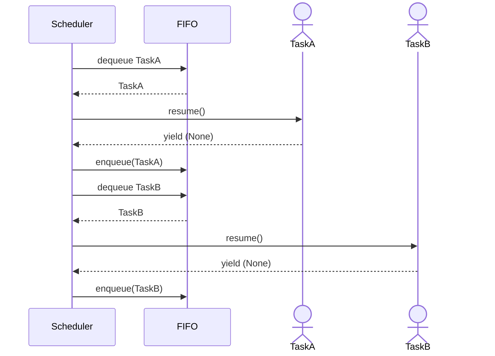

### Diagram D2 – Nested Coroutines (Trampolining)

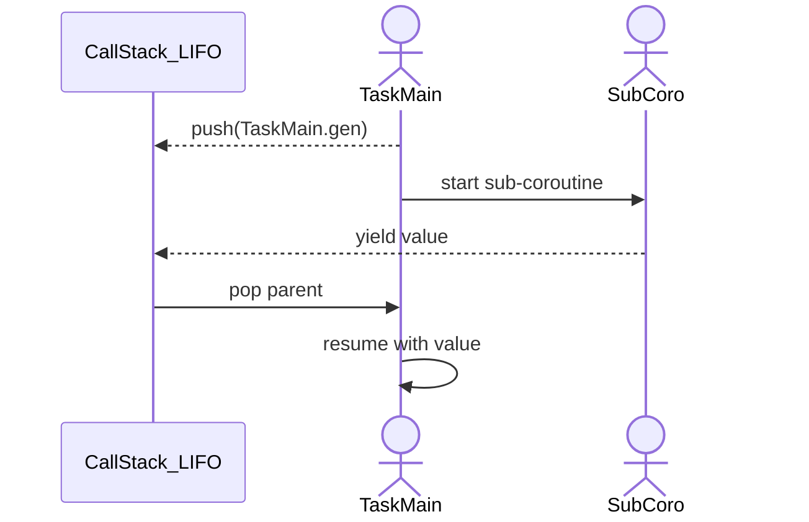

### Diagram D3 – I/O Blocking and Wakeup

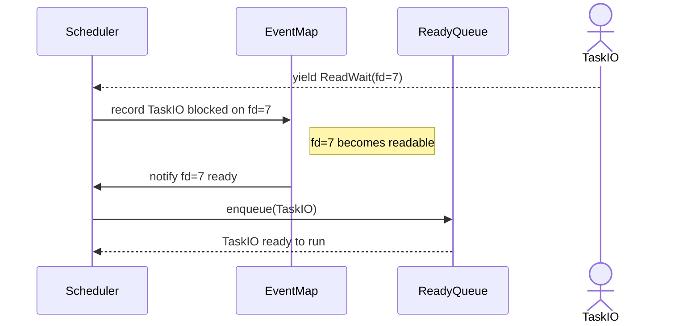

### Diagram D4 – Sleep Timer
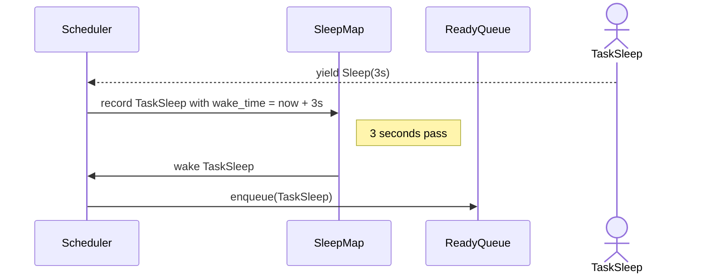

### Diagram D5 – Join / WaitTask
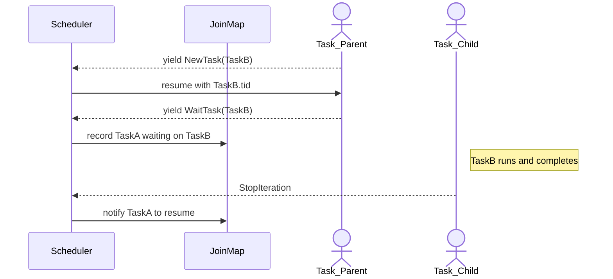

### ✅ Agent Task Graph (Per Agent / DAG View)

Type: graph TD (or flowchart TD)
Purpose: Visualize how one FAR agent's current task decomposes into subtasks, dependencies, joins, etc.

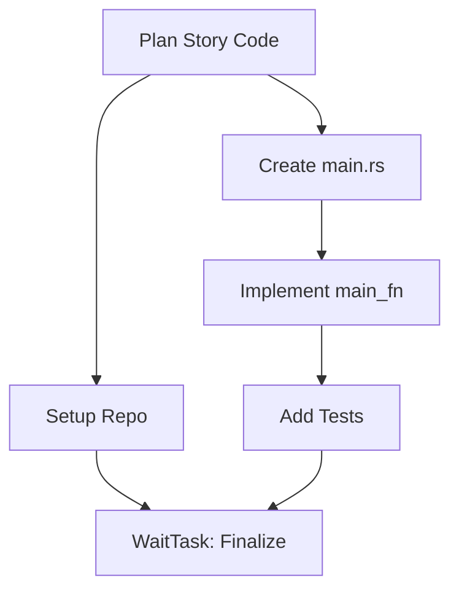

### ✅ FAR Cluster View: Distributed Agents & Scheduler

Type: graph LR or flowchart LR
Purpose: Show how agents across blades interact with a central orchestrator + local schedulers

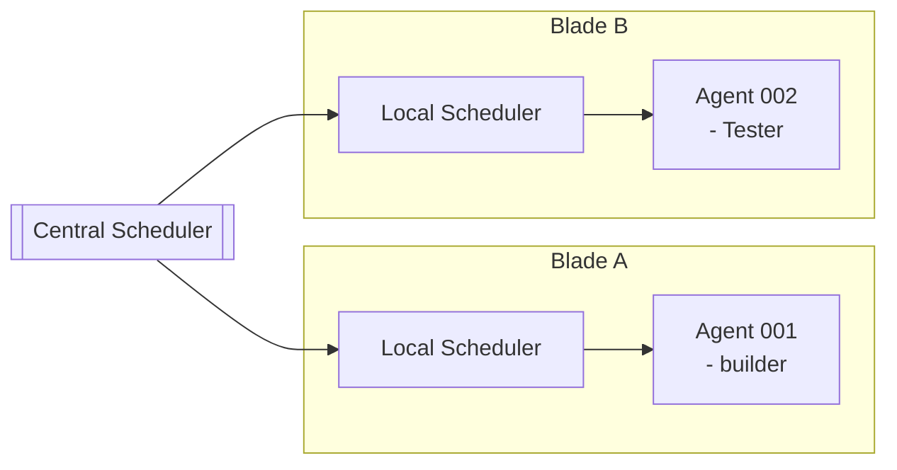

### ✅ Skill Invocation Trace (ReAct-aware timeline)

Purpose: Show how a ReAct loop invokes skills with context, yields, retries, and memory access

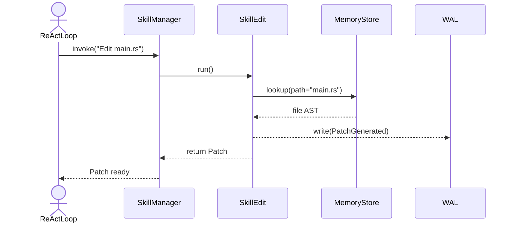

✅ 11. Agent Memory Structure (Graph + Vector)

Purpose: Show semantic and episodic memory layers, link to disk/durable store

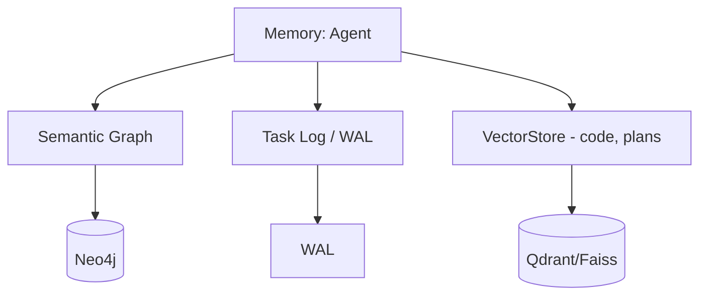

✅ 12. Coroutines Timeline (Concurrent Task Steps)

Purpose: Show wall-clock execution of several tasks with yield/resume gaps

```mermaid
gantt
    title Task Concurrency Timeline
    dateFormat  HH:mm:ss
    section Task_Main
    run      :active, 00:00:00, 5s
    sleep    : 00:00:05, 3s
    resume   : 00:00:08, 4s
    section Task_Sub
    start    :active, 00:00:02, 3s
    block_io : 00:00:05, 4s
    finish   : 00:00:09, 2s

```

✅ System Call Map

Purpose: Visualize all supported system calls and their dispatch targets (WAL, IO, Scheduler)

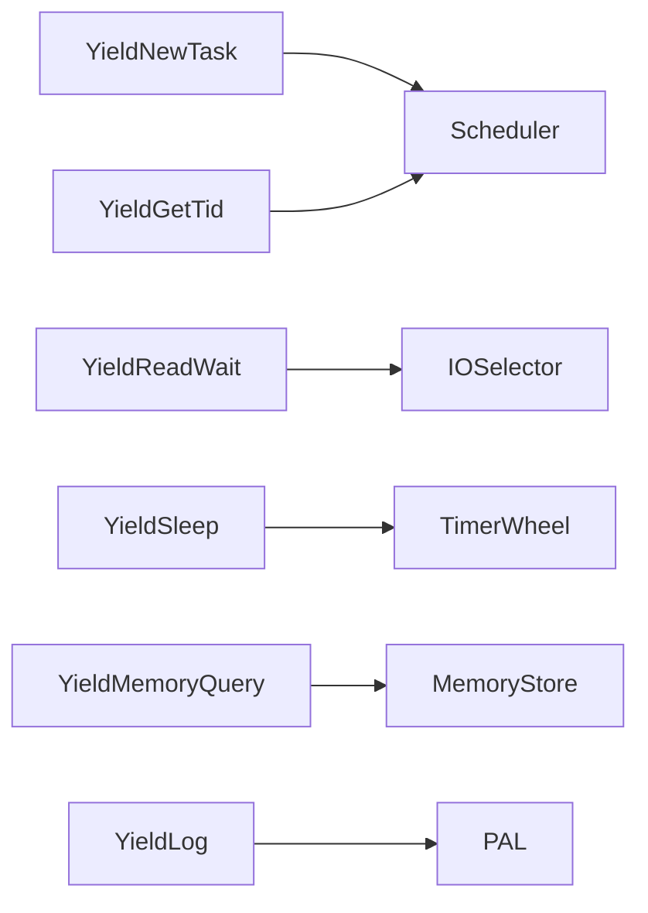

✅ Task WAL Replayer Flow

Purpose: Shows how the replay engine reconstructs a task from the WAL stream, rehydrating state and optionally stepping through each yield point.

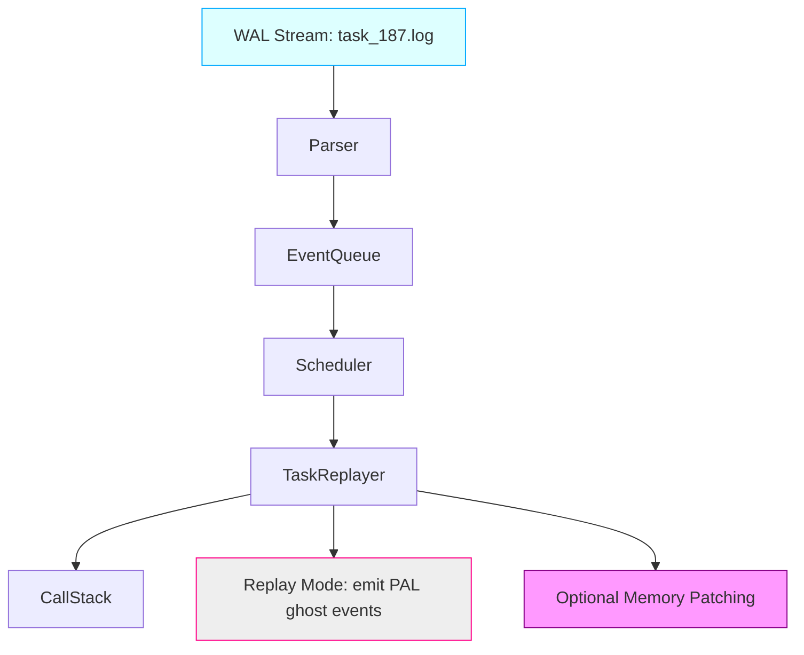

✅ Panic Propagation via Wait/Join Graph

Purpose: If a child task panics, show how the error might propagate to parent or dependents if not isolated.

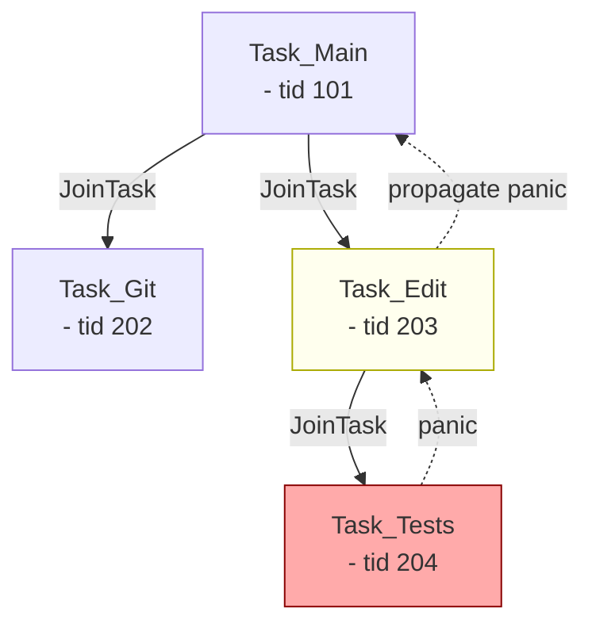

✅ Bonus 3: Skill Invocation Heatmap

Purpose: Visualize which system tools/skills are being used most frequently, based on PAL telemetry stream.

```mermaid
graph LR
    Skill_Edit["📝 Edit File"]:::hot
    Skill_Grep["🔍 Grep"]:::warm
    Skill_Test["✅ Run Tests"]:::hot
    Skill_Git["🌿 Git Ops"]:::warm
    Skill_Plan["🧠 Plan/Refactor"]:::cold
    Skill_Fmt["🧹 Format Code"]:::cold

    style Skill_Edit fill:#f88,stroke:#800
    style Skill_Test fill:#f88,stroke:#800
    style Skill_Grep fill:#fb6,stroke:#aa0
    style Skill_Git fill:#fb6,stroke:#aa0
    style Skill_Plan fill:#ccf,stroke:#44f
    style Skill_Fmt fill:#ccf,stroke:#44f

```

