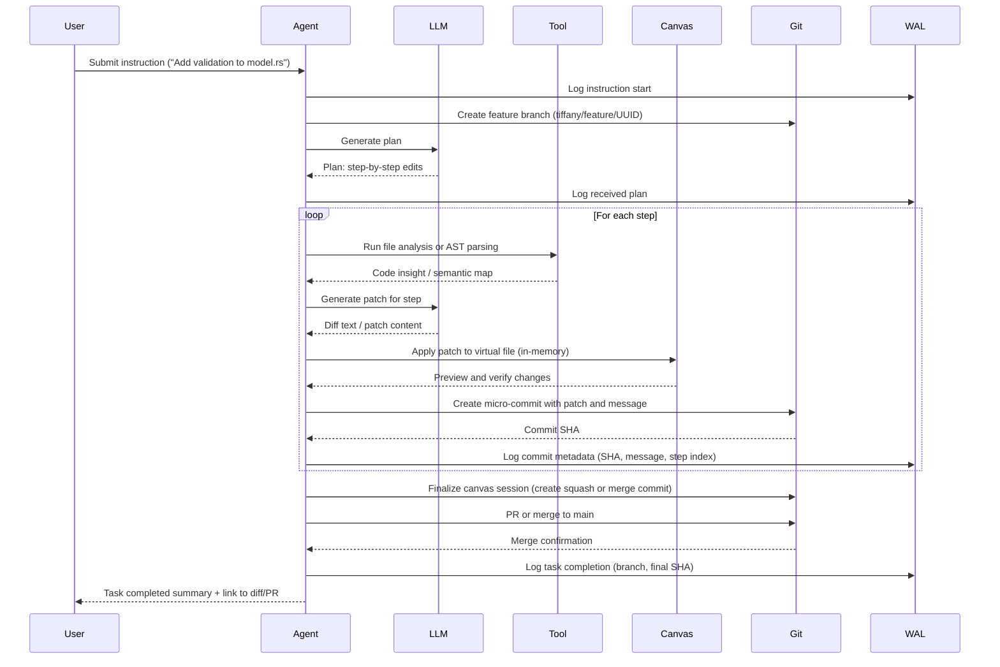

# ADR-0005: Virtual Canvas and GitOps Strategy

## Status
Accepted

## Context
Tiffany agents execute reasoning and action loops that produce edits to codebases and configuration files. These changes must be:
- Previewed and isolated in-memory before committing
- Committed to a Git-compatible format for auditing
- Logged as durable steps in the WAL

To achieve this, Tiffany introduces a **Virtual Canvas** that acts as a mutable, ephemeral buffer for applying LLM-generated or tool-generated edits prior to Git integration.

This ADR defines the structure of the virtual canvas, our Git branching strategy, the use of micro-commits, and how patches flow from the canvas into Git and ultimately `main`.

---

## Decision

We will implement a layered model for code manipulation:

1. **Virtual Canvas**: An in-memory, coroutine-driven buffer representing the current working state of one or more files.
2. **Micro-Commits**: Every semantic patch results in a discrete Git commit on a feature branch.
3. **Feature Branching**: Each agent task operates in its own `tiffany/feature/<UUID>` branch.
4. **Merge Strategy**: Upon successful completion, the feature branch is squash-merged or PR’d into `main`.
5. **Git Library**: All Git interaction is performed using `git2-rs` for deterministic, auditable patching.

---

## Virtual Canvas Design

- Operates entirely in-memory until confirmed
- Supports diffing, rollback, and preview
- Backed by a `CanvasSession` object scoped to a task
- All changes are isolated from working directory until explicitly committed

### Canvas Operations:
- `open(path)` – read file into memory
- `apply_patch(diff)` – apply semantic LLM-generated patch
- `preview()` – show colored diff
- `commit(message)` – commit to feature branch using `git2`

---

## GitOps Model

```text
main
 └── tiffany/feature/<UUID>
      ├── commit: plan step 1
      ├── commit: plan step 2
      └── commit: plan step N

→ squash or PR to `main`
```

### Commit Strategy:
- All commits are generated via `canvas.commit_patch()`
- Each commit includes WAL entry with:
  - Commit SHA
  - Patch summary
  - Task context ID

---

## Detailed Canvas + GitOps Sequence Diagram



---

## Rationale

### 🔄 Replayable & Auditable
- Every commit is logged
- Every patch can be replayed or reversed
- Canvas preserves pre-patch and post-patch state

### 🧪 Deterministic Dev Flows
- No accidental edits to main
- Always-on safety net via branch isolation

### 🤝 GitOps Native
- Easy to inspect with `git log`, `git diff`
- Pull request compatible
- Supports GitHub, GitLab, or local Git workflows

### 🧰 Contributor Enablement
- Canvas acts as an IDE-like abstraction for patch composition
- Crate developers can test diffs before accepting

---

## Consequences

- Canvas must support consistent formatting (e.g., via `rustfmt`) to minimize noisy diffs
- Canvas state must serialize and deserialize cleanly
- WAL must include patch commit metadata
- `git2-rs` must be safely abstracted to avoid unsafe writes to `.git`
- On crash, canvas diffs must be recoverable from WAL replay

---

## Alternatives Considered

- **Direct file edits**: Unsafe, hard to roll back, impossible to diff safely
- **Persistent working tree clone**: Heavyweight, unnecessary complexity
- **Separate repo per task**: Too fragmented, breaks GitOps continuity

---

## Related Documents
- [ADR-0004: Agent Loop and ReAct Design](adr_0004_agent_loop_react.md)
- [Tiffany System Architecture](../whitepapers/Tiffany%20System%20Architecture%20and%20Design%20Overview.md)

---

## Adopted
This ADR is accepted as of June 2025. All code transformations initiated by agents will operate through a Virtual Canvas and commit semantic micro-steps to a task-scoped feature branch.

Maintainers: `@casibbald`, `@microscaler-team`
