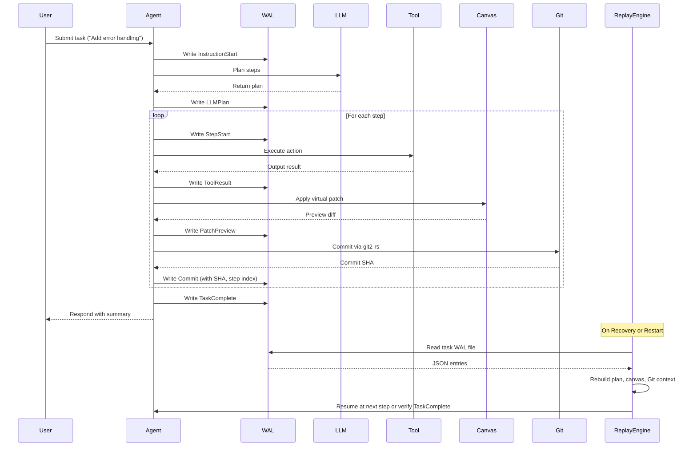

# ADR-0006: WAL Schema and Replay Policy

## Status
Accepted

## Context
The Write-Ahead Log (WAL) in Tiffany provides durable, append-only storage for agent activity, execution steps, and Git-integrated state transitions. It is a core component in ensuring fault tolerance, crash recovery, and task auditability.

As the Tiffany agent runtime handles multiple concurrent tasks, LLM responses, tool invocations, and virtual canvas operations, the WAL must encode enough structured information to allow:
- Resuming interrupted tasks
- Replaying task progress deterministically
- Cross-checking Git commit state and canvas deltas

This ADR defines the structure, persistence policy, replay semantics, and integrity guarantees of the WAL.

---

## Decision

We adopt a structured, JSON-encoded, append-only WAL system with the following characteristics:

### WAL File Format
- File-based, append-only per task context (e.g. `wal/<uuid>.wal`)
- Each line is a valid JSON object (`serde_json::to_writer`)
- Log entries are versioned via a top-level `"v"` field

### WAL Entry Types
```json
{
  "v": 1,
  "ts": "2025-06-27T15:48:00Z",
  "type": "InstructionStart",
  "task_id": "uuid",
  "instruction": "Add validation to model.rs"
}
```

Supported entry types:
- `InstructionStart` — original user input
- `LLMPlan` — response from LLM with plan steps
- `StepStart` — beginning of a plan step
- `ToolResult` — tool output or error
- `PatchPreview` — virtual diff preview
- `Commit` — Git commit metadata (SHA, message)
- `TaskComplete` — signal of end of task (with success/failure)
- `ShutdownMarker` — graceful termination marker

### Storage Model
- Each agent task has a dedicated WAL file
- Optionally streamed to external durable store (e.g. S3, versioned blob)
- Index is built in-memory on load for efficient lookup

### Flush Policy
- WAL entries are fsynced after each write
- Entries are buffered briefly for I/O optimization, but never cached in-memory only

---

## Replay Semantics

On startup or recovery, the WAL replay engine:
- Reads all entries into a memory index
- Validates log ordering and checks for `TaskComplete` or `ShutdownMarker`
- If incomplete, reconstructs TaskState:
  - Current plan
  - Last confirmed step index
  - Last Git SHA
  - Virtual canvas snapshot (if recoverable)

### Recovery Modes
- `resume`: continue from last known state
- `inspect`: dry-run and summarize partial progress
- `replay`: re-run steps for reproducibility / audit

---

## WAL Lifecycle Sequence Diagram



---

## Rationale

### 🔐 Durability & Crash Safety
- WAL ensures no task progress is lost
- Every instruction, LLM plan, tool call, and Git commit is accounted for

### 🧪 Reproducibility
- WAL enables deterministic re-execution of tasks
- Allows audit of LLM decisions, tool usage, and user confirmations

### 🧰 Debug & Forensics
- WAL becomes a source of truth in debugging stuck or incomplete tasks
- WAL diffs explain when/why things diverged from expected flow

### ⚙️ Integration with Canvas & Git
- Each canvas commit references its corresponding WAL entry
- Reconstructing canvas state on restart uses last committed patch snapshot

---

## Consequences

- WAL writer must be thread-safe and coroutine-aware
- Every `AgentTask` must emit structured WAL entries
- On crash or power loss, agent must recover cleanly to last `Commit` or `PatchPreview`
- `cargo test` must include WAL replay + recovery unit tests

---

## Alternatives Considered

- **Single journal file for all tasks**: Difficult to parallelize, isolate, or replay
- **Database-backed log**: Overkill, less portable, breaks GitOps principle
- **Binary format**: More compact, but less debuggable and interoperable than JSON

---

## Related Documents
- [ADR-0005: Virtual Canvas and GitOps Strategy](adr_0005_virtual_canvas_gitops.md)
- [ADR-0004: Agent Loop and ReAct Design](adr_0004_agent_loop_react.md)

---

## Adopted
This ADR is accepted as of June 2025. All agent tasks will be tracked through structured, append-only WAL files to ensure traceability, auditability, and deterministic task recovery.

Maintainers: `@casibbald`, `@microscaler-team