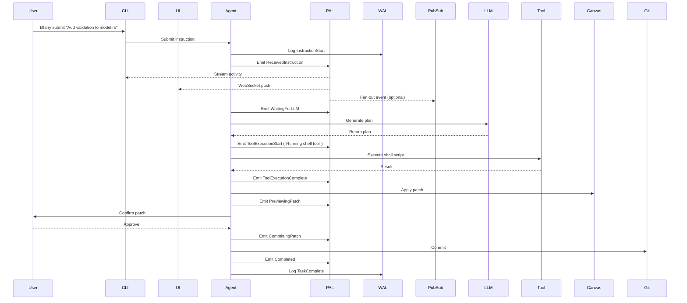

# ADR-0007: Process Activity Log (PAL) and Real-Time Status Stream

## Status
Accepted

## Context
While the Write-Ahead Log (WAL) guarantees task durability and auditability in Tiffany, it is not suited for **real-time observability**. Users and dashboards need visibility into what the system is currently doing — not just what it has already persisted.

To address this, we introduce the **Process Activity Log (PAL)**, a real-time, ephemeral streaming mechanism for broadcasting the active state of each agent task as it progresses through its coroutine lifecycle.

The PAL augments the WAL by offering live introspection into step-level execution, LLM calls, tool activity, patching, and user confirmation — enabling powerful local CLI feedback, remote dashboards, and multi-user observability.

PALs are not commonly implemented in most systems. However, in the context of an agentic runtime with coroutine yield points, explicit steps, and Git-integrated patching, **the value of live process state becomes critically important** for:
- Progress visibility during long-running operations
- Safe human-in-the-loop oversight
- Remote system administration and dashboarding
- Collaborative multi-user environments

---

## Decision

Tiffany will maintain a separate PAL channel per running task, broadcasting structured `ActivityEvent` objects to all connected consumers (CLI, dashboards, logs).

### PAL Characteristics
- Non-durable, ephemeral (not fsynced or written to disk)
- Optimized for streaming, not audit
- Broadcast to:
    - Local CLI (via Unix domain socket)
    - Remote UI (via WebSocket/gRPC stream)
    - Logging adapter (optional)
    - Pub/Sub (e.g., Redis Streams, NATS, Fluvio, etc.)

### Event Schema
```json
{
  "ts": "2025-06-27T16:12:00Z",
  "task_id": "uuid",
  "stage": "ExecutingTool",
  "message": "Running shell: cargo test"
}
```

### PAL Event Types
- `ReceivedInstruction`
- `WaitingForLLM`
- `ToolExecutionStart`
- `ToolExecutionComplete`
- `PreviewingPatch`
- `AwaitingUserApproval`
- `CommittingPatch`
- `Idle`
- `Completed`

### PAL Channel Infrastructure
- Each Tiffany runtime instance will maintain an async broadcast stream (`tokio::broadcast`) for each task
- The CLI and UI connect as **subscribers**, filtered by task ID
- Internal PAL server optionally bridges these into REST, WebSocket, or external pub/sub systems

---

## Sequence Diagram: PAL Streaming in Action



---

## Rationale

### ✅ Real-Time Feedback for Humans
Unlike WALs — which are audit-focused and write-after-the-fact — the PAL is designed to **describe what the agent is doing right now**.

This enables:
- **CLI progress bars, spinners, and log overlays**
- **Remote dashboards that track multiple agents in real time**
- **Streaming logs with contextual status annotations**
- **System admins to monitor all active workloads in the FAR runtime**

### 📟 Pub/Sub Observability
PAL emits can be optionally bridged to:
- Redis Streams
- NATS subjects
- Kafka partitions

This enables:
- Multiple UIs to subscribe to live activity
- Alerting and event-driven monitoring pipelines
- Prometheus exporters to map PAL events to gauge metrics

### 🧩 Complements WAL without Overlapping It
| Feature         | WAL (Write-Ahead Log)             | PAL (Process Activity Log)        |
|----------------|-----------------------------------|-----------------------------------|
| Format         | Append-only, structured JSON      | Broadcast JSON, ephemeral         |
| Scope          | Durable system of record          | Live visibility per active task   |
| Persistence    | Filesystem                        | Memory / socket / stream          |
| Usage          | Replay, recovery, audit           | CLI/UI visibility, status updates |
| Timing         | After the fact                    | Concurrent with step execution    |

---

## Consequences

- Introduces a lightweight PAL layer into each `AgentTask`
- Developers must emit PAL signals at major yield boundaries
- CLI and UI must support PAL subscription and display logic
- Integration tests will include PAL mock subscribers for validation
- PAL memory usage must be bounded (e.g. backpressure if no consumer)

---

## Alternatives Considered

- **Extending WAL with ephemeral events** – Pollutes durability layer; delays update timing
- **Relying on console logs** – Not structured, not streamable, not indexable by UI
- **Polling task status** – Inefficient and fails in multi-user concurrent settings

---

## Related Documents
- [ADR-0006: WAL Schema and Replay Policy](adr_0006_wal_schema_replay.md)
- [ADR-0004: Agent Loop and ReAct Design](adr_0004_agent_loop_react.md)
- [Tiffany System Architecture](../whitepapers/Tiffany%20System%20Architecture%20and%20Design%20Overview.md)

---

## Adopted
This ADR is accepted as of June 2025. All running agent tasks will emit real-time PAL events through an ephemeral pub-sub system to enable responsive CLI feedback, multi-user UI dashboards, and remote introspection.

Maintainers: `@casibbald`, `@microscaler-team`
