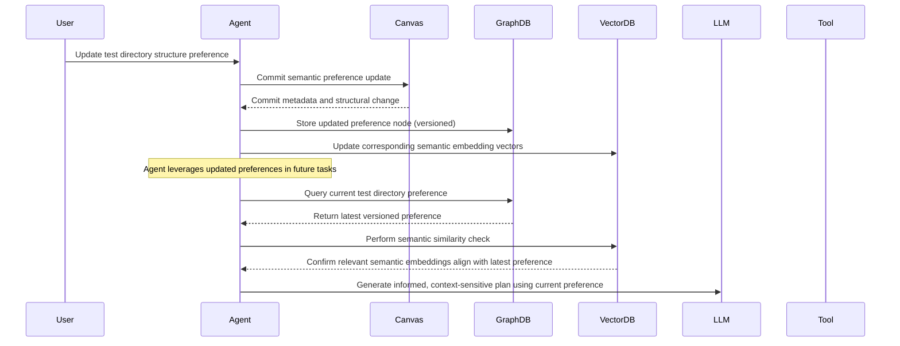

# ADR-0008: Persistent Agent Memory Strategy

## Status

> Please visit the revised version for the latest updates and improvements.
>
> Revised - [ADR-0008: Persistent Agent Memory Strategy](0008-Persistent_Agent_Memory_Strategy_v2.md)

> This document is now deprecated and will not receive further updates.
> The information below is retained for historical context.
> Please refer to the revised version for the most current information.
> The details below are for reference only and may not reflect the latest design decisions.
> This the informaiton in this document is stale and should not be used for current development.

## Context
Autonomous agents face significant challenges maintaining accurate and reliable memory, particularly:
- **Forgetfulness:** Losing context and historical knowledge across sessions.
- **Temporal Drift:** Difficulty adapting to evolving standards and preferences, causing repetitive errors.
- **Limited Reasoning Depth:** Inability to correlate past decisions with current contexts effectively.

Existing agentic systems (LangChain, Claude, Gemini) fail to robustly address these limitations, leading to inconsistent and unreliable agent behaviors, particularly evident in scenarios involving long-term projects and changing development standards.

---

## Design Goals
The Tiffany Persistent Memory Strategy explicitly aims to:
- Provide accurate long-term memory recall across multiple sessions.
- Support dynamic evolution of memory reflecting shifting development preferences and standards.
- Enable sophisticated reasoning that leverages historical decision chains and evolving semantic contexts.
- Integrate semantic graphs with vector embeddings for enhanced semantic similarity querying.
- Address temporal drift through explicit memory versioning and decision-chain tracking.

---

## Decision

We adopt a robust, differentiated **graph-based memory model** leveraging an embedded **Neo4j-compatible store** combined with a local vector database. This sophisticated design facilitates flexible semantic querying and robustly handles temporal memory drift through explicit versioning.

### Memory Types Defined
- **Semantic Memory:** Stores persistent facts, relationships, and semantic knowledge with explicit temporal versioning.
- **Episodic Memory:** Captures historical events and interactions leveraging the WAL structure for detailed context.
- **Procedural Memory:** Encodes actionable agent skills and capabilities through Rust trait implementations.

### Technical Approach
- Utilize Rust Neo4j clients (`neo4rs` or `bolt-client`) for semantic graph storage.
- Combine semantic graphs with local vector embeddings for advanced semantic retrieval.
- Explicit temporal versioning strategy:
```plaintext
(:Fact {version, timestamp})-[:UPDATED_BY]->(:Fact)
(:File)-[:CONTAINS]->(:Function)-[:CALLS]->(:Function)
(:Commit)-[:MODIFIES]->(:File)
(:LLMPlan)-[:PROPOSED]->(:Patch)
```

### Memory Ingestion Events
- On each canvas commit
- During tool metadata extraction (e.g., AST analysis, symbol indexing)
- Upon LLM plan acceptance
- Upon task completion (archiving task, plan, and updating semantic versions)
- During explicit semantic changes (e.g., directory structures, coding conventions)

### Memory Query Events
- During LLM-driven planning: semantic and episodic historical state queries
- During code refactoring and semantic diffing: querying semantic neighbors and dependencies
- For comprehensive meta-review and decision-chain explanations

---

## Practical Example Scenario
Consider a scenario where previously, tests were located in `/tests/*`. A developer updates the directory structure to `/crates/crate_name/tests`. The agent initially continues placing tests incorrectly due to outdated semantic memory. With explicit temporal versioning and decision-chain tracking:
- The agent queries the current semantic preference, retrieves the latest version, and correctly places new tests in `/crates/crate_name/tests`.
- Historical versions of this fact remain accessible, supporting decisions involving legacy code and explaining why changes occurred.

---

## Sequence Diagram: Persistent Memory with Temporal Drift Handling



---

## Rationale

### 🧠 Comprehensive Memory Management
- Explicitly differentiated semantic, episodic, procedural memory types.
- Directly addresses common shortcomings in existing systems like LangChain, Claude, and Gemini.

### 🔍 Advanced Semantic and Temporal Querying
- Enables explicit retrieval of current and historical semantic states.
- Merges graph structures with vector embeddings for intuitive and nuanced semantic retrieval.

### 📆 Robust Handling of Temporal Drift
- Provides clear, versioned memory states, addressing evolving preferences and project standards.
- Decision chains clarify rationale behind semantic evolutions, reducing repeat errors.

### 💾 Industry-Leading Robustness and Extensibility
- Supports scalable integration with external vector databases and clustering solutions.
- Positions Tiffany to lead industry standards by addressing significant agentic memory weaknesses explicitly and comprehensively.

---

## Consequences

- Demands well-defined versioning strategies and explicit garbage collection methods.
- Introduces necessary complexity due to combined graph and embedding storage.
- Requires detailed, context-aware LLM prompting to leverage advanced memory structures.
- Necessitates visualization tools for auditing and debugging temporal memory evolution.
- Implies rigorous CI validation of memory ingestion, querying, and drift management processes.

---

## Alternatives Considered

- **Flat JSON Index:** Insufficient for complex semantic and temporal querying.
- **SQLite:** Inadequate for sophisticated semantic graphs and embedding integrations.
- **Purely Vector-based Solutions:** Fail to provide structured semantic versioning and drift management capabilities.

---

## Comparative Analysis

| Feature                              | LangChain | Claude | Gemini | Tiffany (Proposed) |
|--------------------------------------|-----------|--------|--------|-----------------------|
| Semantic Memory                      | ✔️         | ✔️      | ✔️      | ✔️ (Enhanced, Versioned) |
| Episodic Memory                      | Limited   | ❌      | ❌      | ✔️ (Comprehensive WAL-based) |
| Procedural Memory                    | ❌        | ❌      | ❌      | ✔️                    |
| Explicit Temporal Drift Handling     | ❌        | ❌      | ❌      | ✔️ (Industry-leading) |
| Integrated Semantic Graph + Vectors  | Limited   | ❌      | Limited| ✔️ (Advanced)         |

---

## Related Documents
- [ADR-0005: Virtual Canvas and GitOps Strategy](adr_0005_virtual_canvas_gitops.md)
- [Tiffany System Architecture](../whitepapers/Tiffany%20System%20Architecture%20and%20Design%20Overview.md)

---

## Adopted
This ADR is adopted as of June 2025. The Tiffany persistent memory strategy will leverage a sophisticated semantic graph and embedding model to robustly handle evolving semantic contexts and temporal drift, significantly advancing the state-of-the-art for autonomous agentic systems.

Maintainers: `@casibbald`, `@microscaler-team