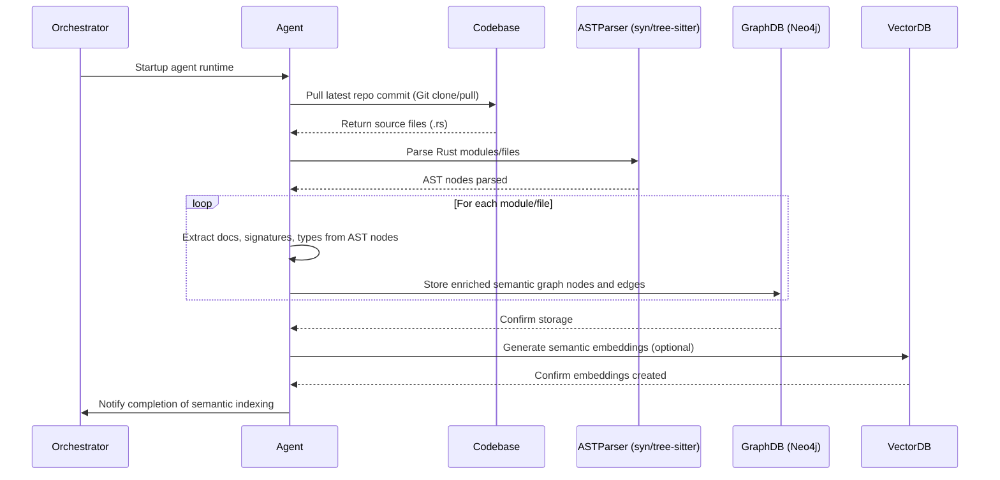
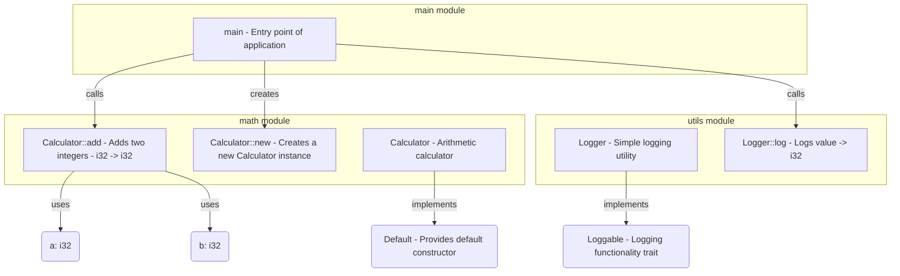

# ADR-0009: Code Structure Graph and Symbol Analysis

## Status

Accepted

## Context

Autonomous agentic runtimes require a deep semantic understanding of source code to accurately generate, refactor, and maintain software. Current solutions (e.g., LangChain, Gemini CLI) fall short by only supporting shallow AST parsing or basic text-based analysis. They often fail to precisely track dependencies, symbol references, and code semantics, severely limiting their usefulness in complex codebases.

Key issues in existing systems:

* **Limited semantic depth**: Most systems only parse code superficially, leading to weak refactoring or impact analysis.
* **Poor symbol and dependency tracking**: Imprecise or absent tracking of code structure, resulting in repetitive errors and brittle agent behavior.
* **Weak refactoring intelligence**: Without semantic relationships, agents struggle to produce reliable and robust code modifications.

## Decision

We adopt a rigorous, graph-based **Code Structure Graph strategy**, leveraging Neo4j alongside advanced AST parsing and symbol resolution libraries to capture comprehensive semantic and structural relationships.

### Technical Implementation

* **AST Parsing**: Utilize Rust’s `syn` crate and `tree-sitter` for multi-language support (Rust, Python, TypeScript).
* **Graph Mapping**: Map parsed AST nodes to a semantic graph model stored in Neo4j.
* **Symbol Indexing**: Explicit indexing of functions, structs, traits, variables, their documentation, types, and signatures.
* **Integration with Git and Canvas**: Link semantic graph elements directly to commits and canvas-generated patches.

### Enhanced Semantic Graph Schema:

```plaintext
(:Module)-[:DEFINES]->(:Struct|:Enum|:Trait|:Function)
(:Struct)-[:IMPLEMENTS]->(:Trait)
(:Function)-[:CALLS]->(:Function)
(:Function)-[:USES]->(:Struct|:Variable)
(:File)-[:CONTAINS]->(:Module)
(:Commit)-[:MODIFIES]->(:File|:Symbol)
(:Patch)-[:PROPOSED_CHANGE]->(:Symbol)

Node attributes:
- docs (parsed documentation comments)
- signature (complete function signature)
- parameters (list of parameter names/types)
- returns (function return type)
- fields (struct or enum fields/types)
```

---

## 🔄 Sequence Diagram: Codebase Parsing and Graph Generation



---

## 🛠️ Practical Mock Example: Simple Rust Codebase (Enhanced)

**main.rs**

```rust
/// Entry point of the application
fn main() {
    let calc = Calculator::new();
    let result = calc.add(5, 10);
    Logger::log(result);
}
```

**math/calculator.rs**

```rust
/// Arithmetic calculator
pub struct Calculator;

impl Calculator {
    /// Creates a new Calculator instance
    pub fn new() -> Self {
        Calculator
    }

    /// Adds two integers together
    pub fn add(&self, a: i32, b: i32) -> i32 {
        a + b
    }
}
```

**utils.rs**

```rust
/// Simple logging utility
pub struct Logger;

impl Logger {
    /// Logs the provided integer value to stdout
    pub fn log(value: i32) {
        println!("Result is: {}", value);
    }
}
```

### 📈 Corresponding Enhanced Semantic Graph Representation:

```plaintext
(:Module {name:"main"})-[:USES]->(:Struct {name:"Calculator"})
(:Module {name:"main"})-[:USES]->(:Struct {name:"Logger"})
(:Function {
    name:"main",
    docs:"Entry point of the application",
    signature:"fn main()",
    parameters:[],
    returns:"()"
})-[:CALLS]->(:Function {name:"Calculator::new"})
  -[:CALLS]->(:Function {name:"Calculator::add"})
  -[:CALLS]->(:Function {name:"Logger::log"})

(:Module {name:"math"})-[:DEFINES]->(:Struct {
    name:"Calculator",
    docs:"Arithmetic calculator",
    fields:[]
})-[:IMPLEMENTS]->(:Trait {name:"Default", docs:"Provides default constructor"})

(:Function {
    name:"Calculator::new",
    docs:"Creates a new Calculator instance",
    signature:"fn new() -> Self",
    parameters:[],
    returns:"Self"
})

(:Function {
    name:"Calculator::add",
    docs:"Adds two integers together",
    signature:"fn add(&self, a: i32, b: i32) -> i32",
    parameters:["&self", "a: i32", "b: i32"],
    returns:"i32"
})-[:USES]->(:Variable {name:"a", type:"i32"})
  -[:USES]->(:Variable {name:"b", type:"i32"})

(:Module {name:"utils"})-[:DEFINES]->(:Struct {
    name:"Logger",
    docs:"Simple logging utility",
    fields:[]
})-[:IMPLEMENTS]->(:Trait {name:"Loggable", docs:"Logging functionality trait"})

(:Function {
    name:"Logger::log",
    docs:"Logs the provided integer value to stdout",
    signature:"fn log(value: i32)",
    parameters:["value: i32"],
    returns:"()"
})
```

### 📊 Visual Representation (Enhanced):


---

## 🎯 Rationale for Chosen Approach (Enhanced)

* **Rich Semantic Understanding:** Captures deep code structures and complete type/documentation details, enabling robust reasoning and refactoring.
* **Enhanced Codebase Navigation:** Precise symbol resolution and dependency tracking using explicit signatures, types, and docs.
* **Powerful Multi-Language Support:** Consistent semantic graphs enriched with detailed metadata across Rust, Python, TypeScript.
* **Comprehensive Impact Analysis:** Supports sophisticated, semantic-aware code changes and refactoring tasks with context-rich metadata.

---

## 🚨 Consequences & Trade-offs (Updated)

* **Complexity:** Requires sophisticated parsing infrastructure for extracting and managing additional metadata.
* **Performance Overhead:** Slightly increased parsing and indexing times due to enriched data storage.
* **Maintenance:** Additional discipline required in maintaining documentation and type accuracy in semantic graphs.

---

## ✅ Alternatives Considered and Dismissed (Updated)

* **Flat text indexing**: Insufficient depth for semantic analysis and lacks type/docs integration.
* **Pure AST analysis without semantic graphing**: Limited contextual metadata and poor semantic querying capability.
* **Static code analyzers without graphs**: Lacks the detailed semantic integration essential for robust agent-driven behaviors.

---

## 🚀 Industry-Leading Capabilities (Reinforced):

This enriched semantic graph strategy positions Tinkerbell as a leader, significantly outperforming current agentic systems by providing unparalleled depth in semantic reasoning, code generation, and refactoring capabilities.

---

