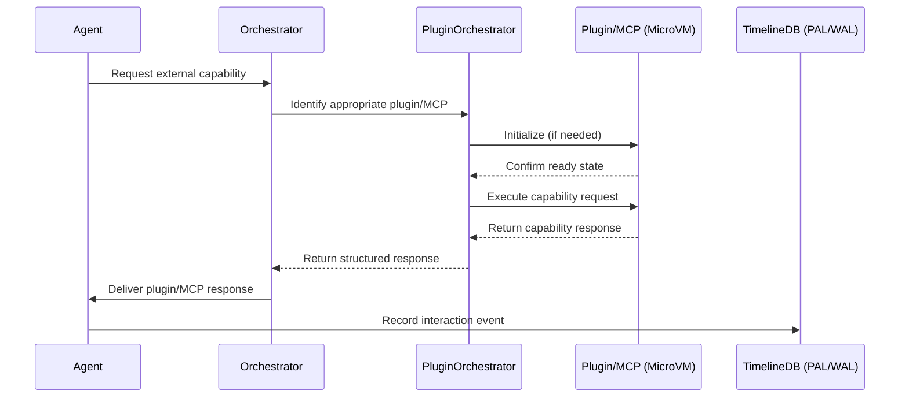

# ADR-0011: Plugin and MCP Tooling Architecture

## Status

Proposed

---

## Context

Autonomous agentic runtimes, such as Tiffany, often require external capabilities to perform specialized tasks. These capabilities could range from internal tooling (e.g., code analysis, semantic graphing) to external Managed Capability Providers (MCPs), such as search services, external APIs, or complex computational tasks.

Existing agentic systems frequently suffer from:

* **Limited Extensibility:** Hardcoded integrations make adding new capabilities difficult or brittle.
* **Security Vulnerabilities:** Direct access to external tools can introduce vulnerabilities or compliance issues.
* **Weak Abstraction Layers:** Inconsistent interfaces across tools complicate maintenance and scalability.

To address these concerns, Tiffany requires a standardized, secure, and extensible plugin architecture for internal tools and external MCPs.

---

## Decision

We will implement a modular and secure **Plugin and MCP Tooling Architecture** using well-defined interfaces, strong isolation, and secure, generic invocation methods.

### Technical Implementation

**1. Uniform Interface Design:**

All plugins and MCPs will adhere to a standardized Rust trait interface, ensuring consistency and interchangeability:

```rust
pub trait CapabilityProvider {
    fn init(&self, config: ProviderConfig) -> ProviderResult<()>;
    fn execute(&self, request: CapabilityRequest) -> ProviderResult<CapabilityResponse>;
    fn shutdown(&self) -> ProviderResult<()>;
}
```

* `ProviderConfig`: Generic configuration for plugin initialization (e.g., API keys, credentials).
* `CapabilityRequest` / `CapabilityResponse`: Generic, structured formats for invoking plugins/MCPs.

**2. Strong Isolation via MicroVMs (Firecracker):**

* Plugins and external MCPs run inside Firecracker MicroVMs, providing strong isolation from the core agent runtime.
* Communication through secured RPC protocols (gRPC or similar) to enforce strict trust boundaries.

**3. Secure Plugin Loading and Lifecycle Management:**

* Plugins and MCPs dynamically loaded at runtime via declarative manifests.
* Explicit versioning and cryptographic signing of plugins for secure and auditable deployments.
* Plugins managed through dedicated orchestrator components enforcing lifecycle policies (start, stop, update, health checks).

**4. Generic Integration and Extensibility:**

* New plugins and MCPs require minimal boilerplate via Rust macros or code generation tools.
* Plugins can be developed externally and integrated seamlessly, enabling community-driven extensibility.

---

## 🔐 Security Model (Detailed)

* **MicroVM Isolation:** Prevents unauthorized access to Tiffany’s core state.
* **RPC with Authentication:** Mutual TLS (mTLS) or token-based authentication between agent core and MCPs/plugins.
* **Minimal Privilege Principle:** Plugins have the least privileges needed for their function.
* **Audit Logging:** All plugin interactions are logged in the WAL/PAL for auditing and debugging.

---

## 🔄 Sequence Diagram: Plugin & MCP Invocation



---

## 🛠️ Practical Example Scenario (Mock):

**Scenario**: "Tiffany agent invoking an external MCP (Google Search MCP) to retrieve information."

**Steps:**

1. Agent requires external information (e.g., "latest Rust async patterns").
2. Orchestrator identifies MCP "GoogleSearch".
3. Plugin orchestrator starts "GoogleSearch" MCP MicroVM instance securely.
4. MCP authenticates request, executes search, returns structured data.
5. Response provided to the agent and logged securely in PAL/WAL.

---

## 🎯 Rationale for Chosen Approach

* **Secure and Robust Isolation:** Firecracker MicroVMs protect the core agent from vulnerabilities in plugins or MCPs.
* **Standardized Interfaces:** Simplify integration, improve maintainability, and accelerate plugin development.
* **Dynamic Extensibility:** Facilitate rapid community involvement and expansion of capabilities.
* **Auditability and Transparency:** Logging and secure interfaces provide transparency for security audits.

---

## 🚨 Consequences and Trade-offs

* **Complexity:** Requires rigorous orchestration and lifecycle management infrastructure.
* **Performance Overhead:** Slight overhead from secure RPC and MicroVM initialization.
* **Learning Curve:** Contributors must learn standardized interfaces and security mechanisms.

---

## ✅ Alternatives Considered and Dismissed

* **Direct Integration Without Isolation:** High security risk and brittle integrations.
* **Docker Containers:** Higher resource consumption and complexity than lightweight Firecracker VMs.
* **Static Plugin Compilation:** Limited runtime flexibility and extensibility.

---

## 🚀 Industry-Leading Capabilities

This secure, isolated, and extensible plugin and MCP architecture positions Tiffany at the forefront of autonomous agentic runtime solutions, significantly exceeding current industry practices in modularity, security, and scalability.

---

## Next Steps:

Upon confirmation, this ADR is ready for review and immediate implementation.

✅ **Ready for review and acceptance.**
