Here's a detailed initial draft of **ADR-0013: Firecracker MicroVM Integration**, tailored specifically to Tiffany's sophisticated requirements for isolation, security, and performance:

---

# ADR-0013: Firecracker MicroVM Integration

## Status

Proposed

---

## Context

Autonomous agentic runtimes executing arbitrary tasks and capabilities require robust isolation, secure execution environments, and efficient resource management. Traditional containerization or bare-metal execution lacks the necessary security boundaries and resource predictability, making them unsuitable for complex, multi-tenant agentic systems.

Currently, many agent runtimes rely on less isolated execution models such as containers (Docker) or shared process spaces, resulting in:

* **Weaker isolation:** Increased risk from malicious or faulty code impacting the runtime.
* **Resource contention:** Less predictable performance and resource management.
* **Limited security:** Higher vulnerability surface due to shared kernel namespaces.

To mitigate these limitations, Tiffany requires a highly secure, performant, and isolated runtime environment for executing tasks and managing plugins and MCPs.

Tiffany’s requirements:
* **Robust Security and Isolation** Critical for arbitrary code and external MCP execution.
* **Predictable Resource Allocation** Reliable and consistent performance.
* **Scalable Infrastructure** Efficiently support clusters of FAR agents distributed across hardware nodes.
* **Flexible LLM Routing** Efficient, flexible LLM execution via a separate gen-AI router to multiple LLM instances.

---

## Decision

We adopt **Firecracker MicroVMs** for secure, performant, isolated FAR agent execution, coupled with a clustered deployment of compute blades, a dedicated LLM routing cluster, and integrated caching mechanisms.

Firecracker provides:

* Minimalist, fast, lightweight virtual machines.
* Strong security isolation (via hardware virtualization and KVM).
* Efficient resource allocation and deterministic resource constraints.
* Enhanced auditability and detailed execution monitoring.

---

## Technical Implementation

### 1. VM Lifecycle Management

**Explicit lifecycle stages** will be managed via a dedicated orchestrator component:

* **VM Initialization:** Launch Firecracker VM with specific kernel and minimal root filesystem.
* **Capability Injection:** Dynamically inject required capabilities, plugins, or task contexts via a secure RPC interface at VM boot.
* **Execution Monitoring:** Continuous health checks, resource monitoring, and metrics gathering.
* **VM Termination:** Graceful or forced shutdown upon task completion or timeout, securely discarding VM resources.

### 2. Execution Isolation and Security Model

Firecracker enforces:

* **Hardware Virtualization (KVM-based):** Strong isolation preventing shared kernel attacks.
* **Minimal Kernel and Root FS:** Vastly reduced attack surface (minimal Alpine or customized microkernel image).
* **Immutable VM Images:** Using pre-built, minimal images ensures no unauthorized modification during execution.
* **Secure RPC Communication:** mTLS or token-based authentication between agent orchestrator and VM.

### 3. Resource Constraints & Predictability

Explicit resource constraints set per VM include:

* **CPU and Memory Limits:** Predictable resource allocation per task.
* **Network Isolation:** Dedicated virtual NICs per VM with strict firewall rules.
* **Filesystem Isolation:** Ephemeral disk storage per VM, discarded post-execution.

### 4. Auditability and Execution Transparency

All VM executions are logged explicitly, including resource usage metrics, status, and termination details, recorded in PAL/WAL databases.

🚀 Detailed Infrastructure Diagram

```mermaid
graph TD
    subgraph Human Interaction
        User[👤 Developer/User] --> UI["🌐 Kubernetes-hosted UI"]
        UI --> Backend[🔧 Backend APIs]
        Backend --> DB[(🛢️ PostgreSQL)]
    end

    subgraph FAR Compute Blade Cluster
        direction TB
        Blade1[🖥️ Blade 1]
        Blade2[🖥️ Blade 2]
        Blade3[🖥️ Blade 3]
        Blade4[🖥️ Blade 4]
        Blade5[🖥️ Blade 5]
        Blade6[🖥️ Blade 6]
        Blade7[🖥️ Blade 7]
        Blade8[🖥️ Blade 8]

        Blade1 --> VM11["🔥 Firecracker VM (FAR Agent)"]
        Blade1 --> VM12["🔥 Firecracker VM (FAR Agent)"]
        
        Blade2 --> VM21["🔥 Firecracker VM (FAR Agent)"]
        Blade2 --> VM22["🔥 Firecracker VM (FAR Agent)"]

        Blade3 --> VM31["🔥 Firecracker VM (FAR Agent)"]
        Blade4 --> VM41["🔥 Firecracker VM (FAR Agent)"]
        Blade5 --> VM51["🔥 Firecracker VM (FAR Agent)"]
        Blade6 --> VM61["🔥 Firecracker VM (FAR Agent)"]
        Blade7 --> VM71["🔥 Firecracker VM (FAR Agent)"]
        Blade8 --> VM81["🔥 Firecracker VM (FAR Agent)"]
    end

    subgraph LLM Cluster
        direction TB
        GenAIRouter["🧭 Gen-AI Router (genai-rs)"]
        LLM1["🧠 LLM Instance 1 (e.g., local LLama)"]
        LLM2["🧠 LLM Instance 2 (e.g., Cloud LLM)"]
        LLM3["🧠 LLM Instance 3 (e.g., optimized inference)"]
        GenAIRouter --> LLM1
        GenAIRouter --> LLM2
        GenAIRouter --> LLM3
    end

    subgraph Storage & Cache
        S3["📦 S3 or Equivalent Object Storage"]
    end

    Backend --> Orchestrator["🎛️ FAR Orchestrator"]
    Orchestrator --> FAR_Coordinator["📡 MicroVM Orchestrator"]
    FAR_Coordinator --> Blade1
    FAR_Coordinator --> Blade2
    FAR_Coordinator --> Blade3
    FAR_Coordinator --> Blade4
    FAR_Coordinator --> Blade5
    FAR_Coordinator --> Blade6
    FAR_Coordinator --> Blade7
    FAR_Coordinator --> Blade8

    VM11 --> GenAIRouter
    VM12 --> GenAIRouter
    VM21 --> GenAIRouter
    VM22 --> GenAIRouter
    VM31 --> GenAIRouter
    VM41 --> GenAIRouter
    VM51 --> GenAIRouter
    VM61 --> GenAIRouter
    VM71 --> GenAIRouter
    VM81 --> GenAIRouter

    VM11 --> S3
    VM12 --> S3
    VM21 --> S3
    VM22 --> S3
    VM31 --> S3
    VM41 --> S3
    VM51 --> S3
    VM61 --> S3
    VM71 --> S3
    VM81 --> S3

```

---

## 🔄 Sequence Diagram: Firecracker MicroVM Task Execution

---

## 🛠️ Practical Example Scenario (Mock):

**Scenario:** "Agent invokes isolated MCP for external web search."

**Execution Flow:**

1. Orchestrator requests isolated MCP execution.
2. Firecracker MicroVM initialized by orchestrator.
3. MCP capability (web search agent) securely loaded into VM.
4. MCP performs search task securely within isolated VM.
5. Results and metrics collected, recorded, and VM terminated.
6. Results returned securely to the main orchestrator.

---

## 🎯 Rationale for Chosen Approach

* **Security & Isolation:** Hardware-based isolation dramatically reduces vulnerability exposure.
* **Predictable Performance:** Explicit resource constraints and isolated environments provide predictable execution times and behavior.
* **Resource Efficiency:** Lightweight VMs are efficient in memory and CPU, outperforming container solutions for isolation.
* **Auditability:** Explicit VM lifecycle logging enhances debugging, auditing, and compliance transparency.

---

## 🚨 Consequences and Trade-offs

* **Initial Overhead:** Setup complexity and orchestration of VM lifecycle management.
* **Performance Overhead (Minimal):** Minor latency for VM startup/shutdown vs. native execution or containers.
* **Learning Curve:** Slightly increased complexity for developers unfamiliar with Firecracker and microVM concepts.
* **Complex Orchestration**: Additional complexity in managing VM lifecycles and dynamic routing.
* **Operational Overhead**: Requires monitoring infrastructure, VM lifecycle management tooling, and resource orchestration.

---

## 🎯 Benefits of This Enhanced Infrastructure

* **Robust Isolation**: Secure microVMs safeguard agents, plugins, and external capabilities.
* **Flexible and Optimal LLM Routing**: Dynamic GenAI routing to multiple LLMs optimizes performance, latency, and cost.
* **Scalable FAR Agent Deployment**: Easily scale horizontally across multiple compute blades.
* **Persistent Caching**: Efficiently persist and retrieve agent memory states, reducing execution time and improving continuity.

---

## ✅ Alternatives Considered and Dismissed

* **Docker Containers:** Higher attack surface and shared kernel vulnerabilities.
* **Traditional VMs (QEMU, VMware):** High resource overhead, slower initialization, and unnecessary complexity.
* **Native Process Execution:** Minimal isolation, high security risk from arbitrary code execution.

---

## 🚀 Industry-Leading Capabilities

This sophisticated deployment and isolation model positions Tiffany as an industry leader, demonstrating cutting-edge integration of isolation, dynamic LLM routing, and scalability through structured FAR agent clusters.

Adopting Firecracker MicroVMs positions Tiffany at the cutting edge of secure, performant, isolated agentic execution environments, providing unmatched reliability, security, and auditability in autonomous agentic runtimes.

---

## Next Steps:

Upon confirmation, this ADR is ready for acceptance and immediate implementation.

✅ **Ready for review and acceptance.**
