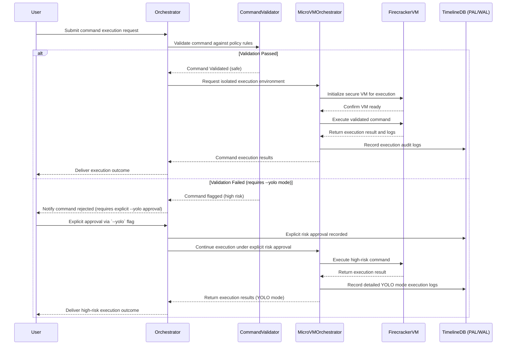

Here's a detailed and structured initial draft of **ADR-0014: Command Execution and Safety Policy**, tailored explicitly to Tiffany’s high standards for secure, controlled, and auditable command execution:

---

# ADR-0014: Command Execution and Safety Policy

## Status

Proposed

---

## Context

Autonomous agentic runtimes inevitably must execute commands within isolated environments. Improper management of command execution can result in:

* **Security vulnerabilities**: Arbitrary or malicious code execution risks.
* **Unexpected system changes**: Inadvertent destructive operations.
* **Lack of transparency and auditability**: Opaque execution flows leading to challenging debugging and auditing scenarios.

Tiffany requires a comprehensive strategy to ensure secure, transparent, and controlled command execution, clearly defining safety boundaries, auditability, and exception-handling mechanisms, along with a mechanism for explicitly accepting risks (`--yolo` mode).

---

## Decision

We adopt a rigorous **Command Execution and Safety Policy**, leveraging explicit trust boundaries, pre-execution validation, audit logging, and an explicit controlled-risk execution mode (`--yolo`) for trusted use cases.

---

## Technical Implementation

### 1. Command Execution Flow

Command execution within Tiffany will follow a strict, staged flow:

* **Pre-validation**: All commands undergo explicit safety validation.
* **Trust Boundary Enforcement**: Commands execute only within predefined boundaries (e.g., specific directories, isolated MicroVMs).
* **Structured Logging**: Every command executed is logged with full context (user, timestamp, environment, rationale).
* **Post-Execution Audit**: Validate command outcomes, explicitly log outputs, status, and changes made.

### 2. Trust Boundaries Definition

Explicit trust boundaries will be enforced via:

* **Isolated Execution**: Commands run strictly inside Firecracker MicroVMs.
* **Directory and Filesystem Restrictions**: Commands restricted to specific working directories and limited filesystem access.
* **Capability-based Permissions**: Commands executed within predefined security capabilities.

### 3. The `--yolo` Mode (Explicit Risk Acceptance)

The `--yolo` (You Only Live Once) mode explicitly bypasses certain safety checks and constraints, acknowledging intentional risk. Usage of this mode:

* Requires explicit opt-in from authorized users.
* Is heavily audited and logged explicitly for future reviews.
* Clearly marked in logs and audit trails as high-risk actions.

---

## 🔄 Sequence Diagram: Command Execution and Safety Checks

---

## 🛠️ Practical Example Scenario (Mock):

**Scenario:** "Agent executing potentially destructive Git command (force-push)."

**Standard Flow:**

| Step              | Status      | Description                      | Audit Trail     |
| ----------------- | ----------- | -------------------------------- | --------------- |
| Request Submitted | ✅           | Command `git push origin main`   | Logged          |
| Validation        | ✅ Passed    | Command deemed safe by validator | Logged          |
| Execution         | ✅ Completed | Successfully pushed changes      | Logged, Metrics |

**High-Risk Flow (`--yolo` Mode):**

| Step              | Status                | Description                                     | Audit Trail       |
| ----------------- | --------------------- | ----------------------------------------------- | ----------------- |
| Request Submitted | ⚠️ Flagged            | Command `git push -f origin main` flagged risky | Logged            |
| User Approval     | ✅ Explicitly Accepted | User explicitly approves via `--yolo`           | Logged (explicit) |
| Execution         | ✅ Completed           | Force-push executed                             | Logged (detailed) |

---

## 🎯 Rationale for Chosen Approach

* **Secure and Predictable Execution**: Strict safety validations prevent unintended or malicious actions.
* **Auditability and Transparency**: Explicit logging and auditing provide full traceability and debugging capabilities.
* **Explicit Risk Management**: The `--yolo` mode explicitly manages and records deliberate high-risk actions.

---

## 🚨 Consequences and Trade-offs

* **Operational Overhead**: Increased complexity due to rigorous validation and auditing.
* **Explicit User Responsibility**: Users must consciously acknowledge risk for high-impact operations (`--yolo` mode).
* **Potential False Positives**: Rigorous validations may occasionally flag safe operations as risky, requiring user review.

---

## ✅ Alternatives Considered and Dismissed

* **No Validation (Direct Execution)**: High security risk and operational vulnerability.
* **Always-On Safety Checks (No Bypass)**: Lack of flexibility for necessary risky operations.
* **Fully Automated Command Validation (ML-based)**: Potential uncertainty and unpredictability in automated risk assessments.

---

## 🚀 Industry-Leading Capabilities

This structured and explicit Command Execution and Safety Policy significantly enhances Tiffany’s operational security, risk transparency, and auditability, setting a clear benchmark in agentic runtime execution safety.

---

## Next Steps:

Upon your confirmation, this ADR is ready for acceptance and immediate implementation.

✅ **Ready for review and acceptance.**
