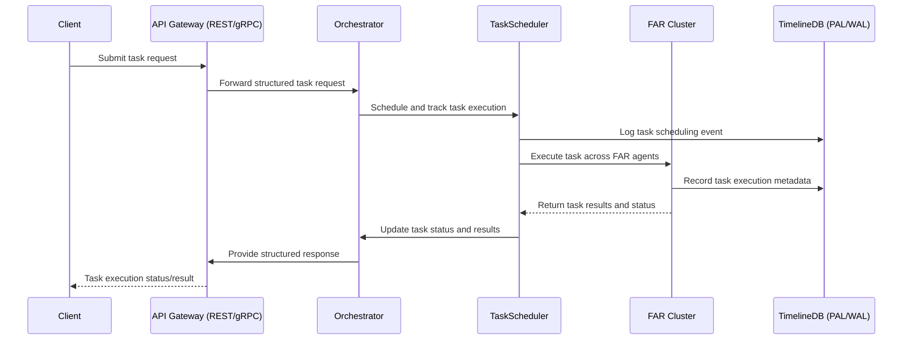

Here's a detailed and structured initial draft of **ADR-0015: REST/gRPC API Design**, tailored to Tiffany’s high standards for clear interfaces, robust communication, and flexibility:

---

# ADR-0015: REST/gRPC API Design

## Status

Proposed

---

## Context

Tiffany’s autonomous agentic runtime requires clear, reliable, and performant external interfaces for interaction with users and external services. The interface must support:

* External task submission.
* Task status tracking and result retrieval.
* System health and metadata queries.

Currently, agentic systems often suffer from inconsistent, ambiguous, or overly complex external APIs, leading to integration issues, poor developer experience, and reduced interoperability with existing tooling.

---

## Decision

We adopt a clearly defined and dual-approach **REST and gRPC API Design**, providing structured, flexible, and performant interfaces optimized for developer ergonomics, machine-to-machine efficiency, and robust external communication.

### API Approach:

* **REST API:** JSON-based, easily consumable by external UIs, command-line tools, and scripting integrations.
* **gRPC API:** High-performance, binary-efficient communication optimized for internal service-to-service interactions and large-scale integrations.

---

## Technical Implementation

### 1. REST API Design (OpenAPI 3.1 Specification)

* Explicit RESTful routes.
* Structured, semantic JSON payloads.
* Strong typing and validation via OpenAPI schemas.
* Clear error handling with HTTP status codes.

#### Example REST API Endpoints:

* `POST /tasks` - Submit a new task.
* `GET /tasks/{task_id}` - Retrieve task execution status/result.
* `GET /metadata` - Retrieve system and agent metadata.
* `GET /health` - Health check endpoint.

**Sample Request (Submit Task)**:

```json
POST /tasks
{
  "task_type": "generate_code",
  "parameters": {
    "language": "rust",
    "description": "Implement login API endpoint."
  }
}
```

**Sample Response**:

```json
{
  "task_id": "abc123",
  "status": "scheduled",
  "created_at": "2025-06-28T10:00:00Z"
}
```

### 2. gRPC API Design (Protobuf Definition)

Efficient, binary serialization for inter-service and internal system communication.

#### Protobuf Service Definition (simplified):

```protobuf
syntax = "proto3";

service TaskService {
  rpc SubmitTask (TaskRequest) returns (TaskResponse);
  rpc GetTaskStatus (TaskStatusRequest) returns (TaskStatusResponse);
  rpc GetMetadata (MetadataRequest) returns (MetadataResponse);
}

message TaskRequest {
  string task_type = 1;
  map<string, string> parameters = 2;
}

message TaskResponse {
  string task_id = 1;
  string status = 2;
  string created_at = 3;
}

message TaskStatusRequest {
  string task_id = 1;
}

message TaskStatusResponse {
  string task_id = 1;
  string status = 2;
  string result = 3;
}

message MetadataRequest {}

message MetadataResponse {
  map<string, string> agent_info = 1;
  repeated string available_skills = 2;
}
```

---

## 🔄 Sequence Diagram: API Interaction Flow



---

## 🛠️ Practical Example Scenario (Mock):

**Scenario**: "Developer using REST API to request a Rust login implementation."

**REST API Interaction:**

1. Client submits task via `POST /tasks`.
2. System returns `task_id` and initial status.
3. Client queries status via `GET /tasks/{task_id}` until completion.
4. Results retrieved and delivered to client.

**Example Result Retrieval:**

```json
GET /tasks/abc123

{
  "task_id": "abc123",
  "status": "completed",
  "result": {
    "code_snippet": "pub async fn login(...) -> Result<(), Error> { ... }",
    "test_results": "All tests passed",
    "commit_id": "def456"
  }
}
```

---

## 🎯 Rationale for Chosen Approach

* **Flexible and Accessible:** REST APIs provide simplicity and accessibility for external integrations, UI tools, and scripting languages.
* **Efficient Internal Communication:** gRPC provides highly performant, structured communication optimized for internal or high-performance scenarios.
* **Interoperability and Extensibility:** Clear OpenAPI and Protobuf schemas enable easy integration and extension.

---

## 🚨 Consequences and Trade-offs

* **Maintenance Overhead:** Dual API (REST + gRPC) requires additional maintenance and documentation effort.
* **Complexity in Client Support:** Clients must choose and understand optimal communication paths based on their needs (simplicity vs. performance).
* **Initial Development Cost:** Increased initial investment in defining and implementing dual APIs clearly.

---

## ✅ Alternatives Considered and Dismissed

* **REST-Only API**: Insufficient performance for internal or large-scale integrations.
* **gRPC-Only API**: Less accessible for quick scripting, UI integration, and web-based interactions.
* **GraphQL API**: Complexity and overhead not justified by current needs; REST and gRPC provide sufficient flexibility and performance.

---

## 🚀 Industry-Leading Capabilities

The dual REST/gRPC API approach positions Tiffany at the forefront of agentic runtime systems, providing unmatched developer ergonomics, interoperability, and communication efficiency.

---

## Next Steps:

Upon your confirmation, this ADR is ready for acceptance and immediate implementation planning.

✅ **Ready for review and acceptance.**
