# ADR-0017: Kubernetes-based FAR Controller (Replacement for CAPMVM)

## Status

Proposed

---

## Context

Tinkerbell's FAR infrastructure leverages LiquidMetal’s Flintlock and Firecracker MicroVMs for secure, isolated execution of autonomous agent workloads. LiquidMetal provides a Kubernetes-native orchestrator known as [Cluster API Provider MicroVM (CAPMVM)](https://github.com/liquidmetal-dev/cluster-api-provider-microvm), a Cluster API provider managing Firecracker VMs as Kubernetes cluster nodes.

However, Tinkerbell's FAR agents do **not function as Kubernetes nodes**—they are standalone workloads with specialized lifecycle management (sleep, resurrect, blocked states). Thus, CAPMVM is not directly suitable for orchestrating FAR agents.

### CAPMVM Overview:

* Kubernetes-native operator using Cluster API patterns.
* Specifically orchestrates MicroVMs as Kubernetes nodes.
* Leverages Flintlock for VM lifecycle management.
* Declarative YAML manifests and native Kubernetes CRDs.

### Why CAPMVM is Unsuitable Directly:

* CAPMVM explicitly manages Firecracker MicroVMs as Kubernetes nodes.
* FAR agents have different lifecycle semantics (sleep, resurrect, blocked, etc.) and are not Kubernetes nodes.
* Tinkerbell requires custom scheduling and orchestration logic.

Thus, a custom Kubernetes controller inspired by CAPMVM but specialized for FAR agent semantics is required.

---

## Decision

We will develop a dedicated Kubernetes-based controller (**FAR Controller**) specifically for orchestrating FAR agents. This controller will take architectural cues from the CAPMVM project while introducing FAR-specific orchestration logic, lifecycle semantics, and integration with Liquidmetal’s Flintlock.

### Core Responsibilities:

* **Task Scheduling:** FAR agents orchestrated based on tasks queued in Kubernetes.
* **Lifecycle Management:** FAR agents explicitly managed (start, stop, sleep, resurrect, force-sleep).
* **Signal Integration:** Interact with node-level Liquidmetal daemons via Unix Sockets to manage FAR agent lifecycle.
* **Metrics and State Management:** Integrate with central PAL/WAL stores for state tracking and auditing.

---

## Technical Implementation

### Architecture Overview

```mermaid
graph TD
  subgraph Kubernetes Control Plane
    FAR_Controller["🚦 FAR Kubernetes Controller"]
    FAR_Crd["📑 FAR CustomResourceDefinitions (CRDs)"]
    JobQueue["📥 Task Queue"]
    PAL_WAL["📚 TimelineDB (PAL/WAL)"]
    Metrics["📈 Metrics & Logs"]
    
    FAR_Controller --> FAR_Crd
    FAR_Controller --> JobQueue
    FAR_Controller --> PAL_WAL
    FAR_Controller --> Metrics
  end
  
  subgraph Compute Blade Node
    Liquidmetal["💧 Liquidmetal Daemon"]
    Socket[/📡 Unix Domain Socket/]
    Flintlock["🧩 Flintlock VM Orchestrator"]
    MicroVM["🔥 FAR Agent VM"]
    
    Liquidmetal --> Socket
    Socket --> Flintlock
    Flintlock --> MicroVM
  end
  
  FAR_Controller-->|Secure Channel -mTLS|Liquidmetal
```



---

### Kubernetes Custom Resources

We define explicit Kubernetes CRDs tailored to FAR agents:

```yaml
apiVersion: agents.tinkerbell.io/v1alpha1
kind: FARAgent
metadata:
  name: far-agent-example
spec:
  taskId: "task-12345"
  resourceLimits:
    cpu: "2"
    memory: "2048Mi"
  lifecycle:
    state: "active" # active | sleep | resurrect | blocked | force-sleep
status:
  currentState: "active"
  lastTransitionTime: "2025-06-28T10:15:00Z"
```

---

## 🔄 Sequence Diagram: FAR Kubernetes Controller Workflow


---

## 🎯 Rationale for Chosen Approach

* **Kubernetes-Native Scheduling:**
  Robust, scalable task scheduling and agent lifecycle control via Kubernetes CRDs.

* **FAR-specific Semantics:**
  Explicit support for specialized FAR lifecycle (sleep, resurrect, forced-sleep) states.

* **Integration with Flintlock:**
  Leverages existing robust orchestration framework for MicroVMs, reducing implementation complexity.

* **Scalable & Robust Architecture:**
  Kubernetes provides proven scalability, reliability, and observability benefits.

---

## 🚨 Consequences and Trade-offs

* **Increased Initial Complexity:**
  Requires custom Kubernetes controller implementation and knowledge of Kubernetes operator patterns.

* **Dependency on Kubernetes:**
  Adds Kubernetes as a central dependency; infrastructure expertise required.

* **Maintenance and Operational Overhead:**
  Necessitates ongoing management and upgrades of Kubernetes controllers and CRDs.

---

## ✅ Alternatives Considered and Dismissed

* **Directly using CAPMVM:**
  Dismissed due to Kubernetes-node-specific semantics.

* **Fully Custom Non-Kubernetes Scheduler:**
  Dismissed as this significantly increases operational complexity and reduces standardization benefits.

* **Standalone Orchestrator outside Kubernetes:**
  Dismissed due to missed scalability, standardization, and integration benefits of Kubernetes.

---

## 📌 Engagement and Contribution Plan:

* Engage early with Flintlock and CAPMVM community to discuss architecture decisions.
* Clearly document custom CRDs and orchestration logic for community awareness.
* Potentially contribute generic features or improvements back upstream where relevant.

---

## 🚀 Industry-Leading Capabilities

This custom FAR Kubernetes Controller represents a state-of-the-art architecture for managing specialized, autonomous FAR workloads securely and efficiently at scale, leveraging Kubernetes' robustness and Flintlock's proven orchestration framework.

---

## 📊 Next Steps:

Upon your review and confirmation, ADR-0017 will be accepted, and detailed implementation planning will proceed.

✅ **Ready for final review and acceptance.**
