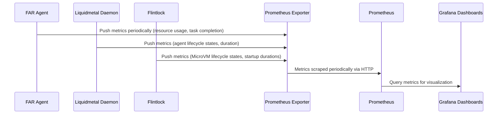

# ADR-0018: Metrics Policy and Instrumentation Plan

## Status

Proposed

---

## Context

Effective observability is essential for reliable operation, debugging, and continuous improvement of the Tiffany FAR infrastructure. Metrics provide quantitative insights into performance, reliability, and resource usage of FAR agents, orchestrators, and infrastructure components.

Challenges faced by current systems include:

* **Inconsistent metric naming and tagging**: Difficulty in interpreting or correlating metrics.
* **Lack of comprehensive metrics**: Gaps in monitoring critical system aspects.
* **Poorly defined dashboards**: Limited actionable insights and user confusion.

To address these, a clearly defined Metrics Policy and Instrumentation Plan is required, using industry-standard tooling like **Prometheus** for metrics collection and **Grafana** for dashboard visualization.

---

## Decision

We adopt a structured and rigorous **Metrics Policy and Instrumentation Plan**, explicitly defining Prometheus metrics conventions, structured labels, and dashboard philosophy, ensuring comprehensive visibility and actionable insights across Tiffany FAR infrastructure.

### Core Goals:

* Comprehensive visibility into FAR agent operations.
* Clear, consistent naming and labeling for easy metric interpretation.
* Actionable, intuitive dashboards in Grafana for rapid diagnosis and operational understanding.
* Integration with existing PAL/WAL databases to correlate metrics with detailed event histories.

---

## Technical Implementation

### 1. Metrics Structure and Conventions

Metrics will adhere strictly to Prometheus conventions:

* **Namespace**: `tiffany`
* **Subsystems**: Defined explicitly (e.g., `far_agent`, `orchestrator`, `liquidmetal_daemon`, `flintlock`)
* **Metric Types**:

    * Counters (`_total` suffix)
    * Gauges (current resource usage, agent count)
    * Histograms (`_duration_seconds` suffix for latency tracking)

### Example Metric Naming:

* `tiffany_far_agent_tasks_total{state="completed|failed"}`
* `tiffany_far_agent_resource_usage_cpu_seconds`
* `tiffany_orchestrator_jobs_pending`
* `tiffany_liquidmetal_daemon_requests_duration_seconds`

---

### 2. Metrics Labeling and Tagging Policy

Metrics labels will follow strict naming and tagging standards to ensure consistency and query performance:

| Label       | Description                           | Example Values                  |
| ----------- | ------------------------------------- | ------------------------------- |
| `node`      | Compute blade node identifier         | `node-1`, `blade-7`             |
| `agent_id`  | Unique identifier of a FAR agent      | `agent-uuid-1234`               |
| `task_id`   | Associated task identifier            | `task-uuid-5678`                |
| `state`     | FAR agent state                       | `active`, `sleeping`, `blocked` |
| `outcome`   | Task result or outcome status         | `success`, `failure`            |
| `operation` | Specific operation (start, resurrect) | `start`, `sleep`, `resurrect`   |

---

### 3. Dashboard Philosophy (Grafana)

Dashboards must provide clear, actionable, real-time insights:

* **Single-Pane-of-Glass Dashboards**: Consolidated high-level cluster overview.
* **Specialized Dashboards**:

    * FAR Agent Lifecycle Status
    * Task Execution & Outcomes
    * Resource Utilization (CPU, Memory, Disk, Network)
* **Drill-down Capability**: From high-level metrics down to individual FAR agent lifecycle events.
* **Clear Visualization Guidelines**: Consistent layout, clear labeling, minimal clutter.

---

## 📈 Example Grafana Dashboard Layout

* **Overview Dashboard**

    * FAR Agents: Active, Sleeping, Blocked (Gauge)
    * Task Status: Success Rate (Counter), Failure Rate (Counter)
    * Node Resource Utilization (CPU%, Memory%)

* **FAR Agent Detailed Dashboard**

    * Task Execution Duration Histogram
    * Individual FAR Agent Lifecycle Timeline
    * Historical Resource Usage (CPU, Memory, Disk)

---

## 🔄 Sequence Diagram: Metrics Collection Workflow

---

## 🎯 Rationale for Chosen Approach

* **Consistency and Clarity**: Rigorous naming and labeling improve usability and reduce misinterpretation.
* **Comprehensive Visibility**: Clearly defined metrics and dashboard standards ensure complete operational visibility.
* **Industry-standard Tooling**: Prometheus and Grafana provide robust, mature solutions and ecosystem support.

---

## 🚨 Consequences and Trade-offs

* **Initial Overhead**: Careful metric definition and tagging require upfront effort.
* **Operational Complexity**: Maintenance and management of Prometheus and Grafana infrastructure.
* **Potential Metric Explosion**: Careful label design required to prevent cardinality explosion.

---

## ✅ Alternatives Considered and Dismissed

* **Custom Metrics and Dashboards**: Higher maintenance cost, lower ecosystem compatibility.
* **Third-party Monitoring Solutions**: Less control, higher cost, and potentially reduced customization.
* **Simplified Tagging**: Insufficient granularity and insight for effective debugging.

---

## 📌 Implementation Recommendations:

* Develop a comprehensive **Metrics Style Guide** document.
* Enforce conventions through automated linting in CI/CD pipelines.
* Regularly review and iterate dashboards based on operational feedback.

---

## 🚀 Industry-Leading Capabilities

The proposed Metrics Policy and Instrumentation Plan significantly enhances Tiffany’s operational excellence, providing clear, actionable, and comprehensive visibility into the FAR infrastructure, positioning it as a leader in observability and agentic runtime operations.

---

## 📊 Next Steps:

Upon confirmation, this ADR is ready for acceptance and immediate implementation.

✅ **Ready for final review and acceptance.**
