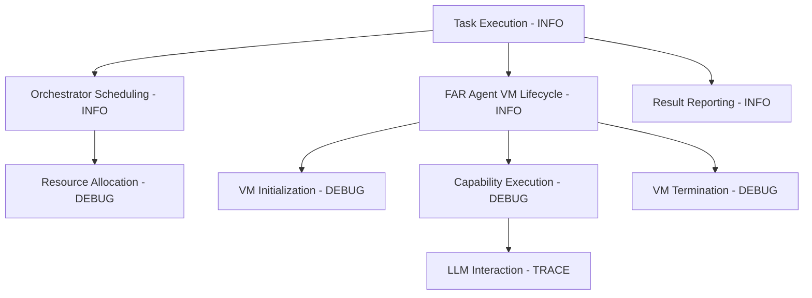
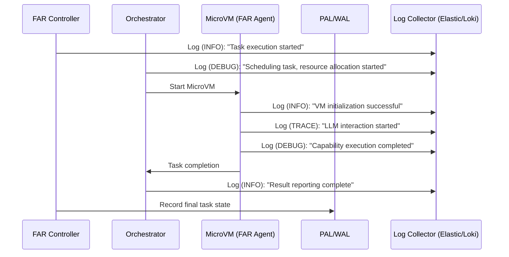

# ADR-0019: Logging Strategy and Span Hierarchy

## Status

Proposed

---

## Context

Effective logging is vital for the observability, debugging, and operational transparency of autonomous agentic runtimes. Without structured logging and detailed execution tracing, debugging complex distributed operations becomes difficult, leading to increased operational overhead and reduced system reliability.

Common issues in logging for complex systems include:

* **Unstructured logs:** Difficult to parse or correlate.
* **Lack of contextual tracing:** Limited ability to trace execution flow or diagnose issues.
* **Inconsistent log levels and verbosity:** Excessive noise or insufficient detail for meaningful debugging.

To address these, Tinkerbell requires a rigorous, structured logging strategy that leverages Rust’s advanced **tracing** framework, clear span hierarchies, structured logs, and consistent log level defaults.

---

## Decision

We adopt the Rust **tracing** crate for structured logging and detailed tracing within Tinkerbell FAR infrastructure, explicitly defining span hierarchies, structured log events, and log level policies.

### Core Components:

* **Structured Logging:** Use of `tracing` with structured, JSON-formatted log outputs.
* **Detailed Span Hierarchy:** Explicit tracing spans for every significant operation (task execution, VM lifecycle events, API calls).
* **Consistent Log Levels:** Clearly defined log level defaults (ERROR, WARN, INFO, DEBUG, TRACE).

---

## Technical Implementation

### 1. Structured Logging with Rust `tracing`

Tinkerbell will adopt Rust’s `tracing` crate, providing structured logs for better parseability and integration with modern log management systems.

**Log event format (JSON example):**

```json
{
  "timestamp": "2025-06-28T10:00:00Z",
  "level": "INFO",
  "target": "tinkerbell::orchestrator",
  "message": "Task execution started",
  "fields": {
    "task_id": "task-12345",
    "agent_id": "agent-67890",
    "node": "blade-1"
  }
}
```

### 2. Explicit Span Hierarchy

Spans explicitly represent the hierarchy and nesting of tasks, operations, and system interactions.

**Example span hierarchy structure:**

```plaintext
Agent Task Execution [trace_id=abc123]
├── Orchestrator Scheduling
│   └── Resource Allocation
├── FAR Agent VM Lifecycle
│   ├── VM Initialization
│   ├── Capability Execution
│   │   └── LLM Interaction
│   └── VM Termination
└── Result Reporting
```

### 3. Span Lifecycle Management

Span lifecycle strictly managed using Rust's tracing macros (`span!`, `.enter()`, `.exit()`), clearly delineating entry and exit points:

**Rust tracing code example:**

```rust
use tracing::{span, Level};

fn execute_task(task_id: &str) {
    let task_span = span!(Level::INFO, "task_execution", task_id = task_id);
    let _enter = task_span.enter();

    schedule_task();
    execute_vm_lifecycle();
    report_results();
}

fn execute_vm_lifecycle() {
    let vm_span = span!(Level::DEBUG, "vm_lifecycle");
    let _enter = vm_span.enter();

    vm_initialization();
    capability_execution();
    vm_termination();
}
```

---

### 4. Log Level Defaults

Explicit guidelines on log levels:

| Level | Use-case Example                                     | Retention Policy     |
| ----- | ---------------------------------------------------- | -------------------- |
| ERROR | Critical failures requiring immediate attention      | High priority        |
| WARN  | Issues potentially impacting normal operation        | High-medium priority |
| INFO  | General operational events and high-level status     | Medium priority      |
| DEBUG | Detailed events useful for debugging                 | Short-term, detailed |
| TRACE | Highly detailed events, rarely enabled in production | Temporary debugging  |

Default log levels: **INFO** in production, **DEBUG** in staging, **TRACE** optionally during local development.

---

## 📊 Diagram: Span Hierarchy Visualization



---

## 🔄 Sequence Diagram: Logging and Span Lifecycle



---

## 🎯 Rationale for Chosen Approach

* **Structured & Parseable Logs:** Enhanced operational visibility, easier integration with log aggregation solutions.
* **Detailed Tracing and Debugging:** Explicit span hierarchies enable precise debugging and operational insights.
* **Clear Log Level Policy:** Reduces noise and improves the clarity and signal-to-noise ratio of logs.

---

## 🚨 Consequences and Trade-offs

* **Complexity of Span Management:** Developers must adhere strictly to span creation and lifecycle rules.
* **Log Volume and Storage:** Potential for large log volumes, especially with DEBUG or TRACE enabled.
* **Operational Overhead:** Requires monitoring of log volumes and retention policies to manage costs.

---

## ✅ Alternatives Considered and Dismissed

* **Unstructured Logging:** Lack of parseability and reduced debugging capability.
* **Using `log` crate:** Lacks structured tracing capabilities and span support of `tracing`.
* **Third-party proprietary logging tools:** Reduced control and higher cost; less customization potential.

---

## 📌 Implementation Recommendations:

* Create a dedicated **Logging Style Guide** document specifying `tracing` usage patterns.
* Use automated linting to enforce span hierarchy and log level conventions during CI/CD pipelines.
* Periodically review log metrics (volume, retention, levels) to manage operational overhead.

---

## 🚀 Industry-Leading Capabilities

This structured logging and tracing strategy significantly enhances Tinkerbell's ability to manage operational complexity, rapidly diagnose issues, and maintain transparency, positioning it as a leader in observability and autonomous agentic infrastructure management.

---

## 📊 Next Steps:

Upon confirmation, this ADR is ready for acceptance and immediate detailed implementation.

✅ **Ready for final review and acceptance.**
