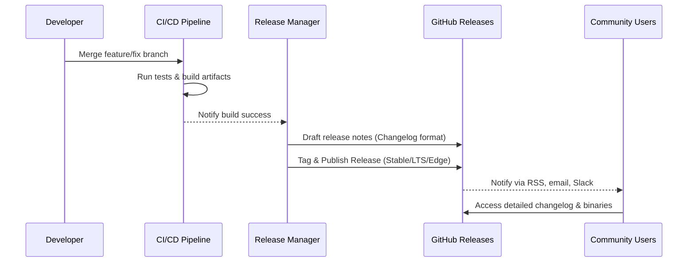

# ADR-0020: Versioning and Release Policy

## Status

Proposed

---

## Context

Tiffany FAR infrastructure is an advanced, community-focused autonomous agentic runtime system. Clear versioning, predictable release cycles, and transparent changelogs are essential for adoption, community trust, and long-term maintainability.

Common pitfalls without clear versioning include:

* **Confusion regarding breaking changes**: Difficulty understanding release impacts.
* **Unpredictable release schedules**: Community frustration and operational difficulties.
* **Poor changelog quality**: Hard to identify important updates and fixes.

To address these issues, Tiffany requires explicit, community-friendly, and robust versioning policies, structured release cycles, and clear changelog protocols.

---

## Decision

We adopt a comprehensive **Semantic Versioning (SemVer) policy**, combined with clearly defined release channels (**Stable**, **LTS**, **Edge**), explicit changelog protocols, and predictable release schedules.

### Key Components:

* **Semantic Versioning (SemVer 2.0)**
  Clearly communicates API stability and breaking changes.

* **Explicit Release Channels**

    * **Stable:** Regular, reliable releases with fully tested features.
    * **LTS (Long-Term Support):** Long-term support releases (18-month security & bug-fix commitments).
    * **Edge:** Rapid development snapshots, frequent updates, and experimentation.

* **Structured Changelogs**
  Clearly detailed changelogs using [Keep a Changelog](https://keepachangelog.com/) conventions.

---

## Technical Implementation

### 1. Semantic Versioning (SemVer 2.0)

Explicit adoption of the SemVer specification ([semver.org](https://semver.org/)):

* `MAJOR.MINOR.PATCH`

    * **MAJOR** version: Breaking API or configuration changes.
    * **MINOR** version: Add functionality in a backward-compatible manner.
    * **PATCH** version: Backward-compatible bug fixes and minor improvements.

Example:

```plaintext
v1.4.2 (Stable)
v2.0.0 (Major breaking release)
```

### 2. Release Channels and Cadence

Clearly defined release schedules:

| Channel | Description                         | Frequency       | Support Duration                           |
| ------- | ----------------------------------- | --------------- | ------------------------------------------ |
| Stable  | Production-ready, fully-tested      | Quarterly       | Supported until next major/minor release   |
| LTS     | Long-term support releases          | Every 18 months | 18 months (security & critical fixes only) |
| Edge    | Rapid development & experimentation | Continuous      | No official support                        |

---

## 📅 Example Release Timeline

```plaintext
|--- Jan ---|--- Feb ---|--- Mar ---|--- Apr ---|--- May ---|--- Jun ---|--- Jul ---|
| Stable v1.0 | Patch v1.0.1 | Patch v1.0.2 | Stable v1.1 | Patch v1.1.1 |
| LTS v1.0 (start)                           | LTS v1.0.1  | LTS v1.0.2  |
| Edge continuous snapshots available throughout                                    |
```

---

### 3. Structured Changelog Protocol

Adopt [Keep a Changelog](https://keepachangelog.com/) format:

```markdown
# Changelog

## [1.0.1] - 2025-03-15
### Fixed
- Fix FAR agent resurrection edge-case (#1234)

## [1.0.0] - 2025-01-01
### Added
- Initial stable release of Tiffany FAR agents
### Changed
- Updated agent lifecycle model (#987)

[Unreleased]: https://github.com/microscaler/tiffany/compare/v1.0.1...HEAD
[1.0.1]: https://github.com/microscaler/tiffany/compare/v1.0.0...v1.0.1
[1.0.0]: https://github.com/microscaler/tiffany/releases/tag/v1.0.0
```

---

## 🔄 Sequence Diagram: Versioning & Release Process



---

## 🎯 Rationale for Chosen Approach

* **Clear Communication**: SemVer explicitly signals compatibility and breaking changes.
* **Predictable Releases**: Regular release cycles help users plan upgrades effectively.
* **Reliable Long-term Support**: LTS channel ensures stability for enterprise or mission-critical deployments.
* **Community Engagement**: Clearly structured changelogs enhance transparency and community trust.

---

## 🚨 Consequences and Trade-offs

* **Strict Versioning Discipline**: Developers must strictly adhere to SemVer guidelines.
* **Operational Overhead**: Regular release and LTS channels require significant operational commitment.
* **Increased Complexity**: Managing multiple release channels requires disciplined governance and tooling.

---

## ✅ Alternatives Considered and Dismissed

* **Calendar Versioning**: Insufficient clarity regarding compatibility and breaking changes.
* **Rolling Releases Only**: Poor predictability for enterprise users.
* **Ad-hoc Versioning**: Reduced trust, clarity, and adoption potential.

---

## 📌 Implementation Recommendations:

* Automate changelog generation and validation via CI/CD.
* Provide clear documentation on release policies and schedules.
* Establish dedicated Release Manager role to oversee and manage releases.

---

## 🚀 Industry-Leading Capabilities

Adopting this structured SemVer, clear release channel strategy, and detailed changelog protocol will position Tiffany FAR as a mature, transparent, community-driven project, setting a benchmark in autonomous agentic runtime infrastructure management.

---

## 📊 Next Steps:

Upon your confirmation, this ADR is ready for immediate adoption and implementation.

✅ **Ready for final review and acceptance.**
