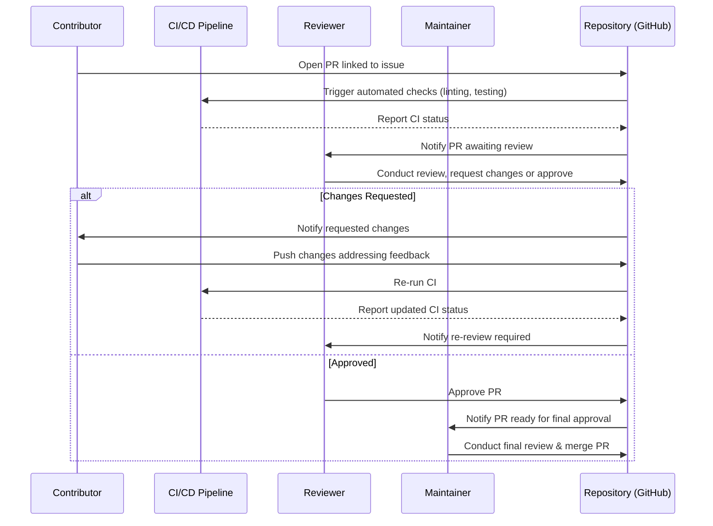

# ADR-0021: Contributor Roles and Governance

## Status

Proposed

---

## Context

Tiffany FAR is an advanced, community-driven autonomous agentic runtime project. Clear governance and well-defined contributor roles are essential to fostering a vibrant, inclusive, and effective open-source community. Without clear roles and governance, community projects often encounter:

* Confusion regarding decision-making authority.
* Inconsistent or slow pull request (PR) review processes.
* Difficulty in resolving disputes or escalating critical decisions.

To address these issues, Tiffany requires explicit, structured governance, clear contributor roles and responsibilities, and well-defined escalation paths.

---

## Decision

We adopt a clearly defined governance model and explicit contributor roles, responsibilities, and PR review flows, supported by transparent escalation paths.

### Governance Model Overview:

* Clearly defined contributor roles: **Maintainers**, **Reviewers**, **Contributors**.
* Structured PR review process with explicit guidelines and timelines.
* Transparent escalation and dispute-resolution mechanisms.

---

## Technical Implementation

### 1. Contributor Roles & Responsibilities

Explicit definition of contributor roles and responsibilities:

| Role            | Responsibilities                                                                                                                                                        | Privileges                                |
| --------------- | ----------------------------------------------------------------------------------------------------------------------------------------------------------------------- | ----------------------------------------- |
| **Maintainer**  | - Oversee overall project health.<br>- Merge PRs and manage releases.<br>- Make final decisions on architectural and strategic issues.<br>- Resolve escalated disputes. | Merge PRs, admin repository rights        |
| **Reviewer**    | - Perform code and documentation reviews.<br>- Ensure code quality and adherence to guidelines.<br>- Recommend PR approval or changes.                                  | PR approval and review                    |
| **Contributor** | - Submit bug reports and feature requests.<br>- Submit code, documentation, and tests via PRs.<br>- Participate in issue discussions.                                   | Open PRs, create issues, join discussions |

### 2. PR Review Workflow

Explicitly structured PR review and merging workflow:

1. **PR Creation:**
   Contributors open a PR linked to a specific issue, including detailed descriptions, tests, and documentation updates.

2. **Initial Review (within 48 hours):**
   Automated CI checks run immediately; reviewers perform initial checks.

3. **Detailed Code Review (within 3-5 days):**
   Reviewers conduct detailed code reviews, providing explicit feedback and required changes.

4. **Iterative Refinement:**
   Contributors address feedback; reviewers verify corrections.

5. **Final Approval (Maintainer):**
   After reviewer approval, a Maintainer performs a final review and merges the PR, ensuring overall project alignment.

---

## 🔄 Sequence Diagram: PR Review Flow



---

### 3. Escalation Path and Dispute Resolution

Clearly documented escalation and dispute-resolution mechanism:

```plaintext
Contributor ↔ Reviewer (resolve through discussions first)
     │
     ▼ If unresolved after 72 hours
Maintainer (final decision)
     │
     ▼ Rarely, significant strategic issues
Governance Committee (strategic advisory panel)
```

* **Step 1:** Contributor and Reviewer attempt resolution via direct GitHub PR discussions.
* **Step 2:** If unresolved after 72 hours, escalate to Maintainer for final decision-making.
* **Step 3 (rarely):** Strategic or significant disputes escalated to the Governance Committee (selected senior community members).

---

## 📊 Governance Committee (Optional, Future Consideration)

* A strategic advisory panel composed of senior maintainers and key stakeholders.
* Provides strategic guidance, dispute resolution, and community health oversight.

---

## 🎯 Rationale for Chosen Approach

* **Clear Roles & Responsibilities:** Reduces ambiguity and clarifies expectations, promoting effective collaboration.
* **Efficient Review Workflow:** Structured timelines improve PR turnaround and community satisfaction.
* **Explicit Escalation Paths:** Ensure timely resolution of disputes, maintaining community harmony and progress.

---

## 🚨 Consequences and Trade-offs

* **Formal Overhead:** Introduces more formal structure and processes, potentially slowing down casual contributions.
* **Operational Burden:** Requires dedicated roles (maintainers and reviewers) actively fulfilling responsibilities.
* **Occasional Dispute Complexity:** Rare disputes may require dedicated committee involvement.

---

## ✅ Alternatives Considered and Dismissed

* **Ad-hoc Reviews:** Reduced quality, predictability, and potential for unresolved conflicts.
* **Fully Automated Review (CI only):** Insufficient for nuanced code reviews, quality assurance, and community engagement.
* **Single-role Contributions (no distinction):** Confusion, unclear decision-making authority, reduced accountability.

---

## 📌 Implementation Recommendations:

* Document roles, review workflows, and escalation paths clearly in `CONTRIBUTING.md`.
* Automate notifications and review reminders via GitHub workflows.
* Regularly review community feedback to refine governance processes.

---

## 🚀 Industry-Leading Capabilities

Clearly defined contributor roles and governance structure positions Tiffany FAR as a leader in community-driven autonomous agentic runtime systems, ensuring robust collaboration, quality contributions, and long-term project sustainability.

---

## 📊 Next Steps:

Upon confirmation, this ADR is ready for immediate acceptance and implementation.

✅ **Ready for final review and acceptance.**
