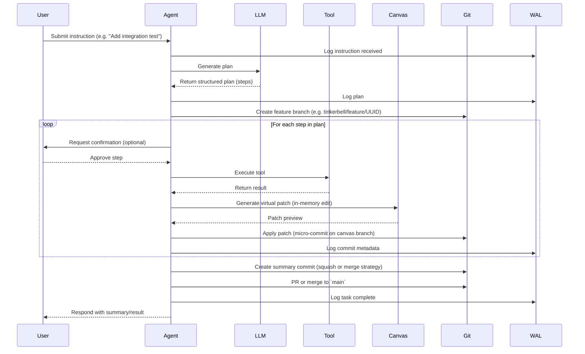

# ADR-0004: Agent Loop and ReAct Design

## Status
Accepted

## Context
Tinkerbell operates as an autonomous agent runtime that continuously interprets user intent, plans action sequences, invokes tools, edits code, and reflects on results. At the heart of this loop lies a **ReAct-style planning and execution model**, inspired by:

- ReAct (Reasoning and Acting) patterns
- Tree-of-Thought / scratchpad reasoning
- Google's Gemini CLI agent cycle

We require a structured yet coroutine-friendly mechanism that models this behavior:
- Looping through steps
- Yielding control to external operations (LLMs, tools, approvals)
- Resuming with new information

This ADR defines how agent loops are structured, how LLMs are invoked, and how action plans are generated, confirmed, and executed.

---

## Decision

We will model the agent loop as a coroutine-driven `AgentTask` composed of the following explicit stages:

### 🔁 Agent Loop Lifecycle
1. **Receive Instruction** – initial user goal or input context
2. **Reasoning Step** – LLM plans next action(s)
3. **Action Execution** – Tool or file operation is triggered
4. **Reflection Step** – Output is logged; LLM may evaluate next step
5. **Repeat or Conclude** – Exit when goal is met or explicitly stopped

### 💡 Loop Signature
```rust
coroutine! {
  yield log("Received user instruction: Add integration test");
  let plan = yield llm.plan("Write test for feature X");
  for step in plan.steps {
    yield confirm_with_user(step.description);
    yield tool.execute(step.tool, step.args);
    yield canvas.commit_patch(step.patch);
  }
  yield log("Task complete.");
}
```

### 🧠 Planning Model
- Planning steps are LLM-generated, cached, and yieldable
- Tool usage is **planned, confirmed, and dispatched** in discrete steps
- Agent state tracks plan, progress, and context

### 🧩 Execution Context
Agent loop runs under the control of the `scheduler`, within a `TaskContext`, and may yield:
- To `llm_router.query()`
- To `tool_runner.execute()`
- To `canvas.commit()`
- To `wal.log_event()`

---

## Enhanced ReAct Sequence Diagram (with Virtual Canvas and GitOps Integration)



---

## Rationale

### ✅ Modelability and Debuggability
A structured agent loop gives us:
- Deterministic steps for replay and debugging
- Hooks for visualizing current stage
- Opportunity to store intermediate state

### 🧠 Inspired by ReAct
Google’s Gemini CLI and academic ReAct papers emphasize **alternating reasoning and action**:
- Reason: use LLM to plan or reflect
- Act: call a tool, apply patch, submit query

This alternating cycle is a natural match for coroutine-based agents.

### ✍️ Recordability
Each yield point corresponds to a WAL entry, and optionally, a virtual canvas diff. This provides traceability for every agent step — useful for debugging, replay, auditing, and agent explainability.

### 🔄 GitOps Commit Model
- Each agent session operates on a dedicated `tinkerbell/feature/UUID` branch.
- Every canvas action results in a `micro-commit` describing a semantic step.
- Summary commits or merge commits allow audit, PRs, and history inspection.
- Git patching and conflict handling is done via `git2-rs` and canvas logic.

### 👷 Extensibility
Additional phases like:
- Self-critique (`llm.reflect()`)
- Code review (`llm.summarize(diff)`)
- Parallel subplans (`fork_agent_loop()`) are easily inserted.

---

## Consequences

- All agent interactions must be decomposed into yieldable planning/action cycles
- The LLM planning interface must support structured plan output (JSON schema, ReAct markdown, etc.)
- WAL will record: instruction → plan → step start → step result → conclusion
- Git branches must be managed for every task (`tinkerbell/feature/...`)
- Canvas operations must map cleanly to micro-commits
- Recovered agents must resume at last successful step or Git commit
- Tests must verify plan parsing, loop control, git patching, and WAL consistency

---

## Alternatives Considered

- **Chain-based pipelines**: Good for linear tasks, bad for interactive agents
- **State machines per agent**: Verbose, hard to modify; coroutines are clearer
- **Spawn-per-step async**: Lacks yield control, hard to reason about
- **No GitOps**: Removes auditability, traceability, and rollback safety

---

## Related Documents
- [ADR-0003: Task Scheduler Model](adr_0003_task_scheduler.md)
- [Tinkerbell System Architecture](../whitepapers/Tinkerbell%20System%20Architecture%20and%20Design%20Overview.md)
- [Gemini CLI Agent Analysis](../whitepapers/Gemini%20CLI%20Agent%20Architecture%20and%20Reimplementation%20Plan.md)

---

## Adopted
This ADR is accepted as of June 2025. All agent interactions will follow a coroutine-driven ReAct loop pattern, yielding to LLMs, tools, patches, and Git-managed commits.

Maintainers: `@casibbald`, `@microscaler-team`
