# ✨ Efficient Virtual Canvas & GitOps Micro-Commits for Structured Code Evolution

---

## ❓ Why Now?

Modern AI-assisted development systems (e.g. GitHub Copilot, Gemini CLI, Claude) generate entire code blocks or files — but they lack structured, controlled integration mechanisms.

The result?

| Problem                                  | Impact                                                                 |
|------------------------------------------|------------------------------------------------------------------------|
| Monolithic diffs                         | Large, unreviewable code chunks with mixed concerns                    |
| No memory of change rationale            | Agentic decisions get lost in opaque blobs                             |
| Conflicting changes across code regions  | No stable “anchor” to reason about intermediate edits                  |
| Developer trust breaks down              | “It rewrote everything — I can’t merge this.”                         |
| No auditable trail of agent decisions    | Teams can’t reason about what changed or why                           |

Agents need the same constraints good engineers impose on themselves:
✅ make atomic commits  
✅ label intents  
✅ allow others (humans or agents) to review and adapt

---

## ✅ What Tinkerbell Introduces

Tinkerbell implements a **virtual canvas**, backed by Git, that:

- 🌱 Isolated from `main` via a named feature or task branch
- ✏️ Accepts fine-grained changes via structured patching
- 🔁 Applies “micro-commits” to Git, with message trails and metadata
- 📚 Maintains a timeline of evolution for each file/symbol
- 📜 Feeds memory systems (WAL/PAL) and semantic graph indexing

This allows agents to:

| Action                         | Implementation                                                                 |
|--------------------------------|---------------------------------------------------------------------------------|
| Write to the canvas            | Buffered, in-memory or disk-layer snapshot of working directory                |
| Submit a patch                 | Struct: `{ file, diff, metadata, rationale }`                                  |
| Apply with metadata            | Generates signed or labelled Git commit                                        |
| Review canvas history          | `git log`, semantic graph, or memory queries                                   |
| Merge to main                  | Only after audit (automated or human)                                          |

---

Here’s a detailed **Mermaid sequence diagram** that illustrates the end-to-end flow of a code patch through the Tinkerbell system — from agent planning to final GitOps-style commit and memory indexing.

---

## 🧬 Sequence Diagram: Virtual Canvas Patch Lifecycle

```mermaid
sequenceDiagram
    autonumber
    participant Agent as 🤖 Agent
    participant Planner as 🧠 ReAct Loop
    participant Canvas as 🧾 Virtual Canvas
    participant Git as 🔁 Git Backend
    participant WAL as 🪵 Write-Ahead Log
    participant PAL as 📡 Process Activity Log
    participant Graph as 🧠 GraphDB
    participant UI as 🧍 Human Operator

    Planner->>Agent: Submit plan with N steps
    Agent->>Canvas: Propose patch (file, diff, rationale)
    Canvas->>Git: Apply patch as micro-commit
    Git-->>Canvas: Commit hash + diff metadata

    Canvas->>WAL: Log patch metadata + result
    Canvas->>PAL: Emit `patch_applied` status update
    Canvas->>Graph: Index updated symbols and file relationships

    UI->>Canvas: Request diff / log review
    Canvas-->>UI: Display commit timeline, rationale, impact

    UI->>Canvas: Approve or reject patch
    Canvas->>Git: (if approved) Merge to main or raise PR
```



### 📌 Legend

* 🔁 Git: Local branch used by canvas engine
* 🪵 WAL: Durable write log of intent + diff
* 📡 PAL: Real-time agent status (e.g., task success/failure)
* 🧠 GraphDB: Indexes function/struct updates for semantic memory
* 🧍 UI: CLI (`tctl canvas`) or Web UI dashboard


---

## 🧠 How It Works

1. Agent receives a plan from ReAct loop:
```json
{
  "intent": "add new CLI command to submit task",
  "steps": ["modify cli/src/commands/mod.rs", "add submit.rs"]
}
```

2. Each step becomes a patch:

```json
{
  "file": "cli/src/commands/submit.rs",
  "diff": "@@ fn main() { ... }",
  "description": "add submit subcommand",
  "reason": "support task submission via CLI",
  "timestamp": "2025-06-29T14:45Z"
}
```

3. Patch is applied to the virtual canvas:

* File is modified in `feature/<task-id>` branch
* Git commit is created per patch, with rationale as message

4. Timeline is preserved:

* Git tracks atomic evolution
* `canvas` and `graphdb` track impacted symbols per patch
* Memory system is updated

---

## 📐 GitOps: Intent-Driven Change Management

Agents do not modify files freely. Instead, they:

* Treat changes as declarative **intents**
* Serialize **patches** with metadata and diff
* Apply via the `canvas` system to a branch
* Validate through local lint/test gates
* Merge via human or LLM-reviewed protocol

This enables a GitOps-style model of agentic collaboration.

---

## 🧪 Real Example

Prompt:

> “Add a `task submit` CLI command that sends JSON to the API server”

Agent:

* Writes `commands/submit.rs`
* Updates `mod.rs`
* Creates two micro-commits:

```bash
* 9df2e3a Add submit.rs for task CLI subcommand
* 8be112c Add mod.rs import for submit
```

Each commit has structured metadata:

```json
{
  "agent_id": "agent:dev-04",
  "change_type": "feature",
  "task_id": "TSK-394",
  "rationale": "implement CLI submission flow"
}
```

---

## 🧠 After Tinkerbell: Collaborative Autonomy

| Capability                        | Enabled by Canvas + Micro-Commits           |
| --------------------------------- | ------------------------------------------- |
| Stable multi-step generation      | Tasks evolve incrementally, not in one blob |
| Transparent agent decision-making | Each commit = traceable rationale           |
| Easy recovery from failures       | Git lets agents backtrack + retry safely    |
| Integration with CI/CD pipelines  | PRs, test checks, LLM review summaries      |
| Multi-agent compatibility         | Agents can independently patch canvas       |

---

## 📦 Implementation Modules

* `canvas/` — Virtual file layer, diff applicator
* `scheduler/` — Orchestrates patch sequencing + retries
* `wal/` — Stores patch intents + Git hash
* `graphdb/` — Indexes affected symbols per commit
* `cli/` — Enables human inspection: `tctl canvas diff`, `tctl canvas commit`

---

## 🚀 Future Enhancements

### 🔐 Signed Commits & Agent Fingerprints

* Every patch is cryptographically signed using the agent’s runtime key
* Allows accountability and chain-of-trust auditing across sessions

### 🧠 Memory-Aware Commit Messages

* Agent auto-generates rationales from semantic diffs + prior facts
* These feed PAL + WAL logs for plan replay and root cause analysis

### 🧑‍⚖️ Human-in-the-Loop Queues

* Canvas can emit changes into an LLM-reviewed suggestion queue
* Humans or agents can accept/reject with justification feedback
* Enables safe delegation and mentorship workflows

### 🧩 Patch Suggestion Summarization

* LLM-generated summaries for a group of commits
* Feeds PR title + body and changelog entries automatically

### 🧠 LLM Reviewer Bots

* Companion agents inspect canvas micro-commits
* Offer feedback, detect anomalies, or auto-revert known risks

