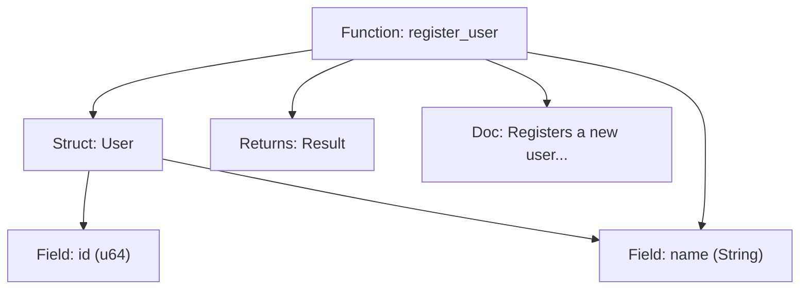

Absolutely — here is the fully updated and enriched document:

---

````markdown
# 📄 Semantic Graphs for Function Signatures, Types & Documentation

---

## ❓ Why Now?

In most current agentic systems (Claude, Gemini CLI, LangChain), code generation relies heavily on:

- Flat text search (e.g., grep/RAG)
- Token-based memory with no symbolic grounding
- Fuzzy matches from pretrained corpora — not your project

This leads to brittle behavior and frequent hallucinations during real-world software development.

---

### ❌ Before Tinkerbell: The Hallucination Problem

Agentic LLMs frequently generate code that is **plausible but incorrect**. These errors stem from the LLM’s inability to align its predictions with:

- Your codebase’s actual structure
- Your dependency versions
- Your current project configuration

This manifests in two primary ways:

#### 🔸 1. Hallucinating Methods on External Libraries

| LLM Misstep                                 | Root Cause                                           | Result                                                      |
|---------------------------------------------|------------------------------------------------------|-------------------------------------------------------------|
| Calls `.to_slug()` on a `String`            | Pattern matched on naming heuristics                 | ❌ Method doesn’t exist — fails at compile time             |
| Uses `.parse_json()` on `serde_json::Value` | Trained on outdated examples or poor associations     | ❌ Invalid — never existed in any version                   |
| Assumes `.spawn()` on `tokio::Task`         | Mixed up `tokio::task::spawn` vs `std::thread::spawn`| ❌ Async context mismatch                                  |
| Assumes `reqwest::Client::post_json()`      | Merged `reqwest` with legacy or internal APIs        | ❌ Method doesn’t exist                                    |
| Calls `chrono::now()` as a method           | Wrong crate (`chrono` vs `time`)                     | ❌ Undefined symbol                                         |

#### 🔸 2. Hallucinating Symbols Inside Your Codebase

| LLM Misstep                          | Root Cause                          | Result                                              |
|--------------------------------------|-------------------------------------|-----------------------------------------------------|
| Uses old `MyStruct` field names      | RAG returned stale files            | ❌ Compile-time field error                         |
| Forgets prior refactor decisions     | No memory of past decisions         | ❌ Reverts to outdated structure or naming          |
| Rewrites a helper that already exists| No awareness of symbol graph        | ❌ Redundancy, duplication, convention mismatch     |

---

## ✅ What Tinkerbell Introduces

Tinkerbell parses and maps every function, struct, trait, and their associated types, docs, and relationships into a **semantic graph**.

Each node captures:

| Node Type    | Properties                                    |
|--------------|-----------------------------------------------|
| `Function`   | name, params, return type, docstring           |
| `Struct`     | fields, derives, associated docs               |
| `Trait`      | methods, docs, implementors                    |
| `Call`       | edges to callee functions                      |
| `File/Module`| path, imports, symbols                         |

This graph is persisted and embedded alongside versioned memory, meaning every LLM generation round is grounded in:

- ✅ Actual symbol names
- ✅ Real types
- ✅ Accurate function signatures
- ✅ Up-to-date crate APIs
- ✅ Local documentation and historical usage

---

## 🛠️ How It Works

Tinkerbell parses code using `syn` + `tree-sitter`, generating a structural graph:

```plaintext
(:Function {name: "submit_task", return_type: "Result<TaskId>", doc: "..."})
(:Struct {name: "TaskRequest", fields: ["description: String", "priority: u8"]})
(:Function)-[:USES]->(:Struct)
(:Struct)-[:HAS_FIELD]->(:Field {name: "priority", type: "u8"})
````

This is then embedded into:

* 🧠 The **semantic memory graph**
* 🧬 The **vector store** (docs, names, types)
* 🔄 The **ReAct loop**, during planning + code generation

---

### 📐 Example Graph: From Code to Semantic Memory

#### 🔢 Source Code Example

```rust
/// Represents a user in the system
pub struct User {
    pub id: u64,
    pub name: String,
}

/// Registers a new user and returns the internal ID
pub fn register_user(name: String) -> Result<User> {
    let user = User {
        id: 42,
        name,
    };
    Ok(user)
}
```

#### 🧠 Semantic Graph Representation

```plaintext
(:Struct {name: "User", doc: "Represents a user in the system"})
(:Field {name: "id", type: "u64"})
(:Field {name: "name", type: "String"})
(:Struct)-[:HAS_FIELD]->(:Field {id})
(:Struct)-[:HAS_FIELD]->(:Field {name})

(:Function {name: "register_user", return: "Result<User>", doc: "Registers a new user..."})
(:Function)-[:RETURNS]->(:Struct {User})
(:Function)-[:USES]->(:Field {name})
(:Function)-[:CREATES]->(:Struct {User})
```

#### 🔁 Mermaid Diagram



---

## 🧪 Real Example: Fixing the Hallucination

You're implementing a CLI command that calls `submit_task()`.

Other agents might hallucinate:

```rust
submit_task(description)?;
```

…when the real function is:

```rust
/// Submit a new task to the runtime queue
/// 
/// # Arguments
/// - `request`: Full task data
pub fn submit_task(request: TaskRequest) -> Result<TaskId> { ... }
```

Tinkerbell has access to:

* ✅ Full function signature
* ✅ `TaskRequest` struct shape and docstring
* ✅ Trait constraints on `TaskId`
* ✅ Prior `impl` blocks that shape its usage

So it generates:

```rust
let request = TaskRequest {
    description: "run backup".into(),
    priority: 5,
};

let task_id = submit_task(request)?;
```

---

## 🧠 After Tinkerbell: Smarter Agents

| Capability                  | Enabled by Semantic Graph Memory         |
| --------------------------- | ---------------------------------------- |
| “Make it fit” accuracy      | Code generated fits type expectations    |
| Code prediction by intent   | Docstring indexing helps match purpose   |
| Type-safe refactors         | Agents know where and how types are used |
| Struct field consistency    | Prevents missing or duplicated fields    |
| Real-time API contract sync | Agents update usage as signatures evolve |

---

## 📦 Implementation Modules

* `graphdb` – AST symbol nodes and semantic edges
* `scheduler` – type-safe task resolution
* `reasonact` – plans generation using semantic graph queries
* `canvas` – snapshots semantic structure as part of commits

---

## 🧱 Implementation Roadmap

* [x] `syn` parser → graph builder
* [x] `tree-sitter` fallback for multi-language support
* [x] Docstring capture and embedding
* [ ] Crate version linker: match AST to `Cargo.lock` and `docs.rs`
* [ ] Symbol timeline indexing: see how a function evolves
* [ ] Trait-impl auto-resolver to identify incomplete definitions

---

## 🔗 Future Enhancements

* 🌐 Link docstrings to online crate versions
* 🧩 Align doc comments with ReAct prompts
* 📅 Version symbol metadata alongside vector cache

