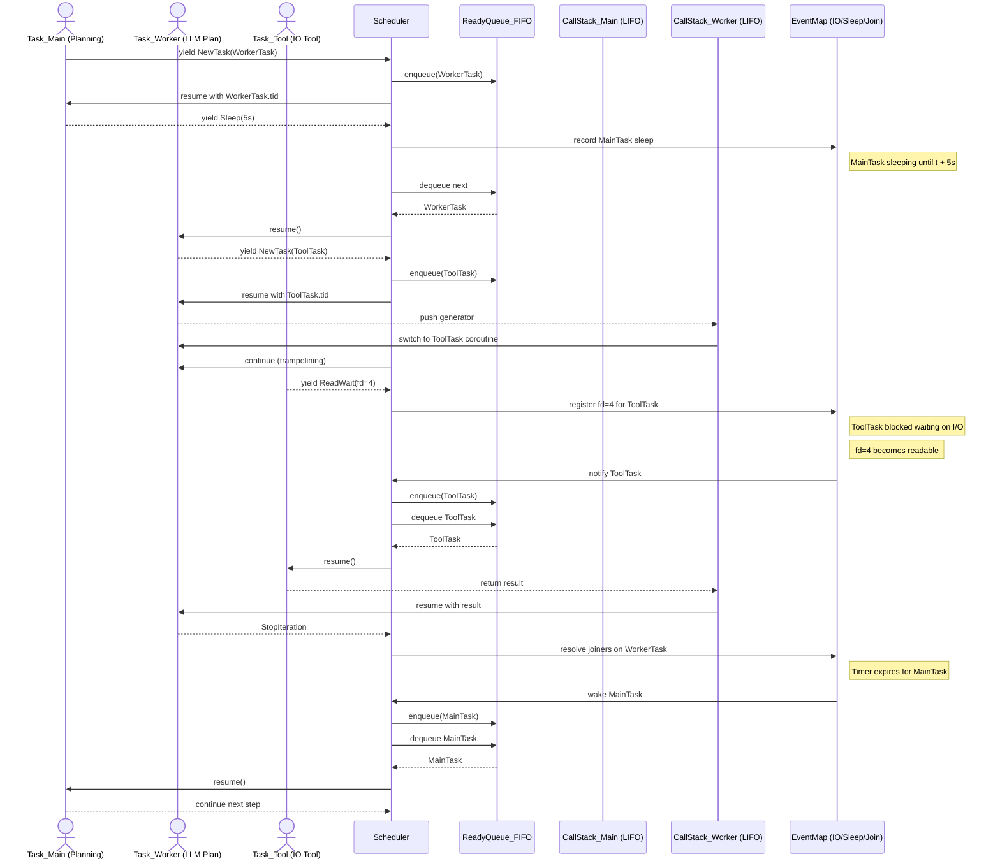
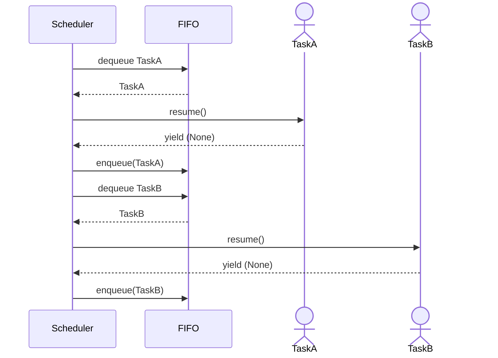
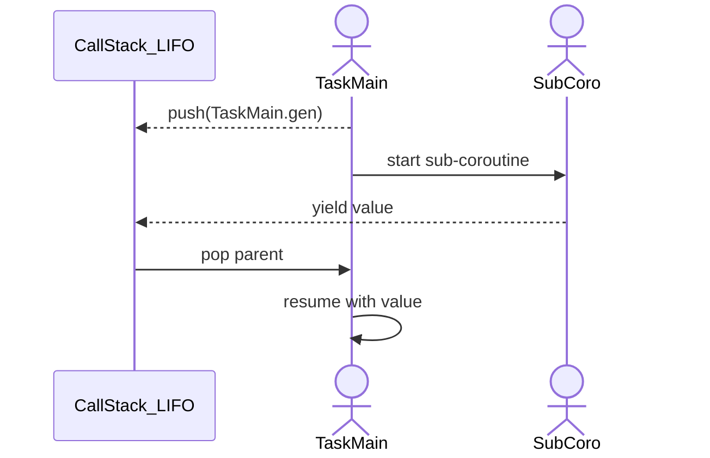
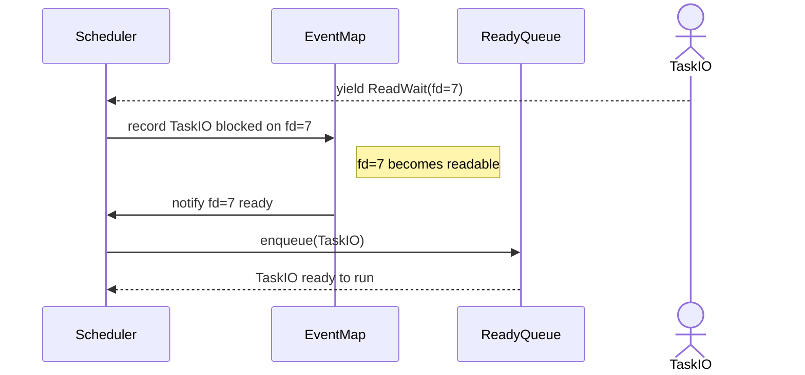
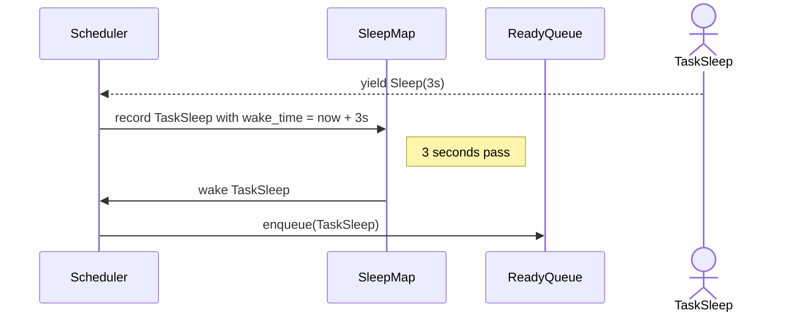
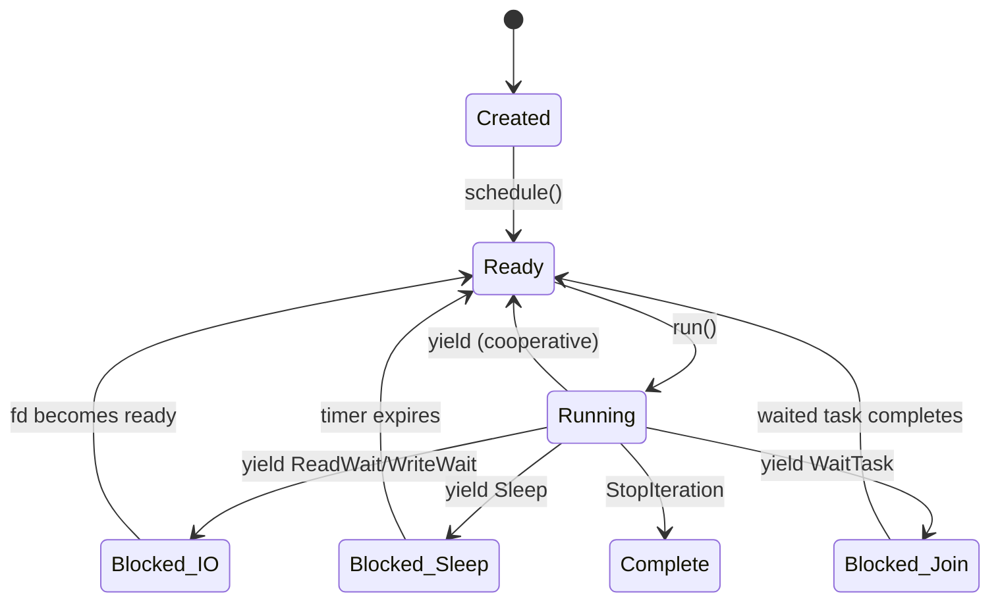
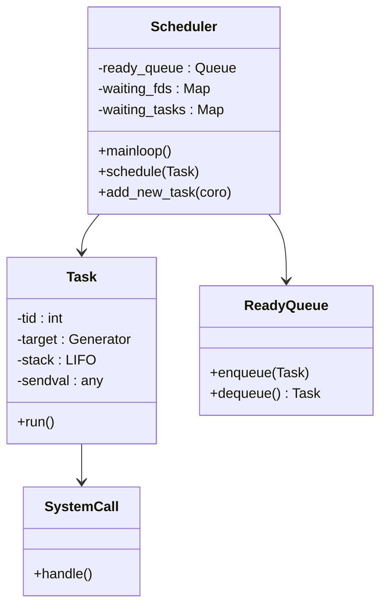
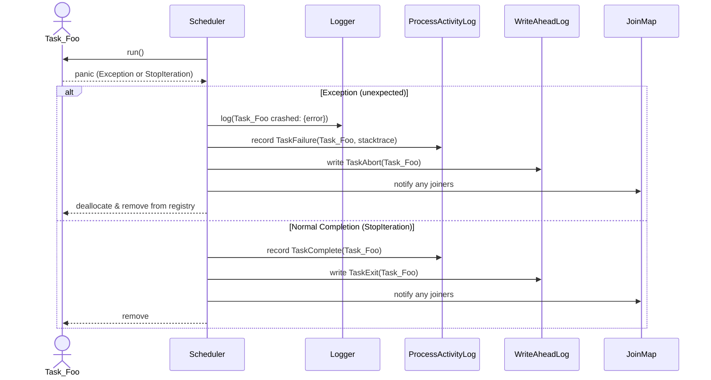
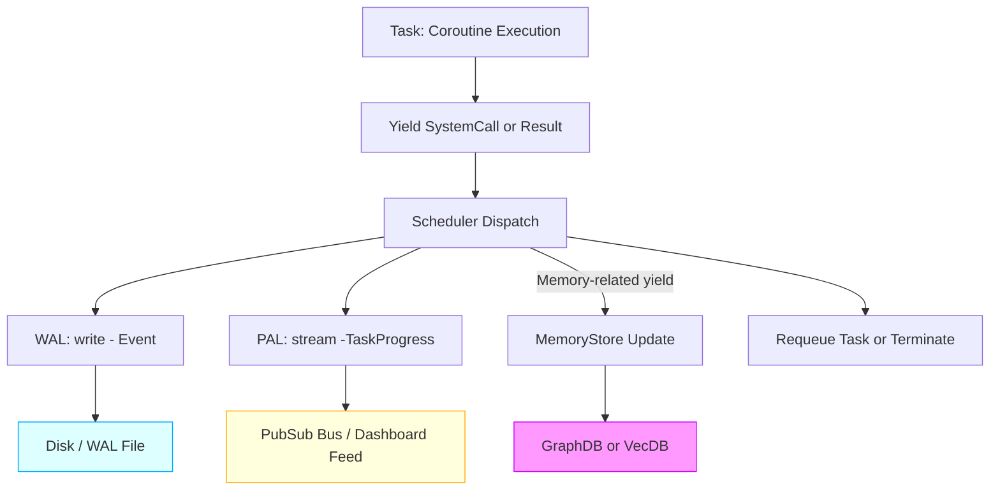

# Design Document: Coroutine-Based Task Scheduler for Tiffany

## Introduction and Background

Tiffany requires a lightweight **cooperative multitasking** runtime to manage concurrent tasks without the complexity of threads or processes. We will build a coroutine-based task scheduler inspired by prior art in Python and other systems. **Coroutines** are program components that generalize subroutines for non-preemptive multitasking: they allow a function to suspend execution (`yield`) and resume later, which is ideal for implementing our own scheduler. By using coroutines, we can explicitly control when tasks give up control (cooperative scheduling) and integrate asynchronous I/O handling directly into the runtime. This approach was popularized in David Beazley’s 2009 PyCon tutorial "A Curious Course on Coroutines and Concurrency," where he constructed a simple “Python Operating System” (PYOS) using generator-based coroutines. Modern frameworks like Python’s `asyncio` build on similar concepts (an event loop, tasks, and awaiting I/O), but for Tiffany we will design a **minimal scheduler** focused on our specific needs rather than a full general-purpose OS or framework.

### Prior Art and Influences

**David Beazley’s PYOS**: Beazley’s example (known through code like `pyos.py` series) is a key reference. In his design, a central **Scheduler** manages a queue of tasks, each task being a coroutine wrapped in a lightweight **Task** object. Tasks voluntarily yield control, either simply to let others run or to request a “system call” (an operation for the scheduler to perform on behalf of the task). The scheduler loop repeatedly takes the next ready task, runs it until its next `yield`, and then decides what to do based on the yielded value (resume the task, create new tasks, wait for I/O, etc.). This cooperative model avoids preemptive context switches and threads, making it lightweight and deterministic. Beazley’s system introduced **system call objects** like `GetTid`, `NewTask`, `WaitTask`, `ReadWait`, etc., which tasks could yield to request scheduler actions. For example, a task could do `yield NewTask(some_coro)` to spawn a new coroutine task, or `yield ReadWait(file_obj)` to signal the scheduler to pause the task until a file descriptor is readable. His final iteration also solved the issue of calling coroutines from within coroutines (nested yields) via a technique called **trampolining**, which we’ll discuss shortly.

**Async IO frameworks**: Python’s `asyncio` (PEP 3156) and similar event-loop systems were motivated by the same goal of handling many tasks with one thread by **async/await** syntax. They formalize coroutines as first-class objects (native `async def` coroutines in Python 3) and use an event loop to schedule their execution. Our design will conceptually resemble a simplified asyncio: we’ll have an event loop (the scheduler), tasks (coroutine functions), and awaitable events (our system call yields). However, we will implement just what we need for Tiffany rather than a full library. This means focusing on **cooperative scheduling and I/O readiness**, and possibly timed delays, without the overhead of unrelated features.

**Coroutines in Rust**: An alternative to a Python implementation is using Rust, which by its 2021 edition (and likely 2024 edition improvements) supports async/await for concurrency. Rust’s model is different under the hood – it uses *futures* and an executor. Each `async fn` in Rust compiles to a state-machine that implements the `Future` trait. An executor (runtime) polls these futures and uses a **waker** mechanism to resume tasks when events (like I/O) are ready. While Rust’s approach is efficient and memory-safe, implementing a custom coroutine scheduler in Rust is more involved than in Python. There is no stable native “yield” for synchronous coroutines in Rust yet (generators are an unstable feature), so one would typically build on the async/await system (futures). In our context, a Rust implementation might involve spawning tasks as futures and using an event loop (like `tokio` or a custom one) to drive them. This is certainly feasible and would give performance and safety benefits, but it means embracing Rust’s asynchronous programming model (polling futures) rather than the simpler generator interface that Python offers. We will discuss the trade-offs in a later section. For now, we draw inspiration from the Python model (which is easier to prototype) while keeping in mind that the design concepts (task, scheduler, event waiting) are transferable to Rust or other environments.

## Requirements and Scope for Tiffany

Tiffany’s scheduler should support **concurrent tasks with minimal overhead**, focusing on our use cases. We are not building a general OS with process isolation or preemptive multitasking. Instead, the requirements are:

* **Cooperative Multitasking:** Tasks yield control explicitly at well-defined points (e.g. when they need to wait or simply to let others run). This avoids complex context switching – the scheduler will only switch tasks when a task yields. Each task runs to its next yield without interruption. This is sufficient for many I/O-bound or event-driven workloads and simpler to implement than preemptive scheduling. It does mean a badly-behaved task that never yields could block others, so we must ensure our tasks are written to yield periodically (especially during long computations or loops).

* **Task Management:** Ability to create (spawn) new tasks dynamically. For example, when a network connection comes in, the scheduler can spawn a new task to handle that connection while the main task continues listening. We might also want the ability to terminate tasks or have tasks wait for others to finish, though these are secondary if our use-case can manage without explicit task joining or killing. (If needed, we can implement a `WaitTask` system call to allow one task to yield until another task completes, and possibly a `KillTask` to remove a task, similar to Beazley’s design.) At minimum, **spawning tasks** is required.

* **I/O and Event Waiting:** A mechanism to integrate non-blocking I/O. Tasks should be able to wait for external events (file descriptors being readable/writable, timers, etc.) without blocking the whole program. In a typical scenario, a task waiting for network data will yield an event to the scheduler (e.g. “read wait on this socket”). The scheduler can then **pause that task** and continue running others. Under the hood, the scheduler will use an OS primitive (like `select` or `poll`) to check when the socket is ready, and then resume the task. This means our scheduler likely needs to maintain a registry of file descriptors (or other event sources) to tasks waiting on them. Beazley’s example uses `select.select` on sets of descriptors, which is a straightforward approach we can use as well (since Tiffany might be running in an environment where `select`/`poll` is available). If Tiffany’s needs include timers (sleeping for X seconds), we could implement a similar mechanism with timeouts: tasks yield a “sleep until time T” event, and the scheduler keeps track of that, resuming the task after the timeout.

* **Efficiency and Simplicity:** Keep the core loop simple and avoid unnecessary features. We don’t need memory protection, true parallelism, or complex prioritization – all tasks run in the same thread and share memory (like async functions do). Context switching is just a function call (resuming a generator), which is very cheap. We will not implement advanced scheduling policies; a simple round-robin or FIFO scheduling of ready tasks is sufficient. Also, error handling can be basic: if a task raises an uncaught exception (aside from the `StopIteration` that signals a generator’s normal completion), it could terminate that task – the scheduler can catch exceptions from `task.run()` and decide to drop the task or log it. In a robust system we’d have to propagate errors or allow tasks to handle others’ failures, but for now a simple strategy (like printing error and removing the task) is acceptable.

* **Trampolining (Nested Coroutines):** As an *optional* but highly useful feature, we want tasks to be able to call coroutine-based subroutines without losing the ability to yield. In a naive generator scheduler, if one generator calls another that uses `yield`, things get tricky – only the top-level generator’s yields are noticed by the scheduler. David Beazley’s **trampolining** solution was to have the `Task` object manage an explicit **stack** of generators. Whenever a running coroutine yields another *generator*, the scheduler **does not** treat it as a final yield; instead, the current task pushes its current generator onto a stack and continues executing the yielded sub-generator. This way, the task can **dive into** nested coroutines and when the sub-coroutine completes or yields a value back, the task pops the stack and resumes the caller. Trampolining is crucial for code modularity – it allows writing coroutine helpers (e.g. an `Accept(sock)` coroutine that itself yields events) and calling them naturally with `result = yield Accept(sock)` inside a task. We will include trampolining in our design so that tasks can be structured hierarchically without the scheduler needing special logic for it (the Task object will handle it, making it *transparent to the scheduler*).

* **Focus on Tiffany’s domain:** If Tiffany is, for example, a provisioning system or similar, typical tasks might include networking (listening for requests, handling connections), file I/O, or invoking system commands. We anticipate heavy use of network/socket I/O which fits well with this async approach. We likely do not need features like CPU-bound parallelism (which would need threads or multiple processes) – cooperative coroutines handle concurrency when tasks are I/O-bound or need to wait. As long as one task is waiting on I/O or an event, another can run. If all tasks are waiting (idle), the scheduler can block on `select` until something happens, using minimal CPU.

## Architecture Overview

Our coroutine runtime will consist of a few core components: **Task**, **Scheduler**, and a set of **System Call events** that tasks can yield to trigger special behavior. Additionally, we have the notion of the **call stack** within a Task for trampolining nested coroutines. Below we detail each component and how they interact.

#### 🧬 Enhanced Sequence Diagram: Tiffany Coroutine Scheduler (Expanded)


🧠 Key Concepts Represented:
- Scheduler is the event orchestrator
- Tasks are coroutine-based units of execution
- ReadyQueue (FIFO) holds ready-to-run tasks
- CallStack (LIFO) enables trampolining between nested coroutine calls
- EventMap (join waits, I/O readiness) manages blocked tasks waiting for conditions to be fulfilled
- SystemCall yields are managed through handle() logic per syscall (not shown inline here for brevity)
- Task completion includes reactivating any tasks waiting on the completed task (e.g. via WaitTask)
- Trampolining logic handles yield sub_coro and propagates results back via stack unwind

#### 🧩 Component-Focused Diagrams Plan

| Diagram # | Focus Area                              | Purpose                                                                |
| --------: | --------------------------------------- | ---------------------------------------------------------------------- |
|    **D1** | 📦 **Basic Scheduler & Task Yield**     | Round-robin task switching using FIFO ReadyQueue                       |
|    **D2** | 🪜 **Nested Coroutines (Trampolining)** | How `yield SubCoro()` pushes/pops the CallStack per task               |
|    **D3** | 🔌 **I/O Blocking & Wakeup**            | Task yields `ReadWait`, blocks on `fd`, gets resumed on readiness      |
|    **D4** | ⏲️ **Sleep and Timer Handling**         | Task yields `Sleep(duration)` and wakes later                          |
|    **D5** | 🔁 **Join / WaitTask Resolution**       | Task B waits for Task A to finish and is resumed when Task A completes |

#### Diagram D1 – Basic Task Switching (ReadyQueue only)


#### Diagram D2 – Nested Coroutines (Trampolining)


#### Diagram D3 – I/O Blocking and Wakeup


#### Diagram D4 – Sleep and Timer Handling


### Diagram D5 – Join / WaitTask Resolution


### State Machine Diagram: Task Lifecycle

Purpose: Shows all valid transitions for a task (created → ready → running → blocked → complete).

Helps with: Understanding task states, debugging transitions, implementing lifecycle hooks.




### Class Diagram: Scheduler Components

Purpose: Depicts the structure of Scheduler, Task, SystemCall, ReadyQueue, etc.

Helps with: Implementation planning, unit test coverage, codebase modularity.



### Fault Handling & Panic Recovery

This diagram shows what happens when a task panics (e.g. raises an exception or hits StopIteration unexpectedly), and how the scheduler logs, cleans up, and optionally notifies dependent systems via the PAL and WAL.



🧠 Interpretation
- Exceptions and normal StopIteration are handled differently, but both trigger:
  - Log/record in PAL (for real-time dashboards)
  - Append to WAL (for deterministic replay)
  - Notify any other tasks waiting on the failed/completed one
- This can be extended later to retry policies, fallbacks, or alert hooks (e.g., webhook to notify UI agent).

### Data Flow: Task Execution + WAL/PAL Logging

This shows how data produced during task execution (including yielded values, system calls, and final results) is recorded into:

- WAL (Write-Ahead Log): durable event stream for recovery/replay
- PAL (Process Activity Log): ephemeral, streaming trace for dashboards
- MemoryStore: optional semantic graph / state mutation

Purpose: Shows how yield/return data from tasks is recorded and logged into the system.
- WAL = Write-Ahead Log
- PAL = Process Activity Log

This is helpful for:
- Task recovery
- Auditing
- Live dashboards


🧠 Interpretation
Every execution result passes through the Scheduler, which:

- Logs to WAL for recovery (e.g. TaskYielded, TaskWaitIO(fd=4))
- Streams to PAL for dashboards (e.g. TaskStep with step label)
- Optionally updates MemoryStore (e.g. a new semantic link or skill)
- WAL is append-only, immutable
- PAL is transient (but real-time)
- MemoryStore is stateful, must be synchronized with execution semantics


🧠 Summary: Which to prioritize?

| Diagram                       | Priority | Purpose                             |
| ----------------------------- | -------- | ----------------------------------- |
| ✅ Task Lifecycle (State)      | ⭐⭐⭐⭐     | Debugging, correctness, onboarding  |
| ✅ Scheduler Class Overview    | ⭐⭐⭐⭐     | Code structuring and test scaffolds |
| ✅ Fault Handling Sequence     | ⭐⭐⭐      | Observability, stability            |
| ✅ PAL/WAL Data Flow           | ⭐⭐⭐      | Logging, traceability, dashboards   |
| ✅ SystemCall Dependency Graph | ⭐⭐       | Extending runtime with new features |


### Task

A **Task** represents a running coroutine (generator). It encapsulates the coroutine and its state, including anything needed to resume it. In our design, a Task will have:

* `tid` – a task identifier (unique per task). This can simply be an integer assigned in sequence for debugging or referencing tasks.
* `target` – the **current generator** that the task is running. Initially this is the coroutine function’s generator object. Due to trampolining, this `target` may change to a sub-generator if the coroutine calls another coroutine (we maintain a stack of generators, see below).
* `stack` – a list (stack) of generator objects, initially empty. This is used for trampolining: whenever the task yields a generator (a sub-coroutine), we push the current `target` onto `stack` and start running the sub-generator as the new `target`. When a generator finishes, we pop from the stack to resume the caller.
* `sendval` – a value to send into the coroutine on next resume. This is how we deliver data or signals to the coroutine. For example, when a task yields an event and the scheduler processes it, the scheduler might set `sendval` for when the task resumes (e.g., the result of a system call). Initially, when a task is first started, `sendval` is `None` (since we have to send `None` or call `next()` to start a generator).

The Task object will have a method like `run()` which essentially advances the coroutine to its next yield point. Pseudocode for `Task.run` might be:

```python
class Task:
    def run(self):
        try:
            result = self.target.send(self.sendval)   # Resume coroutine, send value
        except StopIteration:
            # Coroutine finished
            if self.stack:
                # If there is a calling generator waiting, resume it
                self.sendval = None
                self.target = self.stack.pop()
                return None  # indicate we should continue running (scheduler will reschedule immediately)
            else:
                # No caller, task is truly done
                return None
        self.sendval = None  # reset sendval after sending

        if isinstance(result, SystemCall):
            # If coroutine yielded a system call (special request)
            return result  # hand it to scheduler to handle:contentReference[oaicite:25]{index=25}

        if isinstance(result, types.GeneratorType):
            # Coroutine yielded a sub-generator: trampolining
            self.stack.append(self.target)
            self.target = result
            # loop back (we can just return something that causes scheduler to immediately continue this task)
            return self.run()  # (or manage via while loop as in Beazley’s code)
        else:
            # A normal yield (some value yielded to scheduler or caller)
            if not self.stack:
                # Top-level coroutine yielded a value (not a sub-call and not system call)
                return result  # this result can be ignored or handled by scheduler if needed
            # If there is a caller awaiting this yield:
            caller = self.stack.pop()
            self.target = caller
            self.sendval = result  # send the yielded value as result back into caller
            return self.run()
```

This logic is derived from Beazley’s trampolining implementation. In fact, Beazley’s code used a `while True` loop inside `run()` to handle nested yields in one go. The key idea is: **if a coroutine yields another generator, we don't return to the scheduler**; instead, we switch context to that sub-generator (pushing the current one onto a stack). We only return from `run()` to the scheduler when we hit a yield that *isn't* a sub-coroutine call or when a system call needs handling. If a coroutine fully finishes (StopIteration) and we have a caller on the stack, we pop back to it (effectively as if the yield of the sub-coro returned None). The scheduler will see a return of `None` from `task.run()` as either "task not ready to yield to scheduler (continue internally)" or "task completed". We might handle that by the scheduler: if `task.run()` returns `None`, it means either the task finished or is still running a sub-task (depending on how we code it). In Beazley’s code, he returned `None` to indicate the task isn’t yielding a real value (so the scheduler will just move to next task) until a system call or completion happens. We can follow a similar convention.

To summarize **Task.run outcomes**: It can return a `SystemCall` object (meaning “scheduler, please handle this and don’t immediately reschedule me”), or return a regular value/None. If it returns a non-SystemCall (including `None`), the scheduler can assume the task either completed or just yielded a value without any special meaning – usually we would simply put the task back on the ready queue if it returned a value or `None` (unless `None` signifies completion). One way to detect completion is to track if the task’s coroutine is exhausted. In our code, if a StopIteration occurs with no caller, that task is done and should not be rescheduled. We might mark a flag or simply not requeue it.

### Scheduler

The **Scheduler** is the event loop that coordinates all tasks. It maintains data structures for ready tasks and for tasks waiting on events (like I/O or other tasks). Key parts of the scheduler design:

* A queue (FIFO) of **ready tasks** that can run. We can use a simple list or `collections.deque` for this. Tasks get pulled from here to execute, and if they yield cooperatively (normal yield), they go back to the end of the queue. This ensures round-robin fairness for CPU time among tasks that are ready to run.

* A **task table or registry** to keep track of tasks by ID. For example, a dictionary `tasks` mapping `tid -> Task`. This is useful if we implement operations like `KillTask(tid)` or `WaitTask(tid)` where the scheduler needs to find a specific task by its ID.

* Data structures for **waiting tasks**:

    * For I/O: perhaps two dicts, `read_waiting` and `write_waiting`, mapping file descriptors to Task waiting on them (if any). Alternatively, a combined structure mapping an event key to tasks. Initially, we can keep it simple with two dicts as in Beazley’s example (one for read, one for write).
    * For task waiting: if implementing `WaitTask`, we need a map of task IDs to a list of tasks waiting for them to finish. E.g., `waitting[tid] = [list of Tasks paused until tid finishes]`.
    * For timers: if we want `Sleep(duration)` functionality, we might maintain a min-heap or list of (wake\_time, Task) for tasks that are sleeping, and on each loop check the current time to see if any should be woken and moved to ready. (This is similar to how some event loops manage call-at-future-time events.)

* The **main loop** of the scheduler will roughly do: while there are tasks (or events to wait for):

    1. If there are no ready tasks, block on I/O (and possibly timer) events until something is ready (to avoid busy-wait). If there are ready tasks, we might do a non-blocking check for I/O instead. This logic is found in Beazley’s `iotask()` which the scheduler can also manage as a special periodic task. We can incorporate the polling directly in the loop.
    2. Take the next task from the ready queue.
    3. Call `task.run()`.
    4. Examine the return value:

        * If `result` is a **SystemCall** instance: This means the task is requesting a special operation (and has **yielded control intentionally** for this). The scheduler will *handle the system call* immediately. Typically, the SystemCall object has a `handle()` method that the scheduler can invoke. In our design, we can implement each SystemCall’s `handle` to perform the needed action. Before calling `handle()`, we usually set context on the SystemCall: e.g. `result.task = current_task` and `result.sched = self` so it knows who’s calling and can communicate back. After handling, the task might be ready to continue (or not). For example, `GetTid` system call will set the task’s `sendval` to its tid and immediately requeue the task. A `ReadWait` system call will **not** requeue the task; instead it will put the task into `read_waiting` and *not* schedule it until the I/O is ready. The SystemCall’s logic will determine that. After `handle()`, the scheduler’s loop continues to the next iteration without requeuing the current task (unless the system call did so).
        * If `result` is `None` or a **regular value** (not a SystemCall): This means the task either completed or just yielded a value. If `result is None` and the task’s generator is done, we drop the task (it finished execution). If `result is not None` (or is None but the task is not actually done yet due to trampolining), it likely represents a **normal cooperative yield** – the task yielded control on purpose (maybe via a `yield` with no special object). In such case, we simply put the task back onto the ready queue to resume later. We might not have a strong use for the actual value yielded (some systems use it for passing messages, but in our design we don’t anticipate tasks communicating via yielded values except for the defined SystemCall objects). We can safely ignore or log unexpected yield values. In summary, for a normal yield, requeue the task.
        * If an exception was raised from `task.run()` that isn’t StopIteration (meaning an error in task): we might catch it around `task.run()`. In such a case, we should consider the task crashed. The scheduler can log the exception (and the task ID for debugging) and not requeue the task. This prevents one task’s error from crashing the whole scheduler loop.

* **I/O polling**: To handle I/O, the scheduler will incorporate a call to `select` (or an equivalent like `selectors` in Python) each cycle. One approach (from Beazley’s code) is to spawn a special internal task whose job is to continuously call `iopoll()` in a loop and yield, so that it runs concurrently with others. Another approach is to integrate polling into the main loop when no ready tasks are left (or periodically). We can do something like:

```python
# Pseudocode for I/O wait integration in scheduler loop:
if not ready_queue:
    # No task ready to run, so we can block on I/O
    timeout = None  # block indefinitely until an event
else:
    timeout = 0  # poll without blocking (just check and return)
readable, writable, _ = select(read_waiting_fds, write_waiting_fds, [], timeout)
for fd in readable:
    task = read_waiting.pop(fd)
    ready_queue.append(task)
    # perhaps set task.sendval = None or some actual data if needed
for fd in writable:
    task = write_waiting.pop(fd)
    ready_queue.append(task)
```

This way, if tasks are waiting on I/O, we wake them when ready. If tasks are simply CPU-bound but cooperative, the `timeout=0` poll ensures we check I/O quickly without blocking, and then continue round-robin. If *all* tasks are waiting (no one ready), we do a blocking wait (`timeout=None`) so that the process sleeps until an I/O event occurs. This is important to avoid spinning CPU when idle.

* **SystemCall Handling**: We will define a small set of system call classes that encapsulate operations. Likely candidates for Tiffany:

    * `GetTid` – returns the task’s own ID. Useful for tasks to identify themselves (maybe for logging). This would simply do: `self.task.sendval = self.task.tid; self.sched.schedule(self.task)` (i.e., put the task back in ready queue).
    * `NewTask(coro)` – create a new Task for the given coroutine and schedule it. The current task could receive the new task’s id as a result of the yield. Implementation: create Task, store in task map, enqueue it; set current task’s `sendval` to new task’s id (or some acknowledgment) and then **also** enqueue current task again (so it continues).
    * `WaitTask(tid)` – current task wants to wait until task `tid` completes. We would check if that task is still alive. If yes, remove current from ready queue and put it in a wait list for that `tid`. If the task `tid` is already done, we can immediately continue the current task (perhaps setting `sendval` to some result or `None`). If waiting, when task `tid` eventually finishes, the scheduler will need to take any tasks in its wait list and enqueue them (with perhaps a result indicating that the wait is over).
    * `KillTask(tid)` – to terminate a task. The scheduler would look up the task by id, and if found, remove it from ready queue or waiting structures, and possibly prevent it from running. If a task is killed, tasks waiting on it might need to be notified (maybe with an exception or a special value). We might not need this in Tiffany initially unless we have a use-case to stop tasks.
    * `ReadWait(file)` / `WriteWait(file)` – as described, these will take the file’s file descriptor and put the task in `read_waiting` or `write_waiting`. The task is not requeued; it’ll be resumed by the scheduler when the fd is ready (detected via select). We should mark in the task map that this task is now blocked on I/O. The `handle()` will do: `self.sched.waitforread(self.task, fd)` for example, and nothing more (do not requeue the task). The scheduler’s polling will take care of waking it.
    * (Optional) `Sleep(dt)` – not mentioned in Beazley’s original, but easy to add. It would record a wake-up time (now + dt) and put the task aside (perhaps in a min-heap sorted by wake time). The scheduler each loop can check the soonest wake-up time to decide a timeout for select. When time is reached or passed, the scheduler will requeue the task. This can be implemented similarly to I/O wait.

We can implement these system calls as classes with a `handle()` method as mentioned. They might look like:

```python
class SystemCall:
    def handle(self):
        pass

class GetTid(SystemCall):
    def handle(self):
        self.task.sendval = self.task.tid
        self.sched.schedule(self.task)  # put task back ready

class NewTask(SystemCall):
    def __init__(self, coro):
        self.coro = coro
    def handle(self):
        new_task = Task(self.coro)
        self.sched.add_task(new_task)
        # Immediately schedule new task
        self.sched.schedule(new_task)
        # Also resume current task
        self.task.sendval = new_task.tid
        self.sched.schedule(self.task)
```

And so on for others (`ReadWait`, etc.), following the patterns from Beazley’s code (which we have paraphrased). The scheduler will detect `isinstance(result, SystemCall)` and invoke `result.handle()` after attaching `result.task = current_task` and `result.sched = self`. This injects the needed context so the SystemCall knows which task is making the request and can access the scheduler.

**Scheduler APIs:** We should have methods like `Scheduler.new(coro)` to add a new coroutine (wrap it in Task and enqueue), and `Scheduler.schedule(task)` to enqueue an existing Task (this might just put it in ready queue). Also, perhaps `Scheduler.exit(task)` or internal handling when a task finishes (to do cleanup, e.g., remove from task map, and wake any waiters).

The main loop `Scheduler.mainloop()` drives everything until no tasks remain. It will incorporate the logic discussed: get next ready task, run it, handle results, and poll events. In Python pseudocode:

```python
def mainloop(self):
    while self.tasks or not self.ready.empty():
        # handle IO and timers
        if self.ready.empty():
            timeout = None
        else:
            timeout = 0
        # use select or similar to get ready fds
        rlist = list(self.read_waiting.keys())
        wlist = list(self.write_waiting.keys())
        if rlist or wlist:
            readable, writable, _ = select.select(rlist, wlist, [], timeout)
            for fd in readable:
                task = self.read_waiting.pop(fd)
                self.schedule(task)
            for fd in writable:
                task = self.write_waiting.pop(fd)
                self.schedule(task)
        elif timeout is None:
            # No fds to wait on, but we have to wait (meaning no ready tasks and no I/O)
            # This situation likely means no tasks at all, or only tasks waiting on something that isn't fd (maybe a timer).
            # We could sleep or break.
            break

        if not self.ready.empty():
            task = self.ready.get()  # dequeue a ready task
        else:
            continue  # go back to loop top if nothing ready (maybe all tasks done while waiting)

        result = None
        try:
            result = task.run()
        except Exception as e:
            # handle unexpected task exception
            print(f"Task {task.tid} raised {e}, removing it")
            # (optionally call some task cleanup)
            continue

        if result is None:
            # Task finished or yielded normally with no special request
            if task.is_done():  # we would need a way to check if fully done
                # remove from task map, and if someone waiting on it:
                if task.tid in self.waiting:
                    for wtask in self.waiting[task.tid]:
                        self.schedule(wtask)
                    del self.waiting[task.tid]
                continue  # don't requeue
            else:
                # If not done, it yielded cooperatively (like yield None or something)
                self.schedule(task)  # just requeue
        elif isinstance(result, SystemCall):
            result.task = task
            result.sched = self
            result.handle()
            # Note: the SystemCall handler is responsible for requeueing the task or not
        else:
            # The task yielded a value (not None, not SystemCall)
            # We currently have no use for direct yielded values except maybe debug
            # Treat it as a cooperative yield: task still alive, requeue it
            self.schedule(task)
```

The above is a rough outline; details will differ (like how we mark task done – perhaps `Task.run()` sets an internal flag or we catch StopIteration).

One subtlety: In Beazley’s code, when a task returns a SystemCall, `Task.run()` actually *returns* that SystemCall up to the scheduler, and the scheduler does not immediately requeue the task but processes the system call. The task in such case is still in a running state, just paused until the system call is done. Many system calls will immediately put the task back to ready (like GetTid, NewTask), but some (ReadWait, WaitTask) deliberately do not requeue the task, causing it to be effectively blocked. Our design follows the same approach.

To illustrate the scheduling and task switching, consider two tasks yielding control back and forth:

&#x20;*Figure 1: Cooperative task switching.* In the above sequence diagram, Task A runs and then **yields control** to the scheduler (e.g., by executing a simple `yield` with no special event) to allow other tasks to run. The scheduler receives control and marks Task A as ready (or takes it out temporarily since it yielded). The scheduler then picks Task B to run next. Task B runs for a while and then yields control as well. The scheduler resumes Task A, and so on in a round-robin fashion. This cooperative approach ensures tasks take turns. Each arrow labeled "yield ... control" represents a task suspending itself by yielding, and "resume Task X" represents the scheduler activating the next task. The scheduler is at the center, orchestrating the switches.

### Trampolining and Nested Coroutines

Trampolining is handled within the Task’s `run()` logic, as described, rather than in the scheduler. This is by design: from the **scheduler’s perspective, a Task with trampolining is still a single task** – the scheduler doesn’t need to know if the task internally entered a sub-coroutine. The Task will only return to the scheduler when the entire nested sequence yields a system call or finishes. This keeps the scheduler simple and pushes the complexity to the Task object.

To understand trampolining, imagine a server task that calls a helper coroutine. For example:

```python
def Accept(sock):
    yield ReadWait(sock)            # wait for a client to connect
    client, addr = sock.accept()    # accept connection (once socket is ready)
    yield client, addr              # yield the result back to caller

def server(port):
    sock = setup_listening_socket(port)
    while True:
        client, addr = yield Accept(sock)   # call sub-coroutine Accept
        yield NewTask(handle_client(client, addr))
```

In this scenario, `server()` calls `Accept(sock)` via `yield`. Without trampolining, `Accept`’s yields would not be handled correctly. With trampolining, what happens internally is:

* The `server` coroutine (let’s call it **Outer**) yields a generator object when it does `yield Accept(sock)`. That generator corresponds to the **Accept** coroutine. The Task running `server` detects it yielded a generator. It **pushes the Outer generator onto its stack** and sets its current `target` to the Accept generator. The Task now will start/resume the Accept coroutine. The scheduler is *not* involved in this switch; it all happens inside `Task.run`.

* The Accept coroutine runs until its first yield. It yields `ReadWait(sock)` – a system call to wait for a socket. At this point, in `Task.run`, `result` is a `ReadWait` SystemCall, which triggers the `return result` path. Thus, the Task returns the `ReadWait` event to the scheduler (and pauses). The scheduler sees a SystemCall, sets it up with context, and handles it. In this case, `ReadWait.handle()` will register that task in the `read_waiting` map for that socket’s fd and **not** requeue it. The task is now blocked waiting for I/O. The scheduler will move on to other tasks (if any) or wait in select for file descriptors.

* When a client connection comes in, the listening socket becomes readable. The scheduler’s `select` call returns that fd as ready. The scheduler finds which task was waiting on that fd (the Accept’s task) and puts it back on the ready queue. Now the Accept coroutine can resume. The scheduler will eventually run that task again; in `Task.run`, we re-enter where we left off in Accept (after the `yield ReadWait`). We likely set `sendval = None` when resuming after I/O (no particular value to send, or we could send the `sock.accept()` result, but in this design Accept itself will call `sock.accept()`). Accept now executes `client, addr = sock.accept()` (since the socket is ready) and then `yield client, addr`. That yields a regular value (not a SystemCall or generator) back to the scheduler.

* The Task’s `run()` sees the Accept generator yielded a normal value (the client socket and address). Since the Task’s stack is not empty (Outer is waiting), the code will **pop the Outer generator off the stack**, make it the current target again, and set the value as `sendval`. It then continues running the Outer generator, effectively sending the `(client, addr)` tuple into the `yield Accept(sock)` expression. Thus, in the `server()` coroutine, the call `client, addr = yield Accept(sock)` receives the values and continues. From the scheduler’s view, this entire sequence looks like the task went to sleep on I/O and then produced a SystemCall and later simply yielded a normal value (the tuple) which we ignored/treated as cooperative yield before rescheduling. The Outer coroutine then immediately yields `NewTask(handle_client(client, addr))` as per the code, which will be a SystemCall. The scheduler handles the NewTask system call by creating a new task for `handle_client` and scheduling it. Meanwhile, the server task (Outer) is requeued (since after yielding NewTask it would continue its loop).

This interplay is complex, but the **good news** is our design cleanly separates concerns:

* The Task/trampoline mechanism handles **sub-coroutine calls and returns** without scheduler intervention, making nested coroutine calls possible just like nested function calls.
* The scheduler handles **system calls and dispatch**.
* The net effect is our code can be written in a linear style with `yield` acting as an async wait, which is very convenient.

&#x20;*Figure 2: Nested coroutine (trampolining) and I/O event sequence.* The above diagram illustrates the sequence described: The Outer task (e.g., the `server` loop) yields a sub-coroutine `Accept(sock)`. The Task internals switch to running the Accept coroutine. The Accept coroutine yields a `ReadWait` system call to the Scheduler, indicating it needs to wait for the socket. The Scheduler pauses the task until the socket is ready (some time passes externally). Once a client connects (socket ready), the Scheduler resumes the Accept coroutine. Accept then produces a result (`client, addr`) and returns that back to the Outer task. The Outer task resumes, now with the client info, and can continue (in this case, spawning a new task to handle the client). All of this happens seamlessly: from the programmer’s perspective, `yield Accept(sock)` returned a value when the Accept coroutine completed, just like a normal function call that waited for I/O. This transparency is the benefit of trampolining. The scheduler did not have to know about the call to Accept; it only dealt with the `ReadWait` and later the `NewTask` system calls.

### Rust Implementation Consideration

We should briefly consider how this design would map to Rust 2024, to ensure our approach is not fundamentally incompatible if we choose or need to implement in Rust. Rust’s async/await works differently but the high-level structure of an event loop with tasks is analogous:

* In Rust, an **async function** is analogous to our coroutine. It can `await` on futures (similar to yielding events). We could create an executor that polls these futures. For example, our scheduler’s main loop in Rust would poll each future (task) until it returns `Poll::Pending` or `Poll::Ready`. If pending, it means the task yielded (awaited) on something – we’d then need to know on what it’s waiting (Rust’s waker system handles this via registering wakers with reactors like epoll or timers). If ready, the future completed and can be dropped.

* Many of the constructs we have as SystemCall in Python would correspond to either standard library futures or custom future combinators in Rust. For instance, waiting on a socket is typically done by an async I/O reactor (like using `tokio` which integrates with OS polling under the hood). Spawning a new task is typically a method on the executor (`spawn` in tokio). Getting a task ID is not built-in in Rust futures (since tasks are generally anonymous closures), but one could incorporate an ID for logging.

* One *could* attempt to implement a stackful coroutine in Rust with the unstable `Generator` trait, which would look more like the Python approach (allowing `yield` within a generator). However, using that directly is nightly-only. Instead, using async/await (which are stackless coroutines) is the idiomatic way. Each `.await` in Rust is akin to a yield point where the task returns control to the executor. The executor must know how to wake the task when the awaited operation is ready. This is done via `Waker` objects in Rust, typically provided by the runtime. Our Python scheduler used a simple `select` loop; in Rust, an executor often uses OS selectors (epoll, etc.) or leverages a library for readiness (like `mio` in tokio).

* **Minimum needed vs full features**: In Rust, if using existing libraries, we might not need to implement our own reactor – we could use something like `futures::executor::block_on` or `smol` or `tokio` for a lot of functionality. But if we want a standalone minimal runtime (for learning or control), we could implement a basic `select` or `poll` loop using lower-level crates. Our SystemCall analogs in Rust could be simple functions or futures: e.g., a `read_wait(socket)` could be a future that registers interest in a socket readability event and yields until the socket is readable. The complexity is higher than in Python due to Rust’s safety and the need to interface with OS properly (non-blocking sockets, etc.).

**Evaluating Python vs Rust for Tiffany**: For prototyping and quick development, Python’s coroutine scheduler is extremely flexible and easy to change. It runs in a single thread (which might be fine if Tiffany’s workload is I/O-bound and not CPU-bound) and can handle many concurrent tasks (Python generators are lightweight). Python’s drawback is performance – if we need to handle thousands of tasks or high throughput I/O, the Python interpreter might become a bottleneck. Additionally, Python’s GIL prevents multi-core usage, but since we’re doing single-threaded co-op multitasking, that’s not a concern unless one wanted to scale across threads (not in our current scope).

Rust, on the other hand, offers high performance and true non-blocking behavior with zero-cost abstractions once compiled. If Tiffany’s environment is constrained (e.g., running on bare-metal with low resources or needing to maximize network throughput), a Rust implementation might be worthwhile. Rust also offers memory safety – our Python scheduler must be carefully written, but Python itself is memory safe; the main risks in Python are logical (like forgetting to requeue a task or handle an exception). Rust could help avoid certain classes of errors (like data races, if we later use multiple threads for parallelism). However, writing our own Rust async runtime is a significantly bigger engineering effort than the Python prototype. The **minimum necessary** for our needs might be achieved with the Python approach initially, given we don't need true parallelism or extreme performance in the prototype stage. We can ensure the design is portable to Rust by mirroring concepts:

* Use **Futures** in Rust as tasks; use an executor (which we can implement or reuse) akin to our Scheduler.
* Replace yields and SystemCalls with `await` points and either library futures (for I/O) or custom ones (for things like `GetTid` – though in Rust, `GetTid` is trivial or not usually needed, since tasks aren't typically identified by an integer by default).
* We won’t have an exact equivalent of trampolining issue in Rust because `async/await` handles that automatically via the compiler (an async function can call another async function and `await` it, which is analogous to our yield-from or trampolining solution, but the Rust compiler flattens these awaits in the generated state machine). Essentially, Rust’s `async` is more like having trampolining built-in – you can await nested async calls with no special effort.

In conclusion, for **Tiffany's minimum requirements**, the Python coroutine scheduler suffices and is easier to build and iterate on. We will proceed with that design, implementing just the features we need (task creation, basic synchronization, and non-blocking I/O). If performance tests or production considerations demand it, we can plan a migration to Rust using an equivalent structure (possibly leveraging an existing runtime to avoid reinventing the wheel at low level). The conceptual model of our scheduler – an event loop handling tasks and events – is common to virtually all async runtimes (from JavaScript’s event loop to libuv, Python asyncio, and Rust executors), so the knowledge and design should translate well.

## Summary of Design Decisions

* **Single-threaded cooperative scheduler**: simple design, deterministic behavior, no preemption. Suitable for I/O-heavy tasks. Not suitable for CPU-bound parallel work (not needed for now).
* **Coroutine tasks via Python generators**: easy to implement the logic of yield/resume. We use generator `send()` and `yield` to alternate between tasks and scheduler. We wrap them in a Task class to manage state and allow nested yields (trampolining).
* **System call objects for events**: We define specific events tasks can yield to trigger actions like spawning tasks or waiting on I/O. This makes the yield interface extensible – we can add new capabilities by introducing new SystemCall classes without changing the core scheduler loop much.
* **Trampolining with explicit stack**: This is included to allow tasks to call sub-coroutines cleanly. It adds a bit of complexity to Task.run but keeps scheduler logic clean (the scheduler always sees top-level yields only). This decision is justified by the need for clean code structure in tasks (avoiding monolithic giant coroutines because of lack of yield-from). Since we target at least Python 3.7+ for Tiffany (likely, given modern context), we *could* use `yield from` instead of manual trampolining. Indeed, PEP 380 (yield from) provides a language-level way to delegate to subgenerators, which would make our Task.run simpler (we wouldn’t need to manually push/pop stack). However, using `yield from` means our coroutines would use that syntax directly in their code. If we have control over writing all coroutine functions, this is fine. If we prefer to support even older style or want to see how it works under the hood, trampolining is educational. Given that yield-from is well-supported, an alternative design is: whenever a generator yields another generator, we could use `yield from` to drive it. But since our scheduler is explicitly managing yields, we likely stick to our manual approach.
* **Minimal set of system calls**: We will implement only those needed. For example, if Tiffany’s tasks mostly revolve around network and spawning, we implement `NewTask`, `ReadWait`, `WriteWait`, and possibly a `Sleep`. If tasks need to coordinate, `WaitTask` can be added. We won’t implement features like prioritization or time-slicing (each task runs until it yields). If a task misbehaves (never yields), it will block the system – this is acceptable given our controlled use cases, but we’ll document that tasks must be written to yield appropriately.
* **Integration with actual I/O**: We assume the environment allows non-blocking I/O operations. For example, for network sockets we will set them to non-blocking mode (Beazley’s example uses `socket.accept()` after waiting, which is fine because the accept will not block when select indicates readiness). For file reading or other ops, we may need similar handling. Python’s `select` works on sockets and some other file types on Unix. If we need cross-platform or more complex monitoring, we could use the `selectors` module which abstracts `select`/`poll`/`epoll` differences. But to keep it minimal, `select` is okay if our fd sets are small (there is a FD limit on select, but likely not an issue for Tiffany’s scale).

The design above gives us a clear blueprint to start coding. We have focused on the essential mechanisms: task switching, waiting for events, and maintaining state. We have also discussed how to scale it down or up depending on needs (e.g., what happens in Rust, what features to omit for simplicity). With this design, the next step is to implement the Scheduler and Task classes in code, define the necessary SystemCall subclasses, and test the system with some example tasks (like a simple server or a ping-pong between tasks) to ensure it behaves as expected. The sequence diagrams provided illustrate the flow of control between tasks and the scheduler, which we will use as a reference for implementation correctness.
