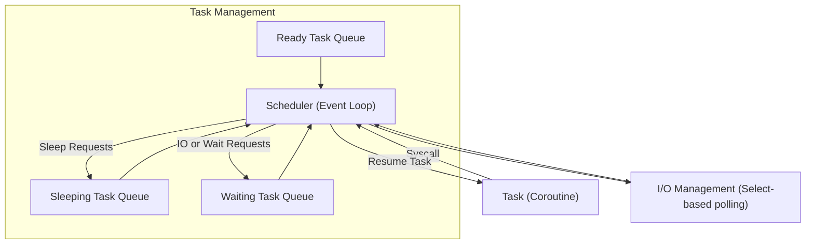

## 📌 **1. Overview of PyOS (pyos8.py)**

**PyOS** is an educational, minimalistic micro-operating system implemented in Python using generators/coroutines to simulate concurrent tasks. The core features include:

* **Tasks as Generators**: Each "task" is a coroutine (`yield`-based) that encapsulates some ongoing work.
* **Scheduler**: A lightweight round-robin task scheduler (`Scheduler`) runs tasks until completion or yields control voluntarily.
* **System Calls (Syscall)**: Tasks request OS services (sleep, wait, IO) via structured system calls.
* **Event-driven Loop**: Scheduler handles tasks based on events (I/O completion, sleep duration, etc.).

---

## 📂 **2. Detailed Architectural Analysis (with Mermaid)**

Here's the architectural diagram of PyOS:



### Core Components:

* **Task**: coroutine (`yield`) wrapped into a `Task` class. Each task maintains its own coroutine state.
* **Scheduler**: event loop managing tasks.
* **Syscall**: task requests (sleep, IO, etc.) handled by the scheduler.

---

## 🧩 **3. Task Management Explained**

**Tasks** in PyOS are managed explicitly through a scheduler:

```python
class Task:
    taskid = 0
    def __init__(self, target):
        Task.taskid += 1
        self.tid = Task.taskid  # Unique task id
        self.target = target    # Coroutine
        self.sendval = None     # Value to send into coroutine
        self.stack = []         # Call stack for nested coroutines
```

**Scheduler** maintains multiple queues:

* `ready`: Tasks ready to run immediately.
* `sleeping`: Tasks scheduled to run after a delay.
* `waiting`: Tasks blocked on I/O or other events.

Scheduler main loop:

```python
class Scheduler:
    def mainloop(self):
        while self.taskmap:
            if not self.ready:
                self.iopoll(None)
            else:
                task = self.ready.popleft()
                result = task.run()
                self.schedule(task)
```

This approach provides:

* **Explicit task control**
* **Predictable execution order**
* **Clear state management**

---

## 🚦 **4. How PyOS Handles System Calls**

Tasks use **Syscall** to yield structured commands:

```python
class SysCall:
    def handle(self, task, sched):
        pass

class GetTid(SysCall):
    def handle(self, task, sched):
        task.sendval = task.tid
        sched.schedule(task)
```

* Tasks yield `SysCall` objects.
* Scheduler intercepts, executes, then resumes tasks.

Example Task using Syscall:

```python
def foo():
    tid = yield GetTid()
    print(f"My task id is {tid}")
```

---

## 🌟 **5. Relevance & Value to Tiffany Daemon**

Applying this architecture to **Tiffany** offers significant advantages:

### ✅ **Advantages for your use-case:**

* **Fine-grained control**: Tasks explicitly yield for system operations (like awaiting API or LLM responses).
* **Memory-efficient concurrency**: Avoid overhead of threads/processes, critical for long-lived agents.
* **Traceable state transitions**: Easier debugging, transparency in state and lifecycle management.
* **Predictable & careful execution flow**: Aligns with your "one-foot-on-the-ground" cautious approach.

### 💡 **Use Case Scenarios in Tiffany:**

* Agent executing a complex, multi-step workflow (e.g., code edit → git commit → API call → LLM query) as separate cooperative tasks.
* Tasks handling different interactions (CLI vs API) concurrently yet clearly separated in the scheduler.
* Easier rollback and checkpointing: Each step clearly delineated by coroutine yield points.

---

## ⚙️ **6. Coroutine Considerations in Rust**

While the example uses Python generators, Rust provides advanced coroutine (async/await) models via runtimes like `tokio`, `async-std`, or coroutine libraries like `may`.

* **Tokio/Async**:
  Standard Rust solution for async tasks and efficient I/O multiplexing.
* **May (Coroutine-focused)**:
  Offers coroutine-style programming and lightweight task handling, suitable for fine-grained control.

**Rust async example (with Tokio):**

```rust
async fn handle_task(task_id: usize) {
    println!("Handling task {}", task_id);
    tokio::time::sleep(Duration::from_secs(1)).await;
}
```

**Rust Coroutine-style example (with May):**

```rust
use may::coroutine;

fn main() {
    coroutine::scope(|s| {
        s.spawn(|| {
            println!("Task started");
            coroutine::sleep(Duration::from_secs(1));
            println!("Task done");
        });
    });
}
```

---

## 🎯 **7. Recommended Architecture for Tiffany**

Based on PyOS inspiration, I suggest adopting a hybrid Rust async + coroutine model:

### ✅ **Tiffany Task Scheduler (Conceptual):**

* Define explicit task states and transitions clearly.
* Tasks (async or coroutine) yielding explicit commands similar to SysCall, allowing predictable scheduling and state management.
* A **scheduler loop** managing tasks explicitly, providing clear debug and auditability.

Example of explicit Rust-based scheduler task structure:

```rust
enum TaskCommand {
    AwaitLLMResponse(Query),
    AwaitFileIO(PathBuf),
    AwaitUserApproval(String),
}

struct Task {
    id: usize,
    state: TaskState,
}

enum TaskState {
    Running,
    Waiting(TaskCommand),
    Completed,
}

impl Scheduler {
    async fn run(&mut self) {
        loop {
            for task in &mut self.tasks {
                match task.state {
                    TaskState::Waiting(ref cmd) => {
                        match cmd {
                            TaskCommand::AwaitLLMResponse(q) => {
                                if let Some(resp) = self.llm.try_get_response(q).await {
                                    task.state = TaskState::Running;
                                }
                            },
                            // Handle other cases similarly
                            _ => {}
                        }
                    },
                    TaskState::Running => {
                        // Run the task's next step
                    },
                    TaskState::Completed => {}
                }
            }
            tokio::time::sleep(Duration::from_millis(10)).await;
        }
    }
}
```

* Tasks explicitly yield commands the scheduler handles.
* Matches your "one-foot-on-the-ground" operational style.

---

## 🛠️ **8. Recommended Roadmap**

* **Prototype a simple Rust Scheduler** inspired by PyOS (using async Rust).
* **Define explicit commands/tasks** for Tiffany (LLM queries, API calls, filesystem ops).
* **Implement simple coroutine/task model** (using tokio + explicit state machine).

---

## 🚀 **Conclusion and Recommendation**

Dave Beazley’s PyOS provides a clear and powerful task management blueprint. Its explicit task control, predictable
scheduling, and structured system call mechanism align extremely well with your **Tiffany** vision.

For your Rust-based daemon, adapt these ideas into a hybrid coroutine/async system, managing tasks explicitly for predictability, clarity, and debug ease.

Your next steps:

* Prototype the Rust scheduler inspired by PyOS.
* Define Tiffany-specific tasks and state transitions.
* Validate with simple coroutine-style and async tasks.

## References:

- [Dave Beazley’s Coroutines](https://www.dabeaz.com/coroutines/)
- [Dave Beazley’s PyOS](https://www.dabeaz.com/coroutines/pyos8.py)
