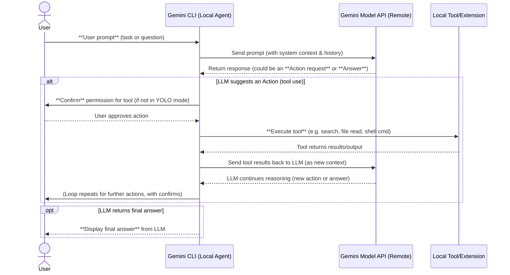

Great. I’ll do a comprehensive analysis of the `gemini-cli` codebase, including a full architectural breakdown with Mermaid diagrams, a detailed explanation of the `agent` module’s orchestration (local vs. remote), and a breakdown of how instructions are processed.

I’ll also assess what it would take to replicate this tool in Rust using a modular LLM router like `genai-rs`, aiming for feature parity, and evaluate what key capabilities are currently missing from `gemini-cli` if one were to design a next-generation agent runtime — Tinkerbell — inside your Microscaller Firecracker Agentic Runtime.

I’ll let you know as soon as the research and diagrams are ready.

# **Gemini CLI Agent Architecture and Reimplementation Plan**

## **Local vs Remote Orchestration in Gemini CLI**

\*\*Gemini CLI’s agent runs **entirely on the user’s machine** – all orchestration and tool use happen locally within the open-source CLI program. The tool acts as a local “wrapper” around Google’s Gemini model API, using a **Reason-and-Act (ReAct) loop** to drive multi-step interactions. In practice, this means the CLI sends your prompt to the Gemini LLM and then interprets the model’s response to decide on actions. There is **no hidden cloud “agent”** making decisions for you – the **control logic resides in the CLI code** and the Gemini model **only provides next-step instructions**. The model’s outputs (e.g. whether to use a tool or answer directly) guide the agent’s behavior, but the CLI itself orchestrates the entire loop.

Notably, **Gemini CLI can integrate external extensions** via the *Model Context Protocol (MCP)*, which allows connecting to **local or remote MCP servers** for additional capabilities. These MCP servers can supply extra tools, data, or prompts to the agent. However, they do **not take over orchestration** – they’re **add-on providers** that the local agent can query. The core agent loop remains on your machine. In short, aside from calling out to the Gemini model (and any MCP endpoints or web services the tools use), **Gemini CLI does everything locally** in the terminal. Google’s emphasis on open-sourcing the project is precisely so developers can **verify that all logic (and security checks) run client-side**.

To answer the question directly: **the agent’s functionality is not remotely orchestrated by Google**. The CLI is a self-contained agent: it sends prompts to Gemini (the LLM) and *interprets the responses locally* to perform actions. There’s no cloud service deciding which tool to run or what step to take next – **the Gemini model’s responses (running in Google’s cloud) are the only remote element**, and everything else (planning loops, tool execution, confirmation prompts, etc.) is handled by the CLI program on your machine. Essentially, Gemini CLI is a local “brain” that **asks the LLM for guidance** and then **executes the plan locally**.

## **Agent Module Function and Control Flow**

**Gemini CLI’s agent module implements a classic ReAct loop**: it maintains a conversation with the LLM, interleaving model “thinking” steps with tool executions. Here’s how it works at a high level:

* **Initial Prompt & System Context**: When you type a request, the CLI assembles the message history, including any system instructions (like the contents of a `GEMINI.md` context file or default role) and your new prompt. For example, the CLI supports a `GEMINI.md` file in your project to provide persistent context or persona instructions. This context plus your query are sent to the Gemini model via its API.

* **Model Reasoning**: The Gemini LLM (remote) receives the prompt and, following the ReAct pattern, may respond with a **thought and an action** (rather than a final answer immediately). Gemini CLI’s system prompt likely tells the model about available **tools** and a format to request using them. For instance, the model might reply with something like: “🔎 *Search for X*” indicating it wants to use the **Google Search tool** to gather information.

* **Tool Invocation**: The CLI parses the model’s response. If it indicates an **action/tool call**, the agent module will prepare to execute that tool. **Crucially, user safety is prioritized**: by default Gemini CLI will **ask you to confirm** potentially risky actions (like running a shell command or writing a file) before execution. (There’s a `--yolo` mode to auto-approve all actions for power users.) Once approved, the CLI invokes the specified tool locally. Gemini CLI comes with numerous built-in tools – for example, a **Google Search tool** (to perform web searches and fetch results), file readers/writers, a terminal command executor, a code editor, etc. These are implemented as local functions or modules in the CLI. The CLI executes the tool and captures its output (e.g. search results text, file content, command output or error).

* **Returning Results to LLM**: After a tool finishes, the agent sends the **tool’s output back to the LLM** as input for the next reasoning step. Essentially, the CLI appends a transcript like: “*Search results for X: ...*” into the conversation context and asks Gemini *“now continue.”* This lets the model incorporate the new information. The model then produces a next response – which could be the final answer or another action. Gemini CLI will loop in this **think-act-reflect cycle** until the model produces a final answer for the user.

* **Final Answer**: When the model’s response is a **solution/answer** rather than an action, the CLI prints it out for the user. The conversation can continue interactively with the next user query, maintaining context unless reset.

This loop is orchestrated by an **Agent controller module** in the CLI code (in open-source, likely a TypeScript class managing state, tools, and the message loop). **Control originates from the model’s outputs** – the model *decides which tool to use next or when to answer* – but the CLI is firmly in charge of carrying out those decisions and enforcing rules. For example, the CLI will refuse to execute disallowed actions or will inject safety checks. Google notes that **multi-layer sandboxing** is used – e.g. the CLI might run shell commands in a restricted environment and always ask for user confirmation. There’s even a “**Shell mode**” (triggered by `!` prefix) that lets *you* run shell commands inside the CLI interface, but this is separate from the agent’s autonomous actions.

To better illustrate the control flow, here is a **Mermaid sequence diagram** of the Gemini CLI’s agent loop, showing how the LLM and the local agent interact:

*Figure: Gemini CLI’s ReAct agent loop – the CLI orchestrates tool use locally, guided by the LLM’s instructions.* The **control is shared**: the LLM decides *what* to do (next action vs. final answer), but the CLI decides *if and how* to execute it. This design ensures that **nothing dangerous happens without user oversight** and that developers can trust the agent’s autonomy in their own environment.

Internally, Gemini CLI’s code is modular. It has a **tool registry** (accessible via the `/tools` command in the CLI to list available tools) and an **MCP integration layer** for extensions. When the agent starts, it can load any configured MCP servers (defined in `.gemini/settings.json`) – for example, you might connect a GitHub MCP server to give the agent abilities like querying PRs or issues via the GitHub API. These MCP servers run as separate processes (the CLI can spawn them via a command like `npx @modelcontextprotocol/server-github`, as shown in the settings example) and communicate with the agent over standardized I/O streams. They essentially **provide additional tools or context** to the agent. From the agent’s perspective, tools from MCP servers are used just like built-in tools – the model can call them, and the CLI will forward the request to the appropriate MCP server and get back a result. This design makes Gemini CLI **extensible**: beyond its built-ins (search, file ops, code editing, etc.), the community or enterprise teams can plug in new capabilities (from media generation to custom data sources) without modifying the CLI’s core.

In summary, the agent module functions as a **local interpreter and executor** of the Gemini model’s instructions. The “brainstorming” (what to do next) comes from the LLM, but the **agency** (the acting) is implemented in local code. All key decisions – which tool to run, whether to allow it, how to format the info for the model – are handled by the CLI program on your machine. This **local-first orchestration** is why Gemini CLI can be open-source and security-audited by users.

## **Reimplementing the Agent in Rust with a Local LLM (Using `genai-rs`)**

Building a Rust version of Gemini CLI (let’s call our new agent **“Tinkerbell”**) is a feasible but involved project. It would require **recreating the core architecture** described above using Rust libraries and targeting a local or flexible LLM backend. Key steps and components needed:

* **LLM Integration**: Use an LLM client library that supports multiple providers. The [`rust-genai` crate](https://github.com/jeremychone/rust-genai) is an excellent choice, as it provides a unified API to various LLMs (OpenAI, Anthropic, Google Gemini via API, local models via Ollama/GGML, etc.). With `genai-rs`, our Rust agent can be **LLM-agnostic** – we can route queries to a local model (for offline use) or to cloud APIs depending on user configuration. This avoids locking the tool to a single vendor. We’d define an interface like `LLMClient` and use `genai` to implement it for whichever model the user selects. This layer would handle converting our messages (system, user, tools/results) into the LLM’s API format and getting the model’s response.

* **ReAct Loop & Prompt Management**: Implement the agent loop logic in Rust. This involves managing a **conversation state** (history of messages and actions) and a loop that alternates between **LLM calls** and **tool calls**. We’d likely maintain a list of `Message` structs (with role = system/user/assistant) that we update each turn. The system prompt would include instructions on the output format and available tools, similar to Gemini CLI’s approach. We might hard-code or template a system instruction like: *“You are an AI agent. You have these tools: \[Search, ReadFile, WriteFile, Shell]. When you need to use a tool, respond with an action in format XYZ… Otherwise, provide the final answer.”* The Rust code would send this context with the user query to the model via `genai`, then **parse the model’s reply** to see if it’s an action or an answer. Designing a reliable parsing scheme is important – we could use a JSON-based protocol (if we instruct the model to output a JSON with fields `"action": "...", "input": "..."`) or a special delimiter syntax that’s easy to split. Some LLMs (like OpenAI) have native function-calling APIs, but to keep it model-agnostic, a prompt-based approach might be better.

* **Tool Plugin System**: Develop a framework for **tools in Rust**. Each tool could be a trait object or enum implementing a common interface (e.g. `fn call(input) -> Output`). We would build in equivalents of Gemini CLI’s tools:

    * **Web search & fetch**: In Rust, we can integrate a search API (for example, call Bing or a Google Custom Search API) to implement a `search(query)` tool, and use an HTTP client (like `reqwest`) for a `fetch(url)` tool to retrieve webpage content.
    * **File operations**: Implement tools for reading files, writing files, maybe listing directory or finding text (grep). Rust’s standard library can handle these, but we must be careful with safety (only allow access within the project directory to avoid reading sensitive system files, for instance).
    * **Shell/Terminal command**: This is powerful but dangerous. We can use `std::process::Command` to run shell commands or scripts. Like Gemini CLI, we’d want to sandbox this. In a simple approach, we could restrict commands to a safe subset or run them in a **jailed environment**. This is where the Firecracker microVM idea comes in (more on that below). At minimum, we would prompt the user for confirmation *every time* the LLM tries to execute a command, unless a “--yolo” flag is set, exactly as Gemini CLI does.
    * **Code-specific tools**: Possibly a tool to open a code file or apply a patch. Gemini CLI can modify code; our Rust agent might include a tool that applies a diff or inserts a code snippet into a file (again, with user confirmation). We could also integrate version control (e.g., a `GitTool` that can run `git` commands or query commit history).

  The tool system should be **extensible**. In Rust, we might let users register custom tools via a config file or dynamic library plugins. We could mirror the MCP concept: e.g., allow the Rust agent to launch external helper programs (maybe as separate processes or WebSocket servers) that provide extra tools. For instance, one might plug in an “Imagen tool” for image generation by running a local stable-diffusion server and teaching the agent how to call it. The **Model Context Protocol** itself could be implemented or adapted – perhaps using an existing crate if available, or by simply following the spec (which uses stdin/stdout messaging). This would let **Tinkerbell** communicate with any MCP-compliant server (for things like media generation or enterprise data) just like Gemini CLI does. In essence, we want a modular architecture where adding a new tool doesn’t require rewriting core logic – the model is informed of the tool and it becomes available.

* **User Interface (CLI)**: We would create a terminal interface, likely using a library like `crossterm` or `rustyline` for reading input. The UI should support an **interactive session** with streaming output (printing the model’s answer as it streams, if using a provider that supports streaming tokens). Also, we’d implement special slash commands or shortcuts similar to Gemini CLI:

    * `/tools` to list tools and maybe enable/disable them.
    * `/mcp` to list connected MCP servers or extensions.
    * `/memory` to show current context or to clear conversation history.
    * Possibly `/stats` to show token usage or model info.
    * The `!` prefix for quick shell commands (this bypasses the AI and runs user-given commands, which is a convenience feature in Gemini CLI).
    * `--help` flag to show usage and `--prompt` for one-shot mode.

  All these features improve usability and parity with Gemini CLI. Fortunately, implementing CLI commands and flags is straightforward in Rust using crates like `clap` for argument parsing.

* **Security & Isolation**: One of the biggest challenges (and important aspects) is running potentially dangerous tools safely. The user specifically mentioned running in the *“Microscaller Firecracker Agentic Runtime”*, which suggests a deployment where each agent (or each tool invocation) runs inside a **Firecracker microVM** (or similar isolation container). Firecracker is a lightweight VM tech that could sandbox the agent’s actions at a kernel level. To leverage that, our Rust program could be structured to either **run entirely inside a sandbox** (so that even if the AI goes haywire and tries a malicious command, it can’t harm the real host), or to **spawn sandboxed subprocesses** for risky tools. For example, Tinkerbell might launch a Firecracker microVM that has limited file system access (maybe just a mounted project folder and nothing else) and a capped CPU/memory, and inside that VM run the shell commands or code that the agent wants to execute. This adds complexity (managing VM lifecycle), but it aligns with “multi-layered sandboxing” that Gemini CLI alludes to. If Firecracker is too heavy for every single tool call, we might use OS-level sandboxing (like Linux seccomp or chroot jails) for a lighter solution. In any case, **designing Tinkerbell with strong sandbox boundaries** is highly desirable, since we want the agent to be able to manipulate files and run code *without risking the user’s system*. Rust as a language already gives memory safety; combining it with environment sandboxing will provide end-to-end safety for agent operations.

* **Testing and Iteration**: Finally, we would need to iteratively test the agent’s prompts and parsing with a variety of models. Different LLMs have slightly different styles, so ensuring our prompt format yields reliable action signals (especially with a local LLM that might be less instruction-following than Gemini) is crucial. We might use smaller local models (for example, Llama 2 or CodeLlama via `ggml`/`llm` crates) for offline mode, and allow configuration to use OpenAI or Gemini via API for more complex tasks. Using `genai-rs` means we can support both simply by changing a config – the rest of the agent logic stays the same.

Overall, **replicating Gemini CLI in Rust** means implementing a similar agent loop, toolset, and interface – but with the freedom to choose any LLM backend. By leveraging `genai-rs` as an LLM router, our Tinkerbell agent could let the user plug in **OpenAI GPT-4**, **Anthropic Claude**, **local models**, or even **Google’s Gemini (via API)** behind the scenes. That flexibility ensures *our tooling isn’t locked to a single LLM*, fulfilling requirement (2). In practice, we’d abstract the model behind an interface and perhaps even support dynamic model selection: e.g., short queries could be handled by a local fast model, while complex coding tasks route to a more powerful cloud model – all configurable by the user. The router could also provide fallback if one API fails, improving reliability.

## **Ensuring Feature Parity with Gemini CLI**

To make our Rust agent competitive, we need to match **Gemini CLI’s key features**:

* **Multi-Step Tool Usage (ReAct Agent)** – The cornerstone feature. Our agent must handle complex tasks by breaking them into steps, using tools in between LLM calls. This includes the ability to **recover from failures** (if one approach doesn’t work, the LLM can try another plan) and even recommend multi-step solutions the user might not have imagined. Essentially, the agent should be a *“collaborative reasoning partner”*, not just a one-shot question answering bot.

* **Large Context and Codebase Awareness** – Gemini 2.5 Pro offers a 1 million token window, which is enormous. Local models won’t match that, but we can implement strategies to handle large codebases. Like Gemini CLI, which *“can query and edit large codebases in and beyond the 1M token context”*, Tinkerbell can use techniques such as: on-demand file reading (the agent opens files when needed rather than stuffing all code into the prompt), semantic search over the repo (embedding code and retrieving relevant chunks), or using summarization tools. For parity, we should include a **code search tool** (perhaps integrated with an MCP server or a built-in Rust library for indexing code) so the agent can find where in the codebase a symbol is defined, etc. Also, supporting the user’s editor/IDE integration (Gemini CLI ties into VS Code’s Code Assist) might be considered, but as a CLI we can focus on standalone usage first.

* **Coding Assistance** – Gemini CLI excels at writing and modifying code. Our agent should support typical “coding agent” abilities: generating new code files, suggesting fixes, refactoring, writing tests, etc. This largely comes from the model’s capability, but we need to support file writes and perhaps a **diff/patch tool**. For example, the agent might output a diff to apply – our tool can read the diff and apply changes to files automatically. Also ensure we support multi-file edits: Gemini can “improve test coverage” and such, which implies it may create multiple files. Our agent could have a planning mechanism for multi-file changes (or simply handle sequential file writes as directed by the LLM).

* **Built-in Tools for Web Access** – Gemini CLI has web search and web fetch built-in. We must provide an equivalent. A `search` tool (hitting an API or even scraping Google results) and a `fetch` tool to retrieve a URL’s content are essential for “grounding responses with external context”. This allows the agent to do **“deep research”** and get up-to-date information, not just rely on its training data.

* **Multimodal Inputs/Outputs** – Gemini is a multimodal model, and CLI allows generating apps from **PDFs or sketches** and creating images/videos via Imagen, Veo, Lyria (through MCP). For parity, our agent should be able to handle at least images as inputs and outputs if the underlying model supports it. If using a local LLM that is text-only, we might instead integrate a separate vision model tool. For example, we could allow an image file path as input to a tool that calls an OCR library or an image captioning model to describe the image to the LLM. For output, we could integrate an image generation model (Stable Diffusion or DALL-E via API). In short, **media generation and understanding** can be plugin-based. Achieving full multimodal parity is challenging (few open models match Gemini’s multimodal prowess yet), but we can design the system to allow it when possible. Even a basic PDF reader tool (to extract text from PDFs for the LLM to read) would cover the “generate apps from PDFs” case in a rudimentary way.

* **Memory and Checkpointing** – Gemini CLI has a `/memory` command to show combined context (system + recent history). Our agent should expose similar functionality: e.g. a command to summarize or reveal what the agent believes the current task/goal is, or to let the user edit the memory (maybe remove some irrelevant history to save tokens). The mention of *“checkpoints”* in some tutorials suggests the CLI might save intermediate state or allow reverting the conversation to a prior point. We could implement a **checkpoint system** where the agent periodically summarizes progress or the user can mark a point to return to if the conversation goes astray. This helps with long sessions by not needing to reset entirely.

* **User Controls and Settings** – Match the CLI flags and config options:

    * `--model` to select model (in our case, we could allow choosing among configured providers or local model names).
    * `--yolo` to disable confirmations (powerful, but for expert users).
    * `--prompt` for non-interactive usage (i.e. run one prompt and exit, useful for scripting pipelines).
    * Config file (\~/.Tinkerbell or similar) to set default options, API keys, tool enable/disable lists, etc. This parallels `.gemini/settings.json` where MCP servers and other preferences are stored.
    * Logging or `--verbose` flag for debugging (Gemini CLI likely has something similar for developers to see raw prompt/response or token counts).

* **Enterprise Integration** – One feature of MCP is connecting enterprise data or services (e.g., “integrate your local system tools with your enterprise collaboration suite”). While our first goal is an open agent, we should design with integration in mind. That could mean the ability to call out to APIs for Jira, GitHub, Slack, etc., via either built-in tools or MCP-like plugins. Feature parity would include the ability to *“query pull requests”* or *“make a slide deck from git history”* as Gemini’s examples show. Achieving that might be as simple as including a `GitHubTool` (which uses the GitHub API with a token) or a `SlideGeneratorTool` (which might be more complex, possibly leveraging an API or an external script to create slides). The key is that our agent’s architecture is flexible enough to add these later.

In short, **feature parity** means our Rust-based Tinkerbell agent can do everything Gemini CLI can do: code writing/refactoring, internet searches, file ops, shell commands, reading user-provided context files, using large context effectively, and extending via plugins. By systematically implementing the above, we ensure no major capability is missing in the open-source reimplementation.

## **Beyond Parity: Improvements and New Ideas for “Tinkerbell”**

Now, with *carte blanche* to design from scratch, we can address some limitations and dream up new features for our agent. Here are several enhancements and missing pieces we could provide in **Tinkerbell**, especially given the target environment of a *Microscaller Firecracker Agentic Runtime* (which implies scalable, isolated agent instances):

* **Stronger Isolation & Security**: Gemini CLI already sandboxes actions to a degree, but running the agent inside a Firecracker microVM per session would significantly harden security. In Tinkerbell, we could run the entire agent process in a microVM that only has access to a controlled folder (e.g., your project directory) and limited network access. This means even if the LLM decided to try something destructive (like deleting files outside the project, or calling an external service you didn’t intend), it couldn’t harm the host system. The Microscaller runtime could spawn a fresh VM for each new task or user session, and destroy it afterwards – achieving **ephemeral, safe execution**. This is especially useful for multi-user or server-side deployments of the agent. In addition, within the VM we could employ fine-grained permission controls: e.g., certain tools might be disabled or require explicit flags to enable (similar to how some IDE copilots require turning on “experimental features” for dangerous actions). This improvement gives users (and system admins) confidence to let the agent run more autonomously, because the worst it can do is trash its sandbox. It’s a foundation for allowing “headless” agent operation with minimal oversight – eventually enabling scenarios where *multiple agents run in parallel, fully automated*, without hand-holding, because they’re safely confined (the Reddit comment on “disparate agents running headless and orchestrated” speaks to this future vision).

* **Multi-Model Ensemble or Routing**: With an LLM router at our disposal, why use only one model at a time? We could empower Tinkerbell to **dynamically choose the best model for a given subtask**. For example, for a coding task it might use a code-specialized model (Codex or CodeLlama), but for a reasoning task it might switch to GPT-4, and for a user’s proprietary data it might use a smaller local model fine-tuned on that data. The agent can have a meta-policy (maybe even learned) to route queries. We could also run *multiple models in parallel* and have the agent compare answers – e.g., ask both Model A and Model B to propose a solution, then use an automated critique to pick the best. This kind of ensemble approach could overcome individual model weaknesses. It’s beyond Gemini CLI’s scope (which sticks to Gemini model only), but since we’re not tied down, we can explore it. The genai-rs library could facilitate this by making it easy to call different providers in one codebase.

* **Enhanced Memory and Knowledge Integration**: While Gemini CLI’s context window is huge, long-term memory beyond a single session could be better. Tinkerbell could integrate a **vector database or knowledge base** to store facts, user preferences, or previous conversations. Imagine the agent retains what you taught it last week about your coding style or project roadmap – it could recall that when you ask a related question today, even if the context window was reset. This persistent memory could be opt-in for privacy, but it’s a powerful addition. Similarly, integrating a **knowledge graph** or documentation index (so the agent can query official docs rather than always web searching) would make it more self-sufficient. Essentially, we move toward an “AI junior developer” that not only reacts but also **learns over time** within its runtime.

* **Richer Tool Ecosystem and Plugins**: MCP provides a standard for tools, but we can broaden the concept. For instance, allow **WebAssembly plugins** – one could write a small WASM module in any language, and the agent can load and execute it securely (WASM can be sandboxed). This would let third parties extend Tinkerbell easily with new capabilities (compute-heavy tasks, specialized data processing) without exposing the main process to risk. We can also include more **out-of-the-box tools**: e.g., direct database query tool (if the user wants to ask questions to a SQL database), an email-sending tool, a text-to-speech or speech-to-text tool (making the agent voice-interactive), etc. Given carte blanche, we’d try to make the agent *truly polyglot and multi-capable* – a “soup of spells” as the name suggests, where it can mix various magic (LLMs, APIs, scripts) to accomplish goals.

* **User Guidance and Controls**: We can improve the UX by giving users more insight into the agent’s reasoning. For example, a **“plan viewer”** that shows the steps the agent is considering (“Step 1: search for X, Step 2: read file Y, Step 3: write new code…”) in real-time could build trust. We could allow the user to **approve a full plan** at once or tweak it before execution. Gemini CLI currently prints each tool usage as it happens, but we could proactively show a draft plan. Additionally, implementing an interactive **“critique mode”** where the agent offers two solutions (like some UIs do with compare view) and explains the pros/cons could be valuable for complex questions. Since the Medium article mentions a binary feedback UI for comparing two LLM responses in some context, we might incorporate that idea: the agent could occasionally double-check its own work by using another tool or model to verify results before presenting them. All these features give the *user* more involvement if they want, or confidence to let the agent run if they don’t want to micromanage.

* **Performance and Scalability**: In a runtime with possibly many agents (think of a cloud service where multiple Tinkerbell instances handle different tasks concurrently), we’d want efficiency. Rust’s speed and memory safety are a boon here. We can optimize token usage by compressing context (e.g., summarizing earlier parts of conversation when they get too long) and parallelize operations (maybe fetching multiple pieces of information simultaneously if the model is waiting). Also, **scaling out**: if one agent can’t solve something alone in a reasonable time, maybe spawn a helper agent (a smaller one) to gather data while the main agent thinks. This is speculative, but the runtime could orchestrate multiple micro-agents collaborating. Since the question hints at an “Agentic Runtime,” we could imagine launching a fresh Tinkerbell agent per task, or even a hierarchy where a supervisor agent delegates subtasks to others (a bit like the “Task” tool in the Claude code reverse-engineering). Designing our system to allow an agent to invoke another agent (with perhaps a simpler prompt) to handle a sub-problem could mirror how human teams work. This is beyond Gemini CLI’s single-agent loop, but an exciting frontier.

* **Improved Multimodal and Multistep Workflow**: If we dream big, Tinkerbell could handle entire **workflows**. For example, not just generating an image from text, but creating a short video given a concept (stitching images or using a video generation model), or taking a user’s sketch image, generating code from it, then asking the user to confirm UI details, etc. Essentially, we can incorporate **branching logic** and more complex flows than a linear chat. A YAML/JSON “workflow script” that the agent can interpret (possibly even written by the LLM itself) could allow conditional steps, loops, or parallel tasks. This moves it slightly from pure conversational agent toward an **automation assistant**. Given our blank slate, we can experiment with that – for instance, the agent might decide “I need to monitor a file for changes and then compile it; I’ll set up a watcher.” This could be an advanced feature where the agent runs background tasks.

To ground these ideas: imagine *Tinkerbell running in the Microscaller Firecracker Agentic Runtime*. You open your dev terminal (or perhaps a web UI connected to this runtime) and spin up an isolated agent VM. You call it like: `Tinkerbell --model local-llama --enable-plugins image_gen,audio --project ~/myapp`. The agent comes up, loads your project context, and greets you. Now you ask: *“Help me add a feature to this app: whenever a user uploads a PDF, extract text and save to the DB.”* Tinkerbell might plan: (1) find where file uploads are handled (`search` in project code), (2) use a PDF parsing library (maybe suggest installing one, or use a plugin if available), (3) write code to integrate it, (4) run tests. It might fetch documentation from the web about a PDF library, write the code, then run `cargo test` (with your approval). If a test fails, it could automatically debug by reading the error and adjusting code. All the while, each shell command runs in the Firecracker VM, so your actual system is safe. In the end, it might even generate a report or a summary of changes. If this agent finds the local LLM struggling with the PDF content, it could route that portion of the task to a more capable model via the router (e.g., call GPT-4 just for extracting a summary of the PDF).

The difference from Gemini CLI is subtle in usage – both aim to achieve the task – but under the hood Tinkerbell is **more flexible (model-agnostic)** and **more secure (VM isolated)**, and potentially **more powerful** through parallelism or ensemble. We would also aim for even more **extensibility and openness**: since this is a from-scratch project, we can ensure every aspect is configurable or replaceable by the user (want to use a different sandbox mechanism? Just implement the trait; want to add a new tool? Drop a WASM in the plugins folder or add a line in config). By improving on areas where Gemini CLI might be constrained (tied to Google’s model, single-agent loop, etc.), Tinkerbell can be a truly **open, model-flexible AI agent**.

In conclusion, **Gemini CLI** provides a strong template: a local-first, tool-using AI agent with a rich feature set. Our analysis shows that its agent logic is local (no mysterious cloud orchestrator – just the LLM guiding a local loop). To replicate it in Rust, we’d rebuild that loop, integrate a variety of tools, and use an LLM routing library like `genai-rs` to avoid single-LLM lock-in. Achieving feature parity means supporting everything from web search grounding to code editing and MCP-based extensions. And with carte blanche, we would push further: enhancing security via microVM sandboxing, embracing multiple models, extending memory, and adding new “spells” to our soup of capabilities. **Tinkerbell**, running on the Microscaller Firecracker Agentic Runtime, could thus evolve into an AI agent that is not only on par with Google’s offering, but one that is **highly customizable, safer to trust, and limited only by the community’s imagination**.

**Sources:**

* Google Cloud Documentation – *“Gemini CLI uses a reason and act (ReAct) loop with your built-in tools and local or remote MCP servers...”*; *Gemini CLI is a versatile local utility*.
* Google Blog (Keyword) – *Gemini CLI is fully open source (Apache 2.0)... built to be extensible, building on emerging standards like MCP and system prompts via GEMINI.md.*
* 9to5Google – *Gemini CLI brings 2.5 Pro to your terminal... offers file manipulation, command execution, and troubleshooting with a rich interface.* Also *built-in tools include grounding with Google Search, MCP extensions, custom prompts, and non-interactive scripting mode*.
* 9to5Google – *Security: users have to confirm actions initially, with multi-layered sandboxing leveraged.*
* Medium (Jack W.) – *Gemini CLI features: GEMINI.md context files (`/memory show` to view), built-in tools (`/tools` lists Google Search, etc.), MCP support (`/mcp` lists configured servers), shell mode (`!` prefix), and flags like `--yolo` (auto-accept actions) and `--prompt`.*
