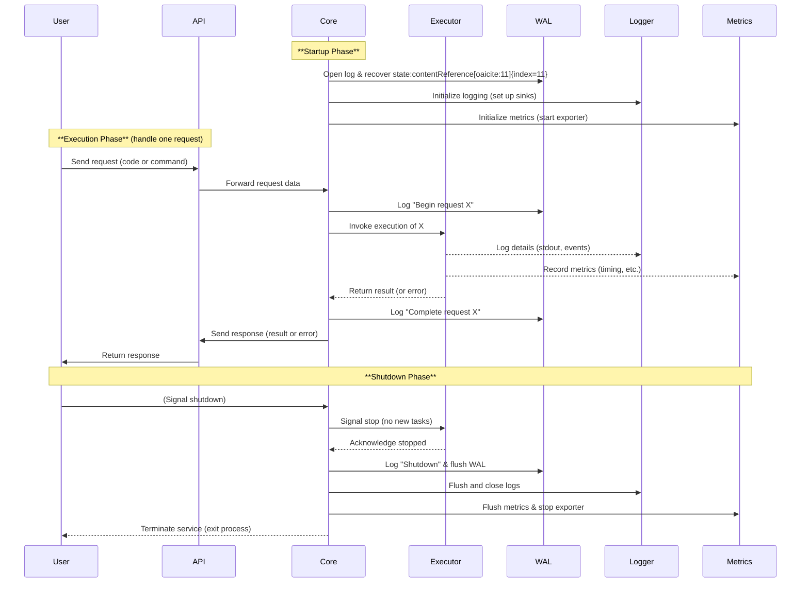

Perfect. I’ll draft a technical whitepaper that blends formal architectural detail with Rust-focused engineering specificity. It will cover all systems, components, interdependencies, and runtime flow — including the Process Activity Log, sequence diagrams, and system graphs. This will serve as a comprehensive reference for future open-source contributors.

I’ll let you know as soon as the document is ready for your review.


# System Architecture and Design Overview

## Introduction

This document presents a comprehensive architecture and design for our open-source system, striking a middle ground between a high-level technical whitepaper and a detailed engineering specification. The system is implemented in Rust, targeting Rust developers and systems programmers, and emphasizes reliability, observability, and performance. Key design features include a **Process Activity Log** (a write-ahead log for durable state), integrated **logging and metrics** for observability, and a robust model for graceful startup and shutdown. By leveraging Rust, we ensure memory safety and high performance – Rust’s strict ownership model (the *borrow checker*) prevents common memory errors like use-after-free while eliminating the need for a garbage collector. This strong foundation makes our system suitable for safety-critical and high-performance scenarios.

The goal of this project is to create a platform that can execute user-defined code or requests with strong guarantees of durability and traceability. Every significant action is recorded in the Process Activity Log (similar to a database WAL) so that no work is lost even in the face of failures. Comprehensive logging and metrics instrumentation provide deep insight into runtime behavior, because without logging “you’re flying blind” in production, and metrics offer real-time visibility into system performance. We want to **sell this concept** to potential open-source contributors by detailing how each component works in isolation and how they interact as a cohesive whole. The following sections catalog the system’s components, their responsibilities, and their interactions, followed by diagrams illustrating the overall architecture and a typical sequence of operation from start-up to shutdown.

## Architecture Overview

At a high level, the system follows a modular architecture with clearly delineated components. The primary components include:

* **API Interface** – the entry point that receives external input (such as user requests or code submissions).
* **Core Orchestrator** – the central brain coordinating all other components and the lifecycle of requests.
* **Execution Engine** – executes the user’s code or request logic (e.g. running a function, query, or task) in a controlled environment.
* **Process Activity Log (WAL)** – a durable write-ahead log recording every significant state change or activity for recovery and audit.
* **Logging Subsystem** – collects and persists application logs for debugging and analysis.
* **Metrics Subsystem** – gathers runtime metrics and exposes them for monitoring tools.

These components and their interactions are depicted in **Figure 1** below. Solid arrows indicate primary request/response flows, while dashed arrows indicate asynchronous or background flows (such as emitting logs and metrics). External entities like the user and external monitoring/log storage are shown for context.

【図1†embed\_image】 *Figure 1: High-level system architecture. Components include the API interface (entry point for user requests), Core orchestrator, Execution engine, Process Activity Log (for durability), Logging, and Metrics. Arrows show interactions: the Core orchestrates execution of requests via the Executor, logs events to the WAL, and feeds into logging and metrics systems for observability.*

**(Figure 1 is a conceptual component diagram.)**

```mermaid
flowchart LR
    User(Client) --> |Request| API[API Interface]
    API --> |Dispatch| Core[Core Orchestrator]
    Core --> |Invoke| Executor[Execution Engine]
    Executor -->> |Exec logs| Logger[Logging<br/>Subsystem]
    Executor -->> |Exec metrics| Metrics[Metrics<br/>Subsystem]
    Core --> |Record start| WAL[Process Activity Log<br/>(WAL)]
    Core <-- |Result| Executor
    Core --> |Record finish| WAL
    Core --> |Response| API
    Logger --> |Write logs| LogFile[(Log File)]
    WAL --> |Persist WAL| WALFile[(WAL Storage)]
    Metrics --> |Export metrics| Monitor[Monitoring System]
```

## System Components

Below we catalog each component in isolation – describing its role, implementation considerations, and interactions with other parts of the system:

### API Interface

**Role:** The API Interface is the external face of the system. It receives incoming interactions – for example, an HTTP request, CLI command, or function invocation from a user – and translates them into internal actions. In our design, the API could be a REST/JSON HTTP layer (using a framework like Axum or Actix Web in Rust) or another IPC mechanism. Its responsibility is to validate and parse incoming requests (or code submissions) and then hand them off to the Core orchestrator for processing.

**Interactions:** The API interacts **upstream** with the **User/Client**, accepting requests and returning responses. **Downstream**, it communicates with the **Core Orchestrator** by invoking a core handler function or sending a message that represents the user’s request. The API should be kept lightweight – mainly concerned with protocol handling and not business logic. For example, in a web service scenario, this component would translate an HTTP request into an internal command for the Core, then await the result to form an HTTP response. If the system were extended to multiple instances, the API layer could also handle load balancing or routing, but in the scope of this design it’s a singular interface component.

**Isolation:** In isolation, the API’s job is simply to be a request translator. It should not need to know about how execution or logging is done internally – it only knows that it can call into the Core to process a request. This separation allows the API layer to be swapped (for example, a different network protocol) without affecting the core logic.

### Core Orchestrator

**Role:** The Core Orchestrator is the heart of the system. It contains the main control flow and state machine that ties everything together. When a request arrives (via the API), the Core orchestrates its execution: it triggers the Execution Engine to run the code/operation, logs the activity to the WAL for durability, and ensures results or errors are properly handled. The Core is also responsible for life-cycle events like startup initialization and graceful shutdown coordination.

**Interactions:** The Core interacts with almost every other component:

* It **receives requests** from the **API Interface** and decides how to handle them.
* It **invokes the Execution Engine** with the necessary context to perform the work, possibly using Rust concurrency (e.g. spawning a task via Tokio for async execution).
* It **records events to the Process Activity Log** – for example, before starting an operation it appends a “start request” entry to the WAL, and after completion it appends a “completed request” (or error) entry. This ensures that if the system crashes, on restart the Core can replay or recover any operations that were in-progress based on the WAL. The primary goal of using a WAL is to provide *efficient, atomic, and durable data persistence* – the Core relies on this to guarantee no work is lost.
* It interacts with the **Logging subsystem** (directly or indirectly) to emit log messages about the progress of the operation (e.g. “Started processing request X”, “Completed in Y ms”). In practice, the Core might use a logging *facade* (such as the `log` or `tracing` crate in Rust) to produce logs that the Logging subsystem will handle.
* It similarly uses the **Metrics subsystem** to record metrics (e.g. increment a counter for “requests processed” or record the execution duration). The Core might, for instance, mark the start and end time of a request and report a histogram metric for latency.
* During **startup**, the Core is responsible for initializing other components: it may load configuration, open or create the WAL file and recover state (replaying the log if needed to restore consistency), set up the logger (initialize log output sinks), and register metrics collectors. On **shutdown**, the Core coordinates the termination: it decides when to shut down (e.g. upon receiving a SIGINT or an admin command), signals the Execution Engine to stop accepting new tasks, flushes pending log and WAL entries, and so on (more on this in the sequence section).

**Isolation:** In isolation, the Core encapsulates the primary logic of what to do when. It can be thought of as the **state controller** or **workflow engine** of the system. Other components are largely dumb in comparison – they do their one job (execute code, write log, etc.) when called upon. This design means contributors can reason about the Core’s logic to understand overall system behavior, and modify policies (like scheduling, error handling, retry on failure, etc.) in one place.

**Considerations:** Since the Core touches concurrency and multiple subsystems, careful design is needed to avoid deadlocks or bottlenecks. For instance, if the Core writes to the WAL, it should do so efficiently (possibly batching writes or offloading to a WAL writer thread). Similarly, logging and metrics calls from the Core should be non-blocking (e.g. using asynchronous channels or buffers) to not stall the main workflow. Rust’s async facilities (via Tokio or async-std) can be employed to manage these interactions concurrently. The Core should also handle backpressure – e.g. if the Execution Engine is busy or WAL is slow to fsync, the Core might queue incoming requests or apply flow control.

### Execution Engine

**Role:** The Execution Engine (Executor) is responsible for carrying out the actual user-defined code or request logic. In a database analogy, if the Core is the transaction coordinator, the Execution Engine is the query processor. If this system is a function runtime, the Execution Engine runs the function’s code; if it’s a task runner, it performs the task. This component is designed to be as decoupled as possible: the Core hands it a unit of work and expects a result (or error) back.

**Interactions:** The Executor primarily interacts with the **Core** – receiving tasks and returning results. It may be implemented as a separate thread pool or even a separate process (for example, running untrusted code in isolation). In our design it’s a component within the same service process for simplicity, but one could imagine plugging different executors (e.g. a WASM runtime for untrusted WebAssembly code, or a database engine for queries).

While executing, this component can produce **logs and metrics** as well:

* It uses the **Logging subsystem** to record any application-specific logs or debugging information during execution (for example, if user code prints to stdout or logs events, the Executor captures and forwards those to the logger).
* It uses the **Metrics subsystem** to report metrics like execution time, resource usage, etc., which the Core might not directly know. For instance, if the execution involves multiple steps internally, the Executor could increment counters for each step or record detailed timing.

However, the Execution Engine typically does **not** interact with the **WAL** directly – it’s the Core’s job to log the high-level events to the WAL. The Executor focuses on performing the computation. One exception might be if the Executor needs to page out intermediate state or results to disk, but such state persistence would likely be managed by the Core or a storage module rather than the executor itself.

**Isolation:** In isolation, the Execution Engine could be thought of as a pure function: given input (the request data or code), it produces output. It shouldn’t need to know about *how* the system ensures durability or observability. This separation means the executor code (which may be complex business logic, a script interpreter, etc.) remains independent of infrastructure concerns. For example, one could swap out the execution engine for a newer version (say, a more optimized algorithm or a different language runtime) without changing how the rest of the system logs or persists data.

**Considerations:** If user code can be executed, safety and sandboxing are considerations. Rust’s ownership and memory safety help if the code is compiled in, but if the system allows dynamic code (like loading a plugin or script), we must ensure the executor cannot compromise the whole system (perhaps running in a restricted environment). Additionally, the Execution Engine might run multiple tasks concurrently (if allowed by Core), so it should handle threading or async properly. Rust’s `Send` and `Sync` traits will enforce some of this at compile time, and using asynchronous execution or a threadpool (like `rayon` or custom threads) can allow parallel execution of multiple requests.

### Process Activity Log (WAL)

**Role:** The Process Activity Log is essentially a **Write-Ahead Log (WAL)** – a sequential log of every critical action or state change in the system. The concept is borrowed from database design: before the system modifies its state or produces an output, it first writes an entry to this log on disk describing what it is about to do. In the event of a crash or restart, the system can replay or examine this log to recover to a consistent state. In our system, the WAL records events like “Starting execution of request X”, “Completed execution of request X with result Y”, “Service shutting down at time T”, etc., along with any metadata needed for recovery (like unique IDs, timestamps, maybe checkpoints). This component guarantees **durability** – once an event is in the WAL and fsynced, the system can survive a crash without losing that event.

**Interactions:** The WAL component primarily interacts with the **Core Orchestrator**, which invokes it to append log records. The Core will call the WAL interface (e.g. a function like `log_event(Event)`) at well-defined points:

* During startup, the Core might use the WAL to **recover**: the WAL module can read the log file and provide the Core with any pending or incomplete operations that need handling. For example, if there was an “Started X” without a corresponding “Completed X” due to a crash, the Core knows it should re-run or roll back X.
* Before executing a request, Core writes a **Begin event** to WAL. After execution, Core writes a **Complete event** (or **Error event** if it failed) to WAL. Only then might the Core consider the request fully handled.
* During shutdown, Core writes a **Shutdown event** to WAL (and flushes it). This way, if the system boots up and finds an abrupt end in the WAL (no shutdown marker), it knows the previous run crashed and might check for inconsistencies.
* Other components typically do *not* write to the WAL directly. The Logging and Metrics subsystems have their own outputs; only the core transactional events go into the WAL, keeping it lean and focused.

**Isolation:** In isolation, the WAL component is essentially a low-level **storage module**. It manages a file or set of files on disk. It might handle tasks like file rotation, checksums for integrity, and batching of writes for performance. One could implement this using existing crates (there are Rust libraries for WAL, such as `okaywal` or similar), or custom-build it. The WAL doesn’t know *why* events are logged; it only ensures they are stored and retrieved reliably. This could be a separate crate in the project, given its distinct functionality.

**Considerations:** The WAL must be extremely reliable and relatively efficient. Writing to a WAL introduces overhead on the critical path of request processing (since we typically don’t consider a request started until the WAL “start” record is on disk). However, the design can leverage file system caching and batch commits – group multiple log entries and flush once for higher throughput. The principle is that *sequential writes to disk can be very fast* if done properly, often faster than random writes to a database, which is why databases use WALs to begin with. We should ensure the WAL write is atomic (perhaps using a single append write call) and use techniques like pre-allocation or memory-mapped files if performance demands. Additionally, on recovery, the WAL should be able to detect partial writes or corruption (using checksums or markers) to avoid replaying incomplete entries.

Finally, note that the WAL by itself doesn’t hold the *primary data* that the user might care about (if the system has such data). In a database, the WAL is paired with a data store (tables, etc.). In our system, if there is state produced by executions, that state could be kept in memory or stored elsewhere but not in this design’s scope. If needed, the WAL can serve as an event log that, together with periodic checkpoints or in-memory state in the Core, constitutes the full state. For now, the WAL ensures we can always recover the fact that “an operation happened” and its outcome.

### Logging Subsystem

**Role:** The Logging subsystem handles all **application log output** – primarily for the benefit of developers and operators rather than for recovery (that’s the WAL’s job). This includes informational messages, debug traces, warnings, and errors that occur at runtime. Effective logging is critical for troubleshooting: when something goes wrong (or for auditing normal operations), one should be able to inspect the logs to understand what happened. The Logging subsystem in our design ensures that logs from the Core, Execution Engine, or any other part of the system are collected in a consistent format and persisted (to disk files or other storage).

**Interactions:** Various parts of the system **emit log messages**, typically via a logging API (for example, Rust’s standard `log` crate provides a logging facade, and `tracing` provides structured, contextual logging). The **Core Orchestrator** will log high-level events (e.g. “Received request X”, “Dispatched to executor”, “Completed request X”), possibly at INFO level. The **Execution Engine** might log more detailed or domain-specific messages (e.g. “Step 2 of algorithm done”, or any error stack traces if something in user code fails). The Logging subsystem receives these through the logging facade.

Under the hood, the Logging subsystem consists of a **logger configuration and output sinks**. When the service starts, the Core will initialize the logging framework – setting log levels, and configuring one or more *sinks*. A common setup is:

* A file sink: write logs to a rotating file on disk (for later analysis).
* Possibly a console sink: print logs to stdout/stderr (useful during development or if running in a container where logs are captured by infrastructure).
* In production, logs might be forwarded to a centralized logging system (like Elastic Stack, Splunk, etc.), but that forwarding would often be handled by an agent outside our process or by the container platform. Our Logging subsystem just needs to get them to a file or stdout.

The subsystem might include **formatting** (ensuring a structured format for logs). For example, logs should include timestamps, severity level, request identifiers, and other context to be useful. We would configure the logger to include such fields (Rust’s `tracing` crate, for instance, excels at structured logging with spans and fields).

**Isolation:** In isolation, the Logging component can be thought of as a **consumer of log events**. It doesn’t initiate actions on its own; it passively receives events from the logging API and writes them out. As a separate module or crate, it could encapsulate the logic of initializing loggers and the specifics of output format. Other parts of the system do not need to know how logging is implemented – they just call `log::info!("message")` or similar and the Logging subsystem handles the rest.

**Considerations:** Logging should have minimal performance impact. In Rust, the idiomatic approach is to log asynchronously: the log macro calls send data to a channel or buffer, and a background thread actually writes to disk. This avoids blocking the Core or Executor when they emit logs. Our design should ensure the logging doesn’t become a bottleneck under high throughput (e.g., use asynchronous, bounded queues and possibly backpressure if the log I/O can’t keep up, to avoid memory bloat). We should also avoid logging excessive detail in hot code paths unless at debug level, to keep the overhead low in production runs.

Additionally, we must avoid logging sensitive information inadvertently. Since we might open this project to contributors, establishing logging best practices (no plaintext passwords, etc.) is important, though detailed contributor guidelines will come later.

### Metrics Subsystem

**Role:** The Metrics subsystem is responsible for collecting and exposing **quantitative performance and health indicators** of the system. Metrics differ from logs in that they are numeric, aggregated data points (counters, gauges, histograms) that can be graphed and monitored over time. They are crucial for observability – enabling automated systems to trigger alerts (for example, if requests per second drop or error counts spike) and for developers to track performance trends. Our system’s metrics subsystem will gather data like number of requests processed, execution durations, resource usage (if available), and internal events rates.

**Interactions:** The **Core** and **Execution Engine** are the main sources of metrics:

* The Core might increment a *requests\_processed* counter for each request, track *active requests* gauge (number currently running), and record latency metrics by measuring how long each request took.
* The Execution Engine might contribute to metrics such as *operations within the execution* (if, say, it executes multiple sub-operations), or it might simply report back timing that Core uses. If the Execution Engine has internal instrumentation (e.g., a VM could count instructions executed), it could emit those as metrics too.
* The Metrics subsystem receives these via an API. In Rust, this could be done with a metrics facade (like the `metrics` crate which provides macros like `metrics::increment_counter!("requests")`). Under the hood, these calls update in-memory counters or histograms.

The Metrics subsystem also typically includes an **exporter**. This means it provides a way for external monitoring systems to scrape or receive the metrics. A common approach is exposing an HTTP endpoint (e.g. at `/metrics`) in Prometheus format. There are crates like `metrics-exporter-prometheus` that can integrate with the metrics system to serve metrics to Prometheus. Our design would likely spin up a thread or task that listens for scrape requests or pushes metrics periodically to a server, depending on the chosen monitoring tool.

**Isolation:** The Metrics subsystem, like Logging, is mostly passive and infrastructure-oriented. It maintains counters and other data structures independently. Other components do not need to know *how* metrics are stored or exposed; they only call the metrics API. We can implement this subsystem as a separate crate responsible for registering metrics and managing the exporter endpoint. Rust’s metrics ecosystem allows a pluggable recorder – meaning during initialization, the Core would set up the global metrics recorder (e.g. configure it to use a Prometheus recorder, which the Metrics subsystem provides). After that, any `metrics::increment_counter!` call anywhere in the code will channel into our Metrics subsystem.

**Considerations:** Performance is key here as well: metric updates should be low-overhead (they often use atomic operations or lock-free datastructures under the hood). We should define a reasonable set of metrics to avoid high cardinality or excessive overhead. The system should also handle the case when no external monitor is attached – e.g. the metrics endpoint can be there but if not scraped, it just accumulates data cheaply. Thread safety is crucial (the metrics library will handle that, ensuring for example that multiple threads can increment counters concurrently). If our system runs as a single process, metrics are just global within it; if in a cluster, each instance would expose its own metrics (aggregation across instances would be the monitoring system’s job). Since we target a single-instance open-source project for now, we focus on the per-process metrics.

Finally, just as with logging, we avoid putting sensitive or extremely granular data as metrics labels (common best practice, as metrics are often stored long-term). We also ensure metrics reflect the important aspects of the system’s function so contributors and users can readily see the system’s behavior via dashboards.

## Sequence Flow: End-to-End Operation

Having outlined the components, we now illustrate how the system works as a whole, by walking through the sequence of events from service start-up to a graceful shutdown, including the processing of a single request. **Figure 2** below is a sequence diagram that divides the operation into three phases: **Startup**, **Execution (request handling)**, and **Shutdown**. This diagram shows how each component interacts over time, with notes highlighting each phase.

【図2†embed\_image】 *Figure 2: Sequence diagram of the system’s operation from start to graceful shutdown. The diagram shows the service startup (initializing components), handling of one example request (from a user’s perspective), and the shutdown procedure. The **Process Activity Log** is written at key steps (start/completion of the request, and on shutdown) to ensure durability. Logging and metrics are also emitted during execution. Graceful shutdown involves signaling the executor and flushing logs/WAL, as explained in the text.*

**(Figure 2 is a UML sequence diagram depicting interactions over time.)**



As shown above, the system goes through the following steps:

### Startup Phase

1. **Core Initialization:** On service start, the Core orchestrator takes charge. It opens or creates the WAL log file and performs recovery if needed (reading the log for any incomplete operations). It then initializes the Logging subsystem (setting up log format, log file, etc.) and the Metrics subsystem (registering metrics and launching any background tasks such as an HTTP endpoint for Prometheus). At this point, the system is ready to receive requests. All components are warmed up: for example, the WAL is ready to record new entries, and logging is configured so that any subsystem can emit logs right away.

   *Rationale:* Doing this work upfront in the startup ensures that the service runtime is in a consistent state. If recovery finds half-finished operations in the WAL, the Core might decide to handle them now (perhaps by re-queuing them to the Executor or marking them as failed). The design can vary – a simple approach is to log a warning for any incomplete operation and move on (since we are focusing on one request at a time in this scenario). In a more advanced design, the Core might actually complete the operation (if it’s safe to do so) or roll it back. Regardless, by the end of initialization, the WAL’s contents align with the in-memory state (which at start is empty or restored) and we’re confident proceeding.

2. **Service Ready:** The system then typically enters an idle state awaiting input. In a real implementation, the API component would be listening on a network port or reading from a queue at this point. The Core might spawn a thread or async task to run an event loop for the API (for instance, an HTTP server). All this setup is abstracted in this design description for brevity – we assume the API is now ready to accept a user request.

### Execution Phase (Single Request)

3. **Request Received:** A user invokes some operation – for example, calling an API endpoint or sending a piece of code to run. The **User** -> **API** arrow indicates this external interaction. The API layer would parse the request, perform basic validation or authentication (if any), and then package the request into an internal format (e.g., a struct or message).

4. **Request Dispatched to Core:** The API calls into the **Core Orchestrator** (e.g., by invoking a function or sending through a channel). The Core now “owns” the request.

5. **Log Start in WAL:** Before doing any heavy work, the Core appends a *begin-request* entry to the **WAL**. This might look like “TxID 123 START op=XYZ timestamp=...” etc. The WAL immediately (or periodically) flushes this to disk. This step is crucial for durability – if a crash occurs after this point, the WAL record on disk will tell us that request 123 had started but not completed, cueing the recovery process to handle it. By writing to the WAL first, we follow the write-ahead log principle that ensures *atomicity and durability* of the operation begin. (If the system crashes even one microsecond after telling the Executor to run, we have the record that it started.)

6. **Execute Request:** The Core invokes the **Execution Engine** to actually perform the work. This could be a direct function call (if synchronous) or sending a message to a worker thread/task. In either case, at this point the Core might either wait for the result (synchronously) or allow other tasks to interleave if using async. For simplicity, think of it as the Core calling a function `executor.run(request)` and blocking until it returns.

7. **Execution in Progress:** The **Executor** now does whatever the request entails – this could be quick or could take some time. During this process, the executor might produce logs – e.g., if it's running user code that uses a logging macro, those logs are captured by the Logging subsystem asynchronously. This is indicated by the `Executor -->> Logger` arrow labeled "Log details". For instance, if the user code prints "Hello", that would go through the logger. The executor might also update metrics – for example, it could record how many database queries it made or simply note that it finished execution in N milliseconds by updating a histogram in the **Metrics** subsystem (`Executor -->> Metrics`). These operations are shown as dashed arrows because they typically happen in the background (the executor isn’t waiting on them; it just fires off log/metric events while it continues processing).

8. **Result Ready:** The Execution Engine finishes the task and returns control to the Core along with the result (or an error if something went wrong in execution). In the diagram, `Executor -->> Core: Return result` indicates this. Now the Core has the outcome of the request.

9. **Log Completion in WAL:** Upon receiving the result, the Core appends a *completion* entry to the **WAL**. This could be “TxID 123 COMPLETE success” or if there was an error, “TxID 123 FAILED error=...”. This WAL entry, when flushed, guarantees that the outcome of the request is durably recorded. At this point, the operation can be considered fully durable: both the start and end are in the log. If the system crashes after this, the WAL on recovery would show a completed entry for 123, so it knows it doesn’t need to redo anything (though depending on the system’s needs, it might need to re-send the result if the client didn’t get it – but that’s beyond our scope).

10. **Respond to API:** The Core then sends the result back to the **API Interface**. In a synchronous call model, this is just returning from the function call. In an async model, maybe the Core had a callback or a channel to send the response. Either way, the API layer now has the response data.

11. **API Returns Response:** The API formats the response for the user (e.g., an HTTP response body) and sends it back to the **User**. From the external perspective, the user’s request is now fulfilled. They get the result or an error message.

12. **Post-Execution:** Although not a specific numbered step in the diagram, it’s worth noting that concurrently, the Logging subsystem has been writing any collected logs to the log file (and might flush them on info/error boundaries), and the Metrics subsystem has updated its internal counters. None of those should block the main flow – they operate asynchronously.

At this juncture, the system is ready to accept another request and would repeat steps 3-11 for each. For our single interaction scenario, we move on to shutdown.

### Shutdown Phase

13. **Shutdown Signal:** At some point, the service is instructed to stop. This could be triggered by a user (as shown by **User -> Core: Signal shutdown**, e.g., an admin hits a stop button or sends a special request), or by an OS signal like SIGINT/CTRL-C from the console, or even an orchestrator sending a termination signal in production. Regardless of source, the Core Orchestrator is designed to handle a shutdown notification. According to best practices for graceful shutdown, there are typically three parts: detecting the shutdown signal, telling every component to shut down, and waiting for them to finish.

14. **Core Notifies Components:** The Core begins graceful shutdown. First, it will stop accepting new work. For instance, it could stop the API listener (stop accepting new connections or requests). Then it signals the **Execution Engine** to cease operation. If there are no requests currently running, this is trivial. If there *is* an in-progress request, the Core might wait for it to finish or, if necessary, attempt to cancel it. In many systems, the approach is to let current work finish but not take new work. If the Execution Engine supports cancellation (perhaps via a cancellation token or interrupt), the Core might trigger that for a speedy shutdown. In our diagram, we show Core -> Executor: "Signal stop" and Executor -->> Core: "Ack stopped". This implies the Executor either completes any current task or immediately stops (if we implemented cooperative cancellation). In Rust async, for example, one could use a `CancellationToken` from the Tokio utility to notify tasks to cancel. Since we’re only handling one request at a time, we can assume either the last request finished, or if the shutdown came in the middle of a request, the Core might decide to abandon it (this would be recorded in WAL as incomplete, to potentially retry on next start).

15. **Flush WAL:** The Core writes a final **Shutdown event** to the **WAL** (e.g., “SHUTDOWN timestamp=...”) and ensures the WAL is flushed to disk. Flushing means calling fsync or equivalent to guarantee all log entries are physically on disk. This is important because if the process is killed or exits, we want the WAL to show a clean shutdown marker. If on next startup the WAL does not end with a shutdown, the system can infer that a crash or kill happened and may perform additional recovery checks. The shutdown record is the bookend that signals “all operations before this are accounted for; the system stopped at this point intentionally.”

16. **Flush Logs:** The Core then signals the **Logging subsystem** to flush and close. Many logging frameworks flush automatically periodically, but on shutdown it’s wise to ensure any buffered log messages are written out. We want the last messages (like “Shutting down” or any error info) to be in the log file. The logger closes file handles cleanly after flushing.

17. **Flush/Stop Metrics:** Similarly, the Core stops the **Metrics subsystem**. If there is an HTTP endpoint thread for Prometheus, it should be shut down. This prevents errors or hangs. We might also consider dumping final metric values or ensuring any last updates are captured (though metrics are mostly in memory; there’s typically no need to flush since they’re not buffered to disk in our design). Ensuring the metrics exporter is stopped prevents any dangling threads.

18. **Service Termination:** Finally, after all subsystems have acknowledged shutdown, the Core exits the main process (or returns from `main`). The service terminates gracefully. This whole shutdown procedure follows the pattern of coordinated teardown: detect signal, propagate cancellation, wait for completion. It ensures we don’t, say, terminate in the middle of writing a log line or while an Executor thread is still updating memory. By the end, we have a clean shutdown with all pending operations recorded.

During shutdown, because we’ve designed with a WAL and graceful steps, the system can guarantee no corruption or lost data: any in-flight request either completed and was logged as such, or it will remain marked as started in the WAL without completion, which the startup recovery can notice next time. This strategy minimizes inconsistent states.

## Conclusion

In summary, the proposed system architecture provides a robust foundation for an open-source project focused on safe, durable execution of tasks (or code) with full observability. Each component has a well-defined role:

* The **API** handles external interfacing, allowing the core logic to remain protocol-agnostic.
* The **Core Orchestrator** governs the sequence of operations, ensuring that for every request the necessary bookkeeping (WAL, logs, metrics) is done and coordinating startup/shutdown.
* The **Execution Engine** cleanly separates the *what* (business logic or user code execution) from the *how*, allowing contributors to focus on improving execution efficiency or adding new capabilities (such as supporting new languages or sandboxing techniques) without worrying about breaking durability or logging.
* The **Process Activity Log (WAL)** provides reliability akin to enterprise databases by guaranteeing that *every critical step is durable*. This is a key selling point – contributors can build features on a system that won’t lose data easily and can recover from crashes methodically.
* The **Logging and Metrics** subsystems fulfill the observability requirements that modern software demands. Logs give detailed insight for debugging (“What happened inside the system?”), and metrics give a quantitative view of performance and usage (“How many, how fast, how often?”). By using Rust’s ecosystem (`log`, `tracing`, `metrics` crates, etc.), we get high-performance, structured logging and metric collection.

From a Rust developer’s perspective, this project is appealing because it leverages the strengths of Rust (memory safety, fearless concurrency, and strong typing) in a systems-level project. The architecture invites contributions in various areas:

* Systems programming (optimizing the WAL, implementing efficient I/O).
* Concurrency and async patterns (the Core and Executor coordination, graceful shutdown handling using Rust futures or threads).
* Observability tooling (perhaps integrating with OpenTelemetry or improving how logs/metrics are gathered).
* Possibly extending the Execution Engine (to support sandboxing, new types of tasks, etc.).

We intentionally structured the design to be modular, so contributors can work on one component (say, improving the logging format or WAL throughput) without needing to overhaul the entire system. The provided diagrams and descriptions in this document should give potential contributors a clear mental model of how the pieces fit together and where their expertise might be applied.

Moving forward, we can evolve this design into an actual implementation. The next steps would include setting up a repository, scaffolding these components (likely as separate Rust crates in a workspace for clarity), and defining clear interfaces between them. While this document does not delve into code-level detail, it establishes the groundwork and rationale for each part of the system. We believe this strong conceptual starting point will attract Rust developers who are interested in building reliable, observable systems. Together, the community can iterate on this foundation to create a robust open-source project.

**Invite:** If you’re a Rustacean excited by the prospect of building a system that never loses an event, that logs and measures everything for full transparency, and that shuts down as gracefully as it starts up – we welcome you to join us in turning this design into reality. Let’s build something great, with the power of Rust and open-source collaboration!
