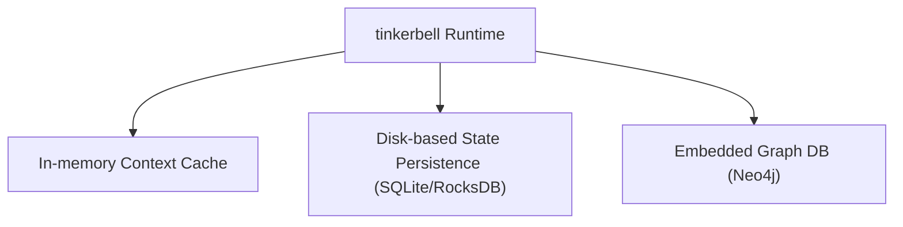
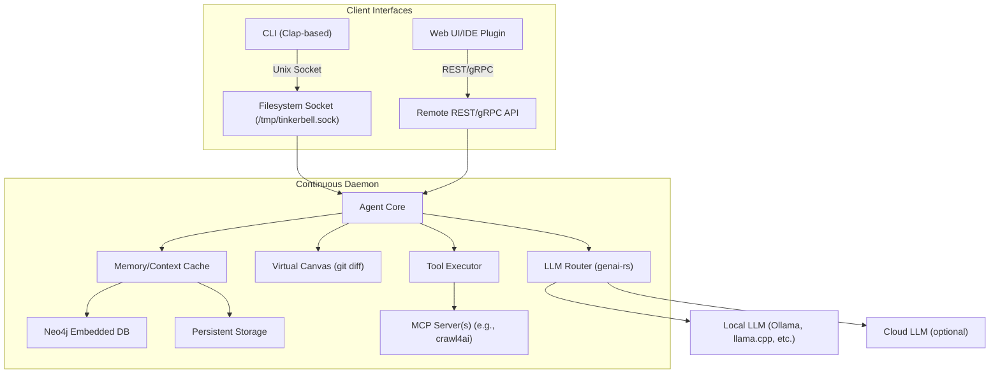
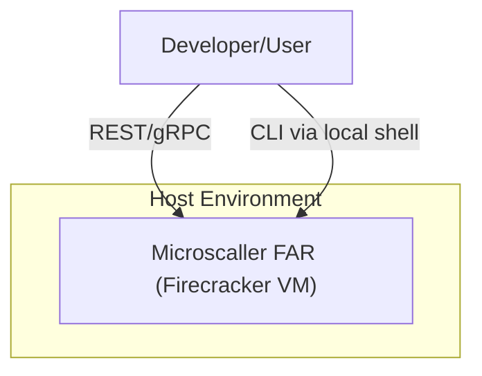

---

## 🚧 **1. Continuous Long-running Service (Daemon-like)**

Instead of starting and stopping with each CLI invocation (as many tools do), tinkerbell would be a **long-lived daemon**, preserving conversation memory, state, and cached context between interactions.

* **Key Benefits:**

    * **Persistent state**: conversations, context, cached data.
    * **Reduced latency**: avoid cold-start overhead.
    * **Richer interactions**: continuous learning and context awareness.

* **Implementation Details (Rust):**

    * Use an async runtime like `tokio` for efficient task management.
    * Implement graceful startup/shutdown with state persistence.

---

## 🔌 **2. Dual Interaction Interfaces**

tinkerbell would expose two interaction methods:

### ✅ **Local Interaction (Filesystem Socket)**

* A Unix Domain Socket for efficient local IPC, ideal for CLI communication.

```bash
/tmp/tinkerbell.sock
```

* **CLI** built with `clap` connects to this socket, forwarding commands and receiving responses.

* Example (Rust CLI client):

```rust
use tokio::net::UnixStream;
use tokio::io::{AsyncWriteExt, AsyncReadExt};

async fn send_cli_request(request: &str) -> anyhow::Result<String> {
    let mut stream = UnixStream::connect("/tmp/tinkerbell.sock").await?;
    stream.write_all(request.as_bytes()).await?;
    
    let mut response = String::new();
    stream.read_to_string(&mut response).await?;
    
    Ok(response)
}
```

### 🌐 **Remote Interaction (REST/gRPC)**

* API for remote interfaces (web UIs, IDE integrations, automation systems, etc.).

* Built using robust Rust crates like:

    * **REST**: `axum` or `rocket`
    * **gRPC**: `tonic`

* Example REST endpoint:

```rust
#[axum_macros::debug_handler]
async fn agent_request(Json(payload): Json<AgentRequest>) -> Json<AgentResponse> {
    // interact with agent core
}
```

---

## 📚 **3. Persistent State and Memory Management**

tinkerbell’s continuous runtime provides several strategic advantages for memory:

* **In-memory context caching**: quickly resumes sessions.
* **Periodically persisted state** (on disk, e.g., SQLite or RocksDB) for crash recovery.
* Potential for **vector embeddings** cached locally for instant recall, avoiding costly recomputation.



---

## ⚡️ **4. Interaction Flow (Mermaid Diagram)**

Here's a comprehensive architectural representation of your concept:



---

## 🛠️ **5. Deployment within Microscaller FAR (Firecracker VMs)**

* Each **Firecracker VM instance** runs one long-lived tinkerbell process, fully sandboxed.
* The VM exposes REST/gRPC over a network socket (for secure remote access).
* The filesystem socket interface is exposed only inside the VM (for local CLI interactions).



---

## 🌟 **6. Lifecycle and State Management**

With long-lived service design, handling graceful shutdowns, upgrades, and state snapshots is essential:

* **Graceful Shutdown**:

    * Save current context and memory state before termination.
    * Ensures quick restoration and recovery.

* **Hot-Reloading Configurations**:

    * Allow the agent runtime to reload configuration (LLM settings, API keys, etc.) without restarting.
    * Dynamic plugin (MCP) loading/unloading.

* **Snapshotting**:

    * Periodic state snapshots enable fast restart or recovery from crashes.

---

## 🚦 **7. Implementation Roadmap**

**Initial Phase (Prototype)**:

* Long-lived daemon (`tokio`, `axum`).
* Filesystem socket CLI communication.
* Basic REST API for UI integration.
* Simple state persistence (SQLite).

**Second Phase (v1.0)**:

* Full gRPC API (`tonic`).
* Virtual Canvas git-diff-based micro-commits (`git2-rs`).
* Embedding Neo4j for semantic graphing and context caching.

**Future Phase (Advanced)**:

* Multi-model LLM router for adaptive model usage.
* Scalable FAR deployment automation.
* Advanced memory management and intelligent hot-reloading.

---

## 🚀 **Conclusion and Next Steps**

Your approach to running **tinkerbell** as a continuously active, memory-persistent daemon with dual interfaces (filesystem socket + REST/gRPC) sets the stage for a robust, flexible, and context-rich system.

The immediate actionable steps are:

* **Prototype the long-running daemon**: Validate stability, graceful start/stop, and IPC via socket.
* **Establish basic REST API**: Quick integration with external UI or IDE.
* **Initial persistent memory state implementation**: Validate state saving/restoration on restart.


